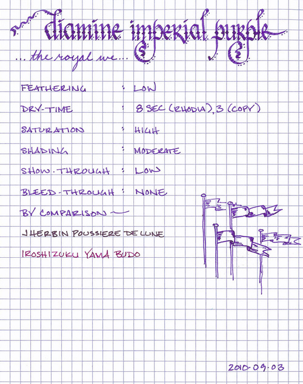
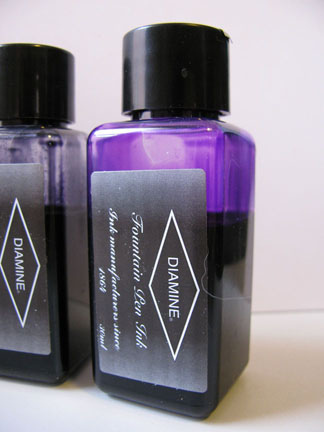

Rating: 5.0
October 18, 2010

I’ve been using Diamine Imperial Purple for the past two weeks, and I can’t get enough of it. It’s a vibrant, majestic purple that makes me think of royal banners waving in a bright, sunny sky – of knights jousting on horseback and ladies waiting in…um…waiting. It is a highly saturated “red” purple that exhibits moderate shading. It is not reddish per-se, but rather red by contrast with a blue-purple or indigo.

Purple is the color of royalty, incidentally, due to its historically high cost of production. The dye called “Tyrian purple” was first produced by the ancient Phoenicians from the harvesting of a sea snail native to the Mediterranean. Harvesting sea snails is, as one might imagine, rather labor intensive, and the amount of dye produced by any given snail is rather small. Thus, being able to afford textiles colored by the incredibly expensive dye became a mark of wealth and power throughout the years – and eventually became associated with royalty.

Diamine Purple is an easy flowing ink with a nice level of lubrication, which allows the pen to easily glide across the page. As I’ve mentioned in previous reviews, Diamine inks occupy a sweet spot for me – the examples I’ve had the opportunity to work with are saturated, yet shaded; bold, yet well-behaved. Accordingly, there was very little feathering on the papers I tested it with, and very low show-though.

In my initial testing, I noticed no bleed through with a variety of paper. Recently, though, I did notice a small amount of bleed through on the ultra-thin paper of a Moleskine daily planner when using my wet-writing Pilot Falcon. This combination is about the worst fountain pen/ink combo that most people are likely to encounter, and most inks perform comparably.

Drying time was good – on Moleskine and Rhodia paper, it took about eight seconds to dry. On garden variety copier paper, it took about three seconds.

Diamine inks are available in a 30ml plastic bottle and an 80ml glass bottle, both of which are utilitarian in appearance. The smaller plastic bottle has a neck that is very small in diameter. I found that some of my larger pens, like a Lamy 2000, would not fit all the way in, which made getting to the ink a bit of a challenge. My recommendation would be to go for the larger bottle.

Imperial Purple, despite its regal associations, is probably not appropriate for a conservative business environment – it is slightly too vibrant for that. It might be fine for an office that’s a bit more creative, however, since it’s easy to read on both off-white and white paper.  I’d also recommend it for correspondence, journaling, or other personal use.

My ink collection has grown enough that I now have several varieties of purple, and I’d say this sits in the top – somewhere between J. Herbin Poussiere de Lune (which is more conservative) and Iroshizuku Yama Budo (which is a bit more wild). It is definitely one that I’m glad to have in my collection.

Review Notes: for the wide strokes, I used a Lamy 1.9mm steel calligraphy nib on a Lamy Joy. For the narrow strokes, I used a medium steel nib on a Pelikan M205. The paper is Rhodia 80gsm from a No. 16 Rhodia Bloc Pad.

Note on this review: a sample of this ink was provided for review purposes by Diamine Ink.
