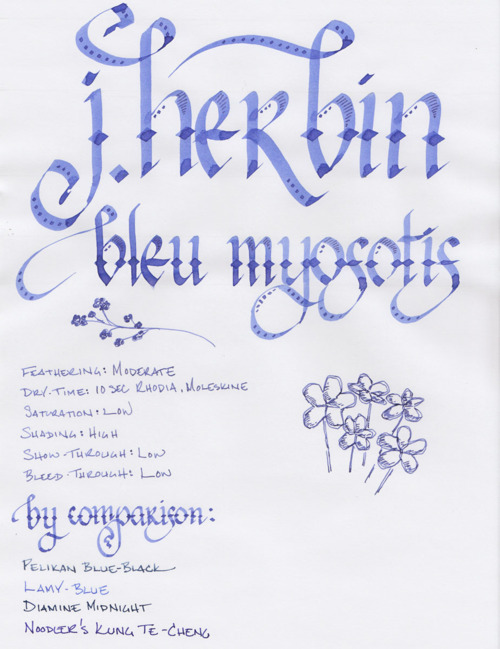
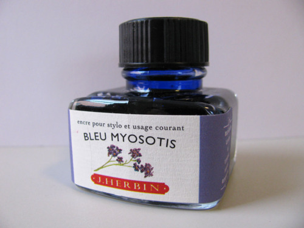

Rating: 4.0
November 15, 2010

J. Herbin Bleu Myosotis is a lovely, pale blue ink that evokes a field of wildflowers – like its namesake “myositis,” which is more commonly known as “forget-me-not.” The low level of saturation allows for an extremely high degree of shading in both fine and wide nibs. In fact, in a wide enough nib, it almost looks like one is painting with watercolors.

Like Vert Empire, Myosotis is one of the wetter J. Herbin inks, which are, as a group, among the wettest inks I own. As a result, it writes smoothly, but tends to feather on Moleskine and other lower quality papers. On Rhodia paper, it behaved itself, but just barely. I could tell that it was giving the paper a run for its money – especially with the 6mm calligraphy pen I used.

Beyond the tendency to feather, this ink is otherwise well behaved. Both show-through and bleed-through were low to negligible, and the drying time was consistent between Rhodia and Moleskine paper: about ten seconds.

Blue inks are generally acceptable in business use, and I expect that Bleu Myosotis would be no exception. It’s a bit pale for my tastes, and, in fact, I find it a bit challenging to read on off-white paper due to its low level of contrast, but it is a lovely ink. For those who like a more ephemeral ink, this would be a good choice for journaling or correspondence. Where I see myself using it most often is in calligraphy, since the level of shading in a wide nib is simply gorgeous.

J. Herbin fountain pen inks come in a 30ml bottle with an integrated pen rest that is suitable for displaying on top of one’s desk. In fact, the colored labels provide a nice burst of color when one has a significant collection assembled.

J. Herbin Bleu Myosotis is a very pretty ink that will appeal to those that like softer, more artistically inclined inks. Those that prefer bold inks that produce consistent lines, however, should avoid it.

Review materials: For the wide strokes, I used three calligraphy pens: Pilot Parallel 6.0mm and 3.8mm pens, and a 1.9 mm Lamy Joy. All three have steel nibs. For the fine strokes, I used a Lamy EF steel nib on a Lamy Safari. The paper is Rhodia 80g.
