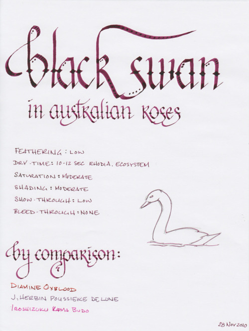
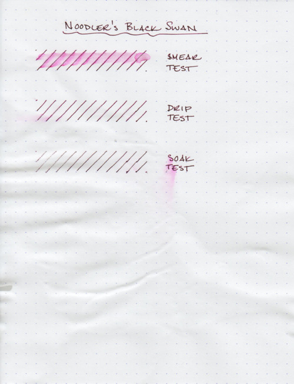
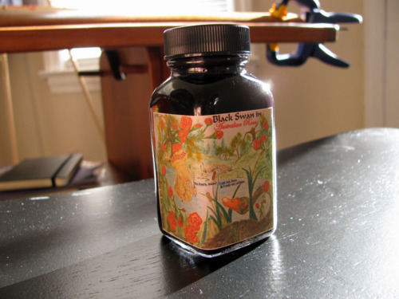

Rating: 5.0
November 30, 2010

The award for most poetically named ink goes to Noodler’s Black Swan in Australian Roses – one of the most poetic inks I’ve reviewed this year. Black Swan is a brand new ink from Noodler’s that was just released in late November. It is a moderately saturated ink with lots of very moody shading, and was designed to show off the shading potential of flex nibs.

On paper, it is easy to see where both aspects of the name come from, as two different colors characterize this ink: on top is a dark purple-black (the black swan), and underneath lies a lovely pink rose (the Australian roses). I almost feel like I’m describing a perfume, with talk of top notes and base notes, but this ink deserves such talk – I’d say that it easily ties J. Herbin 1670 for this year’s most dramatic ink.

Like most Noodler’s inks, Black Swan flows easily in all of the pens I used it with and is very resistant to feathering, even on absorbent paper like Ecosystem journals. It had a very low level of show through with a fine nib, and exhibited no bleed through – another common characteristic of Noodler’s inks.

Where Black Swan differed from other Noodler’s inks is in its drying time. I’ve resisted using many Noodler’s inks due to the typically long drying times, but this one dries relatively quickly on both Rhodia paper and Ecosystem journals – about ten to twelve seconds. Curiously, it took over thirty seconds for this ink to dry on Moleskine paper – I’m at a loss as to why.

Pleasantly, I also found Black Swan to be quite resistant to water. According to Noodler’s, this ink is about sixteen percent bulletproof – but it stands up quite well under most scenarios. A smear test, in which I ran a wet finger across the page, does show some bleeding, but the lines remain bold and readable.

A drip test, in which I let drops of water set for about a minute before blotting them, is barely noticeable. A small amount of ink came up, but nothing that affected the legibility of the lines. The soak test was most impressive. I ran the paper under the faucet for about a minute, and the lines remained quite readable. On the left-hand side of the soak test, you can see some fading where I rubbed the paper – but I was taking paper off at that point. In summary, it performed admirably.

Noodler’s Black Swan in Australian Roses comes in a standard 3 oz. Noodler’s bottle that’s filled to the brim – so be careful when opening. Noodler’s intentionally uses stock bottles and lids to keep their prices low, which means that they aren’t intended to be show pieces in and of themselves. They are functional and stable, but not an objet d’art intended for the top of one’s desk.

However, this bottle’s label contains references to the myth of Leda and the Swan, and interplay between the Noodler’s catfish mascot and a black swan. You can watch Nathan Tardiff, the man behind Noodler’s inks, describe the label in detail here: <http://www.youtube.com/watch?v=SUczPSBbxdA>.

Depending on one’s pen, this ink could conceivably be work-appropriate. In a wet nib, it is very dark almost luxurious. In a dryer pen, the pink undertones come out, which is less work-friendly, but would work well for correspondence and personal use. Italic and flex nibs are where the ink’s potential is expressed fully – and, since it has a semi-bulletproof property, it would be great to see this used with an italic nib as a signature ink.

Noodler’s Black Swan in Australian Roses is a beautiful new ink from Noodler’s – one that I think many people will enjoy using. It’s designed for flex nibs, but works great with both italic and standard nibs, and is well behaved and fun to use. I can easily see this taking a place in my regular ink rotation.

Review notes: I used a 3.8 mm Pilot Parallel calligraphy pen for the widest strokes, a 1.9 mm Lamy Joy calligraphy pen for the medium strokes, and a fine-medium steel nib on a Noodler’s piston-fill fountain pen for the fine strokes. The paper is Rhodia 80g.
