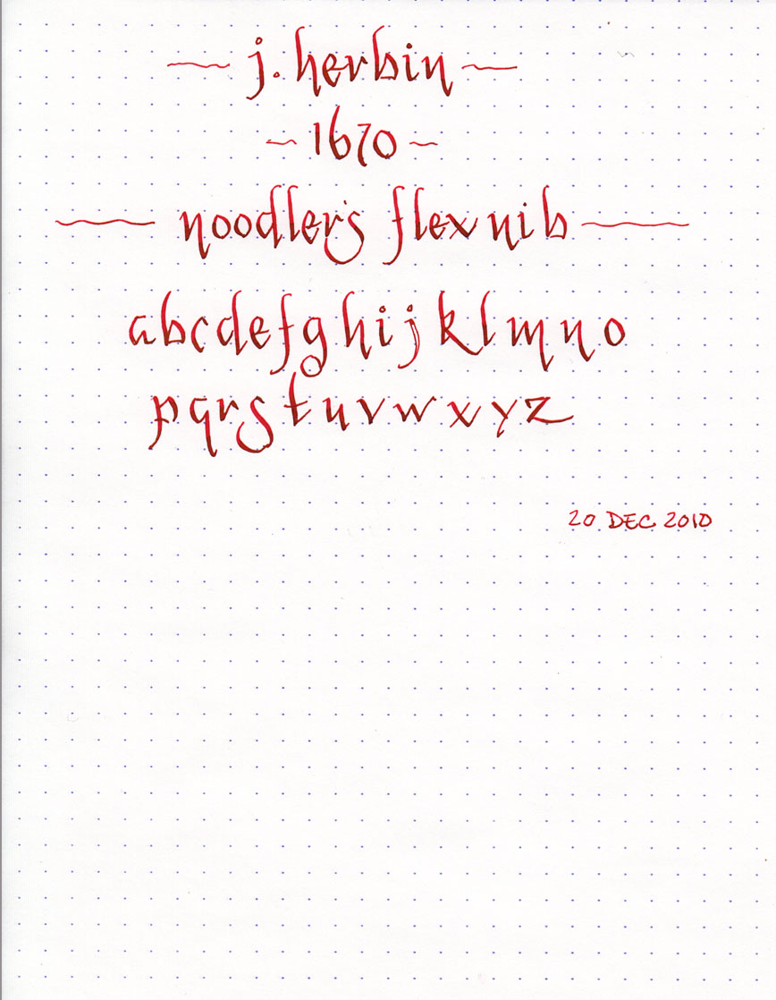
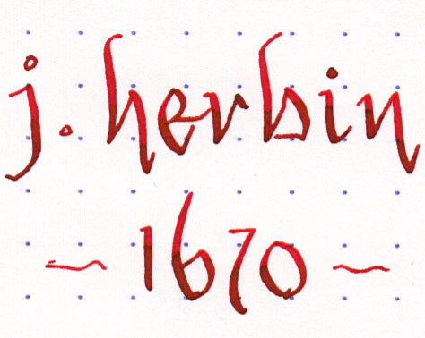
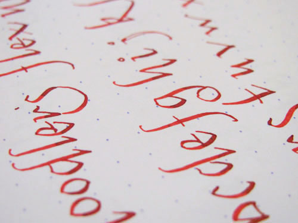

I'm continuing to experiment with my Noodler's Flex Nib Piston Fill fountain pen. Above is a writing sample with [J. Herbin 1670](/blog/2010/5/16/ink-review-j-herbin-1670/) - their 2010 limited edition anniversary ink. 1670 does some very interesting things when used in a flex nib. A golden/copper tone appears in the heavily shaded areas. In fact, in the right light, it actually shimmers a bit.

The script I'm using is an adaptation of the "brush script, broad-edged minuscule 2" from [The Calligrapher's Bible: 100 Complete Alphabets and How to Draw Them](http://www.amazon.com/gp/product/0764156152?ie=UTF8&tag=seizethedav0c-20&linkCode=as2&camp=1789&creative=390957&creativeASIN=0764156152).

You can see the golden/copper tones in the image above. No shimmering, though, due to the scanner.

Another detail sample, taken with a camera.
