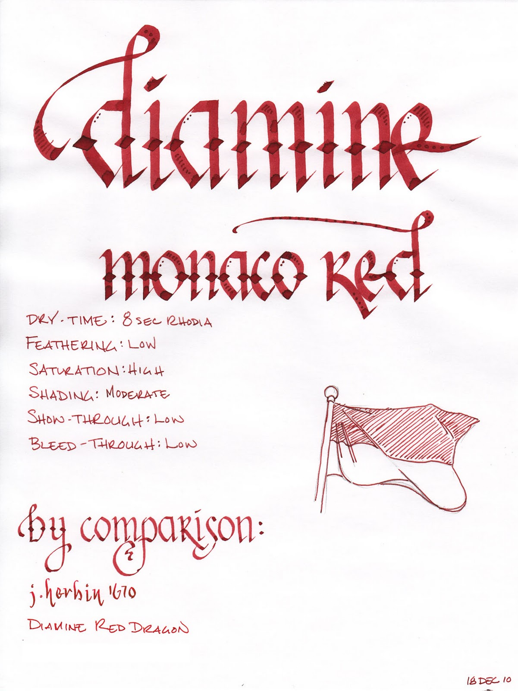
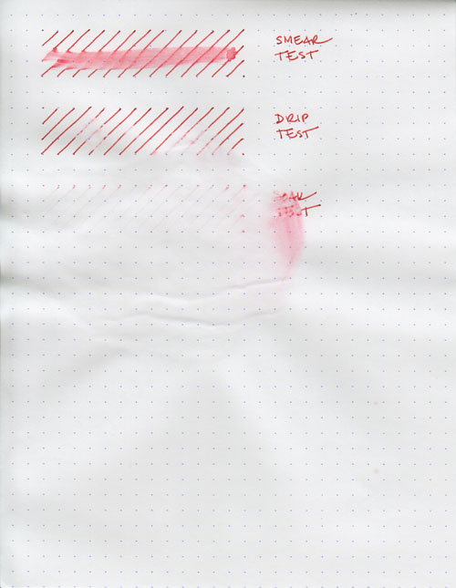
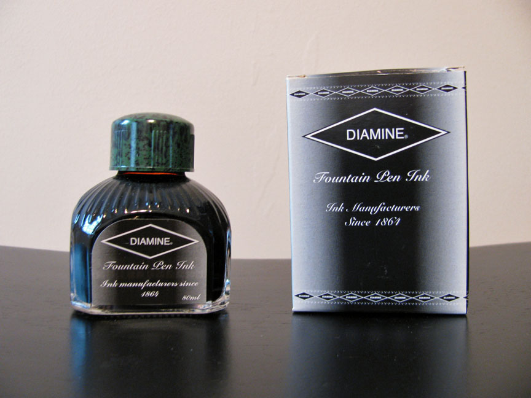

Rating: 4.5
December 24, 2010

Monaco Red is another great red ink from Diamine. It's an earthy, orange red with brick undertones – very reminiscent of J Herbin 1670. It is less blue than Diamine Red Dragon and less brown than Diamine Oxblood. According to at least one source, this ink was formulated by Diamine at the special request of the Crown Prince of Monaco. I presume the ink was engineered to match the red in the Monegasque flag and coat of arms.

It is a saturated red that exhibits a moderate level of shading in a fine nib and a superb level of shading in a wide or wet nib. The color is not dramatically affected by the color of the paper – on both white and ivory Rhodia paper, the ink appears nearly the same. It is also well-behaved on each paper I used to test it. Show-through was low, overall, and bleed-through only occurred on the very thin paper of a Moleskine cahier – and that was minimal.

Diamine Monaco Red provides a nice level of lubrication, allowing an extra-fine nib to glide easily across the page. Drying time is quick as well – only 8 seconds on the normally long-drying Rhodia paper and 4 seconds on the absorbent paper of an Ecosystem journal.

Water resistance is, to my mind, the singular issue with this ink. A smear test, in which I ran a wet finger across the page, did a great job of obliterating the lines and creating a red mess.

A drip test, in which I let drops of water set for about a minute before blotting them, was even worse. The ink came up almost entirely from the areas where the water touched the paper. Worst of all, though, was the soak test, where I run the paper under a stream of water. The ink jumped off the page so quickly, I would have suspected that it was allergic to it. Perhaps they offended each other. Either way, it came up so easily that I cut the test short after only a few seconds.

Diamine inks are available in a 30ml plastic bottle, which is utilitarian in appearance, and an 80ml glass bottle, which is slightly less so. The smaller plastic bottle has a neck that is very small in diameter. I found that some of my larger pens, like a Lamy 2000, would not fit all the way in, which made getting to the ink a bit of a challenge. My recommendation would be to go for the larger bottle.

Red inks are not traditionally workplace appropriate, though I have no qualms about using them. Most, however, would find Monaco Red to be no exception – unless you happen to be the Crown Prince of Monaco, I suppose – and then who's going to stop you anyway? It's good to be the king, no? At any rate, this ink is easy to read, to my eyes – not too bold and not too light – and therefore good for journaling and other personal use.

I continue to be impressed by Diamine, and Monaco Red is an impressive ink. I'm happy I bought the large 80ml bottle – I can see this making its way into my standard repertoire for everyday use and for calligraphy. If you, like me, enjoy red inks, then I will not hesitate to recommend adding it to your collection.

Review materials: For the wide strokes, I used three calligraphy pens: Pilot Parallel 6.0mm and 3.8mm pens, and a 1.9 mm Lamy Joy. All three have steel nibs. For the fine strokes, I used a Lamy EF steel nib on a Lamy Safari. The paper is Rhodia 80g.
