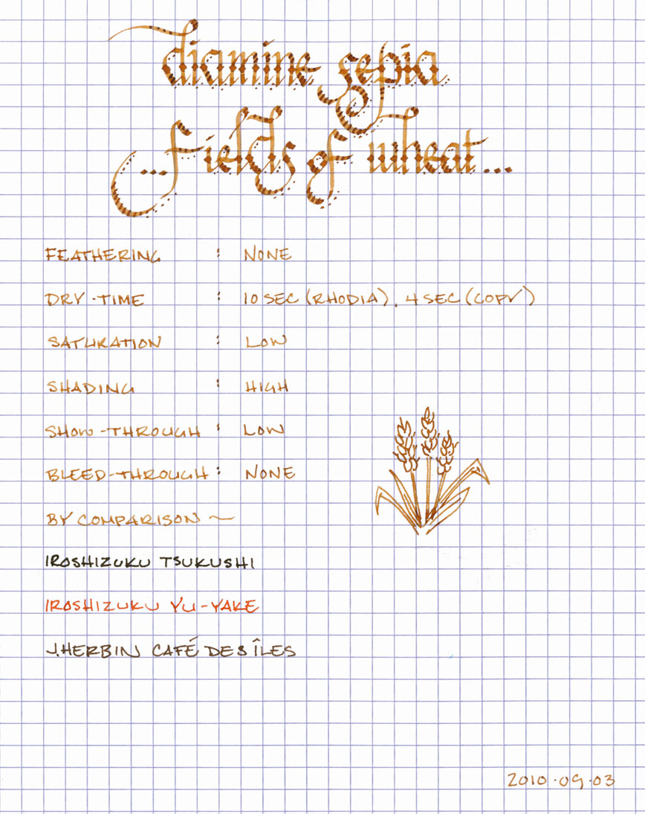

Rating: 4.0
December 07, 2010

Diamine Sepia is a wonderful fall color, reminding me of golden fields of wheat that sway in the wind of a cool November day. It is a golden-brown ink with a low level of saturation and an amazing ability to produce beautiful shading. While the color of some inks varies with the shade of paper, Sepia is consistent, appearing just slightly darker on the off-white paper of a Moleskine journal than on the bright-white paper of a Rhodia pad.

Like other Diamine inks I have reviewed, Sepia behaves nicely on a wide variety of paper. Even with the fine-medium nib on a Noodler's pen, which lays down a thicker line than my EF nibs on my Lamy Safari pens, I noticed no bleed through and very little show-through on Moleskine journal paper.

The drying time for this ink was also very friendly. On the typically long drying Rhodia paper, Sepia took ten seconds to dry to the touch. On an absorbent paper, like standard copier paper, it took four seconds to dry, which should make it a good choice for left-handed over-writers. I also noticed no special tendency to feather on any of the paper I tested it on.

Where Sepia falters, for those who are concerned about such things, is in its resistance to water. For the smear test, I dragged a wet finger across the page, which did a good job of leaving a golden smear and obliterating most of the lines. For the drip test, I let droplets of water stand for about a minute before blotting them up. The water did an effective job of pulling the ink from the paper.

The last test, the soak test, was conducted by running the paper under the faucet for about five seconds. In that time, the vast majority of the ink had washed away. If I'd kept going, I could have easily washed it completely off. As an ink, it's not suitable for addressing envelopes, and I'd refrain from writing out recipes using this ink, if your cookbook is as sauce-stained as mine.

Diamine inks are available in a 30ml plastic bottle and an 80ml glass bottle, both of which are utilitarian in appearance. The smaller plastic bottle has a neck that is very small in diameter. I found that some of my larger pens, like a Lamy 2000, would not fit all the way in, which made getting to the ink a bit of a challenge. My recommendation would be to go for the larger bottle.

Diamine Sepia is a very pretty ink and well behaved. While I don't make much use of brown inks, personally, I can see this being very appealing to those that like do. I plan on using it any time I need a "vintage" or faded look for a calligraphy project.  I've had good experiences with all of the Diamine inks I've reviewed so far, so I don't hesitate to recommend it to those that are looking for a harvest gold color.

Review Notes: for the wide strokes, I used a Lamy 1.9mm steel calligraphy nib on a Lamy Joy. For the narrow strokes, I used the fine medium steel nib on a Noodler's piston fill pen. The paper is Rhodia 80gsm from a No. 16 Rhodia Bloc Pad.

Note on this review: a sample of this ink was provided for review purposes by Diamine Ink.
