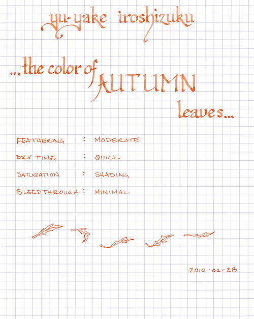

Rating: 4.0
February 28, 2010

The Iroshizuku inks by Pilot are quickly becoming my favorite brand. I started my Iroshizuku collection with Yu-Yake (Sunset), which is a delightful burnt orange that I would describe as somewhere between a sunset and the color of autumn leaves. It is a very saturated orange, though it exhibits significant shading in a wide nib. In a fine nib, the shading is reduced, though still apparent.

One of the characteristics I like about the Iroshizuku inks in general is their relatively quick drying time, which makes them good candidates for journaling. In a Moleskine journal, this ink does exhibit some feathering, though show-through and bleed-through are minimal. It is an easy-flowing ink, and I have had no trouble using it in any pen.

The Yu-Yake is a very vibrant color, though easy to read. I have had no trouble using it for daily use, but it would be an unlikely candidate for business use.

As with the other Iroshizuku inks, Yu-Yake comes in a beautiful, solid, 50 ml bottle. The bottle has a depression in the base to allow for the last drops to be claimed with ease. The only drawback to this ink is the cost – for a comparable volume, Iroshizuku tends to run 50 to 100% more than other inks.

Iroshizuku Yu-Yake is highly recommended.
