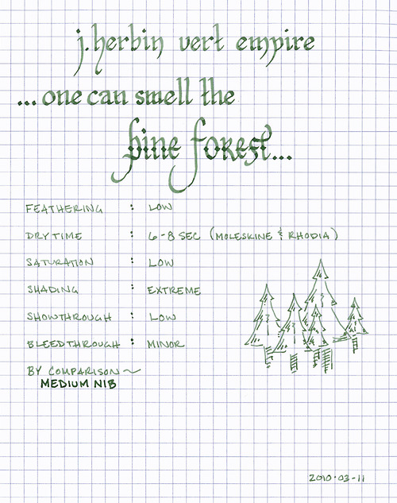

Rating: 3.5
March 13, 2010

J. Herbin Vert Empire is a forest green ink with grey undertones. To me, it is invocative of a pine forest in the hazy light of morning. It is a wet ink with low saturation, so it exhibits a tremendous tonal range, depending on the pen and paper used. In most of my pens it displays significant shading, whereas in a wet writer it lays down a very dark line. Also, the ink takes on the character of the paper – for example, it takes on slight olive tones when used with the off-white paper of Moleskine journals.

Like all other J. Herbin inks I’ve tried, Vert Empire flows exceptionally well. Because it is so wet, it does exhibit minor feathering on some papers. It behaves well on Rhodia and some Moleskine papers, exhibiting minor show-through and bleed-through. On the thin paper of a Moleskine cahier, however, show- and bleed-through is significant. I don’t believe the paper is sturdy enough to stand up to it.

The dry time of this ink seems to be fairly consistent between Rhodia and Moleskine – about six to eight seconds. I typically write on an incline, which often causes ink to pool at the bottom of letters, thus increasing the time it takes ink to dry when compared to writing on a flat surface. Therefore, flat-writers might experience a quicker dry-time.

Vert Empire is an attractive ink that is conservative enough for business use, yet interesting enough for artistic use. However, I would recommend using it with a white paper, as it does not provide sufficient contrast on off-white paper for daily use.

J. Herbin fountain pen inks come in a 30ml bottle with an integrated pen rest that is suitable for displaying on top of one’s desk.

Review materials: For the wide strokes, I used a Lamy 1.1mm steel calligraphy nib on a Lamy Safari. For the fine strokes, I used a Lamy EF steel nib on a Lamy Safari. The medium strokes were made using a Montegrappa Tributo ad Antonio Stradivari with a medium 18K gold nib. The paper is Rhodia 80g.
