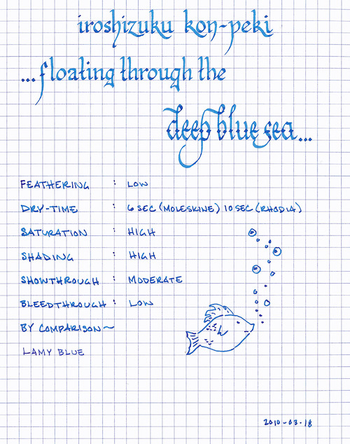

Rating: 4.0
March 18, 2010

Iroshizuku Kon-peki is a beautiful, azure blue ink that captures the tempestuous nature of the wild ocean. It is a highly saturated ink that exhibits a surprising level of shading – representing the light blue of the ocean surface and the deep blue of the bottom of the sea. Because it is highly saturated, it creates a bold line on both white and off-white paper.

Like other Iroshizuku inks, Kon-peki flows liberally. It exhibits minor feathering on Moleskine journals and on Ecosystem paper, but no feathering at all on Rhodia paper. Due to its bold color, it demonstrates moderate show-through on thin paper, like that of a Moleskine cahier. However, even on the cahier paper, it suffers from very little bleed-through.

The dry time of Kon-peki is similar to other Iroshizuku inks: on Moleskine paper, it takes roughly six seconds, and on Rhodia, ten seconds. The pen I used for the review, a Lamy Studio, tends to write wet, however – which increases the dry time when compared to my Lamy Safari or 2000. Also, I typically write on an incline, which often causes ink to pool at the bottom of letters, thus increasing the time it takes ink to dry when compared to writing on a flat surface. Therefore, flat-writers might experience a quicker dry time.

While the color of Iroshizuku Kon-peki is probably too bold for typical business use, it would be a good choice for editing or other highlighting. I also find it to be great for journaling and other artistic use – the ink provides sufficient contrast on multiple paper tones to be easy to read.

As with the other Iroshizuku inks, Kon-peki comes in a beautiful, solid, 50 ml bottle that looks great on one’s desk. The bottle has a depression in the base to allow for the last drops to be claimed with ease. The only minor drawback to this ink is the cost – for a comparable volume, Iroshizuku tends to run 50% to 100% more than other inks.

Review materials: For the wide strokes, I used a Lamy 1.1mm steel calligraphy nib on a Lamy Safari. For the fine strokes, I used a Lamy 14K gold EF nib on a Lamy Studio. The comparison strokes were made with a Lamy 2000. The paper is Rhodia 80g.
