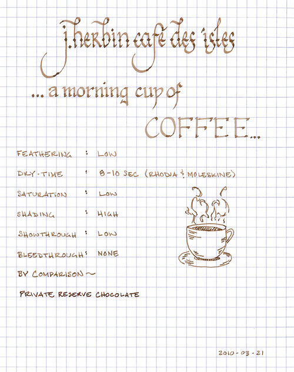

Rating:

4.0

March 22, 2010

J. Herbin Café des Îsles

is an aptly named brown ink, as, more than anything, it resembles the color of coffee. Other reviewers have mentioned its similarity to café au lait or to espresso, depending on the wetness of the line, and I find the comparison apt. Imagine dipping one’s pen in a cup of coffee and then writing – that’s the color of this ink – and the varying strengths of one’s beverage are well represented by the low saturation and significant shading that it exhibits. It is also worth noting that, on a cream or off-white paper, it takes on a delightful sepia tone.

As with other J. Herbin inks, Café des Îsles flows easily in each pen I own. It is not as wet as Vert Empire or Bleu Myostosis, behaving more like Poussiere de Lune. The degree of feathering seems dependant on the paper in question: on Moleskine and Rhodia, there was little to no feathering, whereas on my Ecosystem notebook, the feathering was very noticeable. Regardless of paper, though, the show-through was minimal and the bleed-through nonexistent. Every paper I tried held up well to this ink, including the thin paper of a Moleskine cahier.

The dry time of this ink seems to be fairly consistent between Rhodia and Moleskine – about eight to ten seconds. However, on a very absorbent paper like the Ecosystem, the ink dried in less than three seconds – likely the tradeoff for the increased feathering. Also, as I typically write on an incline, the ink pools at the bottom of letters, thus increasing the time it takes ink to dry when compared to writing on a flat surface. Therefore, flat-writers might experience a quicker dry-time.

I consider Café des Îsles to be an ink with a high degree of character – one I find myself returning to again and again. Even though it isn’t an ink with a high level of contrast, I find its tone to be both easy to read and interesting, which makes it well-suited for journaling or other artistic endeavors.

J. Herbin fountain pen inks come in a 30ml bottle with an integrated pen rest that is suitable for displaying on top of one’s desk.

A note about the scan: While I’ve been fairly happy with the representation of the ink color in most of my ink reviews, this ink has proved to be extremely tricky to scan properly. The actual color is slightly less saturated with a hint of cinnamon.

Review materials: For the wide strokes, I used a Lamy 1.1mm steel calligraphy nib on a Lamy Safari. For the fine strokes, I used a Lamy EF steel nib on a Lamy Safari. The paper is Rhodia 80g.
