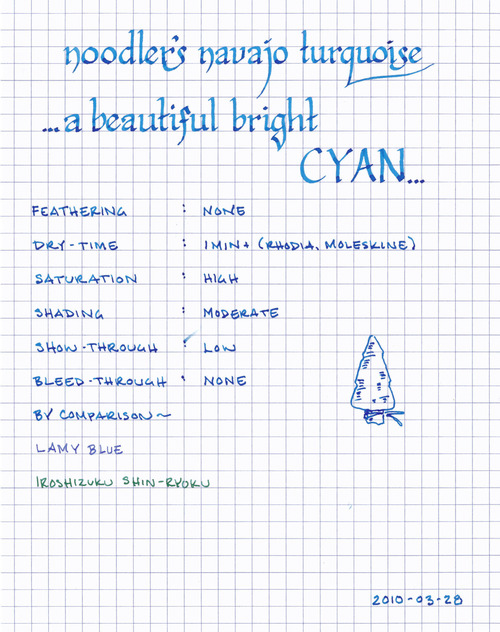

Rating: 4.0
March 28, 2010

Noodler’s Navajo Turquoise is a beautiful, medium-tone blue with a hint of green – very close to cyan, but just a bit darker. It is highly saturated, and I recommend shaking the bottle before using to make sure that the dye has not settled out. It exhibits a nice degree of shading in wide nibs, but is fairly consistent in fine nibs. While this ink is pretty on white paper, its true beauty comes out on cream-colored paper, where its green tones come to the surface – creating a beautiful jewel-like color.

Noodler’s inks tend to flow well – unlike J. Herbin inks, which have a watery character, Noodler’s inks feel slightly viscous and provide a slight lubricating quality. Each pen I’ve used them in tends to glide smoothly across the paper. Another characteristic of Noodler’s inks is their resistance to feathering – on both Rhodia and Moleskine journals, Navajo Turquoise does not feather at all. Compared to Noodler’s Black, Navajo Turquoise exhibits a slightly higher level of show-through, but it is still very low. Even in my wet-writing Lamy Studio, I’ve noticed almost no bleed-through on any paper – including the thin paper of a Moleskine cahier.

Dry time, though, varies quite dramatically based on the paper in question. On Moleskine journals and Rhodia notebooks, the ink takes upwards of a minute to fully dry (as one can see by the inadvertent smear on the scan above). On the more absorbent paper of an Ecosystem journal or on standard copy paper, however, it dries in 3 to 4 seconds – a dramatic difference. This is an odd behavior that I’ve seen with other Noodler’s inks, and I’m currently at a loss to explain it.

Noodler’s Navajo Turquoise comes in a 3 oz. bottle that is typically filled to the brim. Noodler’s intentionally uses stock bottles and lids to keep their prices low, which means that they aren’t intended to be attractive in and of themselves. They are functional and stable, but not something one would display on one’s desk.

I’ve become a very big fan of this ink recently, and can see using it in a number of circumstances. While it is likely too bright for use in a conservative business environment, it would make for a good highlighting or editing color. It is dark enough to be easy to read – unlike a true cyan, which I personally find headache-inducing – which means that it is useful for journaling or other personal uses.

Note about the scan: this color is tough to get scanned correctly. The original has green undertones that do not appear on the scan.

Review materials: For the wide strokes, I used a Lamy 1.1mm steel calligraphy nib on a Lamy Safari. For the fine strokes, I used a Lamy 14K gold EF nib on a Lamy Studio. The paper is Rhodia 80g.
