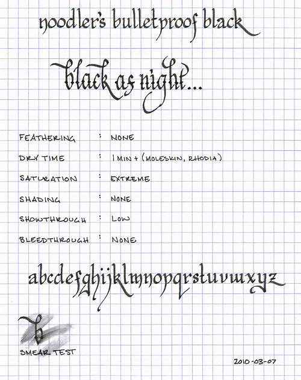

Rating: 3.0
March 07, 2010

Noodler’s (Bulletproof) Black is the first bottled ink that I added to my ink collection. I had heard many good things about the ink, and while many of those things are true, there is one major issue that is difficult to overcome.

First, Noodler’s Black is as black as night. Pitch black. When poets refer to an inky blackness, this is the ink that they have in mind. It is extremely saturated and lays down a very opaque, non-shaded line in every nib and on every paper that I’ve used it with. It’s so saturated that it doesn’t matter what color or texture paper one uses – the result is a solid black line.

Second, the ink is viscous. Neither wet nor dry, it is better described as thick and lubricating – making any pen I’ve used it in write smoothly. Because it of its viscosity, it tends to sit on top of the paper instead of being absorbed. Thus, I have never noticed any feathering on either Moleskine or Rhodia papers. It is also remarkably well behaved when it comes to bleed-through and show-through. It doesn’t bleed through, and, despite its remarkably bold presence on the page, exhibits very little show-through.

All of the admirable qualities above are the ones that I had heard expressed about Noodler’s Black prior to my purchase, and I found all to be true. However, the one quibble that I had heard was that it took a while to dry, and this I also found to be true. On Moleskine and Rhodia papers, Noodler’s Black takes upwards of a minute to completely dry. In my experience, I would often finish writing a note, wait for a minute for the ink to dry, close the notebook, and then open it up later to discover that the facing page was now covered in dark, black spots.

It is because of the enormously long drying time that Noodler’s Black is not an ink that I use regularly. I do use it for calligraphy, when signing documents, and for those special occasions that I need a pitch black line, but only for those occasions. If one doesn’t mind the drying time, or regularly carries a sheet of blotting paper, then Noodler’s Black is a solid ink that’s appropriate for every day and business use.

Speaking of business use, Noodler’s Black is marketed as both archival and bulletproof, meaning that it can’t be removed from a document. According to Noodler’s, the bulletproof inks bind with the cellulose in the paper, making it impervious to most forging techniques. As one can see from the smear test on the review above, it isn’t completely waterproof, but it is still quite readable even after the water is applied.

Noodler’s Black comes in a very full 3 oz. bottle. I would advise setting the bottle down on a level and stable surface before opening it for the first time, as it comes filled to the brim. Since Noodler’s intentionally uses stock bottles and lids to keep their prices low, there isn’t much to say about the bottle other than it does an admirable job of keeping the ink contained.

Noodler’s Black is a bold, black ink that I’m glad that I have in my collection, even if I don’t use it regularly.

Review materials: For the wide strokes, I used a Lamy 1.1mm steel calligraphy nib in a Lamy Safari. For the narrow strokes, I used a Lamy EF steel nib in a Lamy Safari. The review is written on Rhodia 80g paper.
