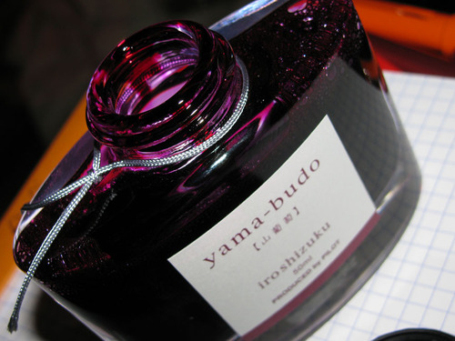

Rating: 5.0
April 10, 2010

Iroshizuku Yama-budo (wild mountain grapes) is a vibrant purple ink the color of fresh grape juice that’s been spilled across a glazed, porcelain countertop. It is brighter and juicier than J. Herbin Poussiere de Lune, which, itself, can be favorably compared to a red wine stain.

Like many other Iroshizuku inks, it is quite highly saturated – to the point that it tends to temporarily stain the ebonite feed on fountain pens. Fortunately, I’ve never seen it stain permanently – a good rinse with water will take it right off. This ink exhibits moderate shading with a wide nib, but is fairly consistent in a fine nib.

Yama-budo flows easily, though it is neither lubricating like Noodler’s inks nor overly wet like J. Herbin inks. In a fine nib, it exhibits no feathering on either Rhodia or Moleskine journal paper, and only minor feathering on the more absorbent Ecosystem paper. Despite its vibrant color, it displays minimal show-through, even on the thin paper of a Moleskine cahier. It behaves quite well on all papers with regard to bleed-through – showing only minimal bleeding on the thinnest of papers.

On Moleskine and Rhodia paper, Yama-budo dries in six to ten seconds – comparable to other Iroshizuku inks. On more absorbent paper like Ecosystem or standard copy paper, it is dry to the touch in less than two seconds. Writing on an incline seems to produce no noticeable increase in drying time compared to writing flat for this ink, at least in the pen I was using to test with.

The vibrancy of this ink makes it inappropriate for conservative business use, but it is wonderful for personal use of all sorts. In a fine nib, it produces a dark enough line to provide plenty of contrast for everyday reading.

As with the other Iroshizuku inks, Yama-budo comes in a beautiful, solid, 50 ml bottle that looks great on one’s desk. The bottle has a depression in the base to allow for the last drops to be claimed with ease. The only minor drawback to this ink is the cost – for a comparable volume, Iroshizuku tends to run 50% to 100% more than other inks.

I’ve mentioned before that Iroshizuku is one of my favorite ink producers, and each new bottle I purchase reaffirms my growing devotion. Their colors are bold, inspiring, and difficult to find from other manufacturers. Yama-budo is highly recommended.

Review materials: For the wide strokes, I used a Lamy 1.1mm steel calligraphy nib on a Lamy Safari. For the fine strokes, I used a Lamy EF steel nib on a Lamy Safari. The paper is Rhodia 80g.
