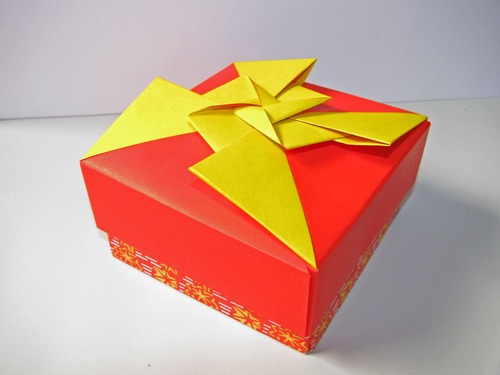
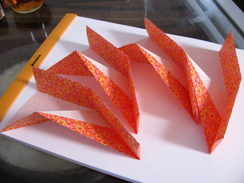
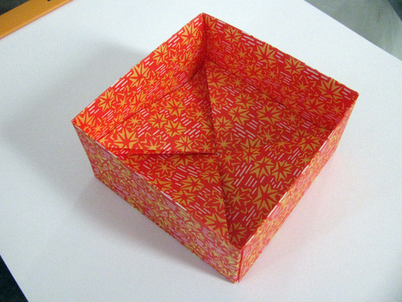
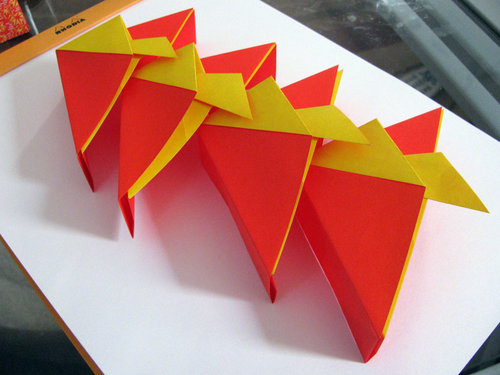
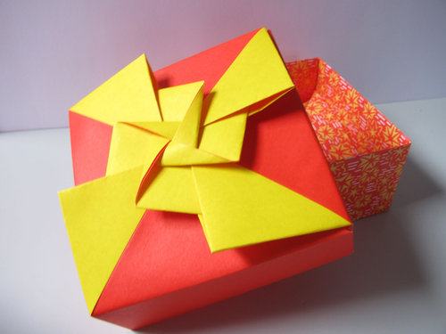

This origami box was folded from 8 uncut sheets of paper: 4 double sided (lid) and 4 patterned (base). The box was assembled entirely without glue or fastener of any sort, as the four units for the base and lid all slot together to form a structurally stable unit. The completed box measures about 3 inches square.

The box pattern was created by the celebrated origami master Tomoko Fuse, and can be found in her book Origami Boxes.

The units for the base of the box.

The assembled base.

The units for the lid of the box.

The assembled lid.

An alternate view of the completed box.
