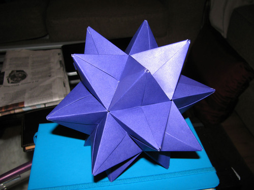
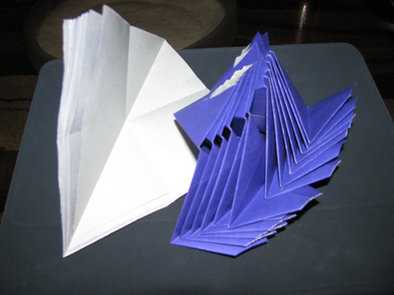
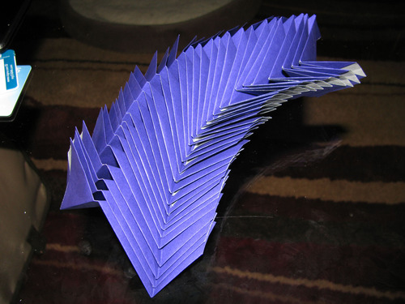
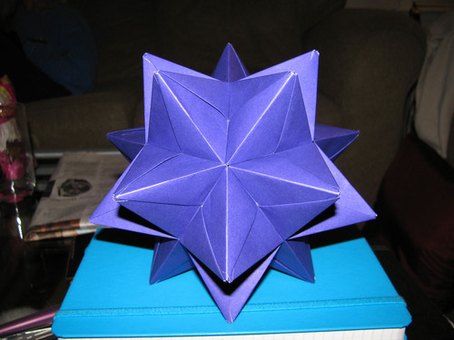

This modular origami star was folded out of 30 uncut sheets of origami paper and assembled without any glue or other fasteners. The individual units are slotted together on the outside of the model, which makes it a wee bit easier to assemble than the kusudama I folded a couple of weeks ago. Like the origami box, this model was designed by Tomoko Fuse.

It took approximately three hours to fold all of the individual units. This is about two thirds of the way through. I’ve done preliminary folds on all of the sheets of paper, and then finished folding about half of the full units.

These are the completed units:

Once all of the units were folded, it took about half an hour to assemble the model. This is an alternate view - the five pointed star motif is repeated around the entire model.

And for those who are curious, the star is sitting on an ecosystem journal - the very same one I use to write my poems.
