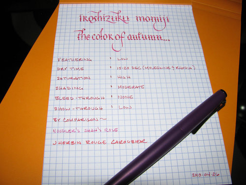
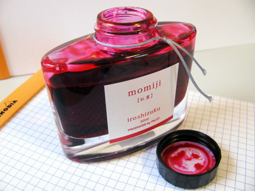

Rating: 4.5
April 28, 2010

Iroshizuku Momiji is currently my favorite ink of all time. I’m a big fan of red ink – though most people consider it too hard to read on an extended basis, I’ve never had an issue with most of them – and Momiji is currently at the top of my list. It is a deep red ink that falls on the bluish side of the spectrum. According to the manufacturer, Pilot/Namiki, it is intended to evoke the “bright red leaves that are iconic of a Japanese autumn.”

While I like the color of Momiji on white paper, I find its appearance on off-white paper to be complex and robust with a barely perceptible level of shading that lends an air of sophistication and depth. Momiji is to other red inks as a fine Cabernet Sauvignon is to grape juice.

Like many other Iroshizuku inks, Momiji is highly saturated – to the point that it tends to temporarily stain the ebonite feed on fountain pens. Fortunately, I’ve never seen it stain permanently – a good rinse with water will take it right off. The other characteristic that I’ve noticed in several pens is that it tends to clog them when left unattended for a while. I would recommend a good cleansing between fills with Momiji.

On paper, Momiji behaves similarly to Iroshizuku Yama-budo. It flows easily, though it is neither lubricating like Noodler’s inks nor overly wet like J. Herbin inks. It exhibits moderate shading with a wide nib, but is fairly consistent in a fine nib. When used with a fine nib, it exhibits little feathering on both Rhodia and Moleskine journal paper, and only minor feathering on the more absorbent Ecosystem paper. Despite its vibrant color, it displays minimal show-through, even on the thin paper of a Moleskine cahier. It behaves quite well on all papers with regard to bleed-through – showing only minimal bleeding on the thinnest of papers.

Unlike Yama-budo, Momiji takes a while to dry. In my tests on Moleskine and Rhodia paper, Momiji took 15 to 20 seconds to dry completely – longer than most other Iroshizuku inks I’ve reviewed. On more absorbent paper like Ecosystem or standard copy paper, though, it is dry to the touch in less than two seconds. Writing on an incline seems to produce no noticeable increase in drying time compared to writing flat for this ink.

While clearly not a standard color for use in daily business writing, Momiji makes a great highlighting or editing ink. For personal use, it works quite well for journaling and other daily use – it’s not too bright to be uncomfortable to read.

As with the other Iroshizuku inks, Momiji comes in a beautiful, solid, 50 ml bottle that looks great on one’s desk. The bottle has a depression in the base to allow for the last drops to be claimed with ease. The only minor drawback to this ink is the cost – for a comparable volume, Iroshizuku tends to run 50% to 100% more than other inks.

Despite the long drying time and the tendency to be a bit high maintenance in a pen, Momiji is an outstanding and inspiring color that I’ve never seen reproduced by any other manufacturer. If you can handle its quirks, Iroshizuku Momiji is highly recommended.

A note about the scan (or lack thereof): I normally scan in the written portion of my review and then make very minor adjustments to the brightness to bring the scanned image back into line with the physical version. However, Momiji appears to be impossible to accurately represent with a scan. When scanned in on both scanners I have available to me, the ink turns a bright pink. Thus, I had to resort to a picture taken in natural light.

Review materials: For the wide strokes, I used a Lamy 1.1mm steel calligraphy nib on a Lamy Safari. For the fine strokes, I used a Lamy 14K gold EF nib on a Lamy Studio. The paper is Rhodia 80gsm.
