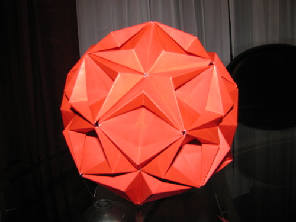
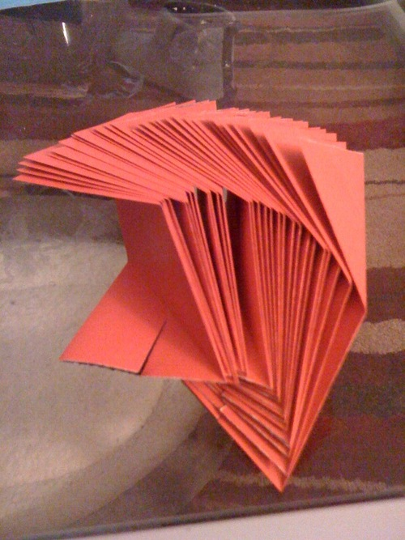
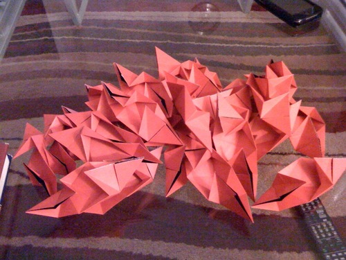

The above is a kusudama folded from 30 squares of paper. Each square of paper is folded into a modular unit, and then the units are assembled without any adhesives or other external connections - they are simply slotted into each other. This model took approximately four hours to fold and assemble.

The folding of the modular units in progress. This is about 1 hour into the process.

The fully folded modular units. This is about 3 hours into the process.

Folding the units themselves is straightforward, if time consuming. However, the units are connected internally within the model, which makes the final assembly quite a challenge.
