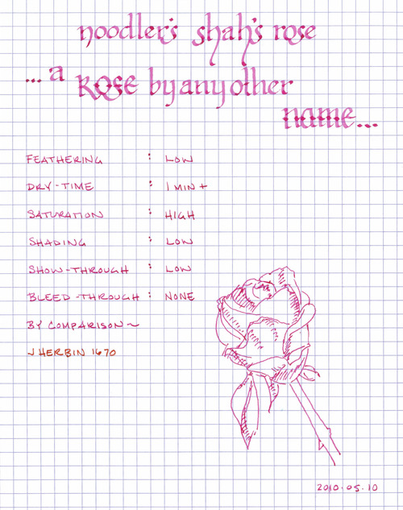
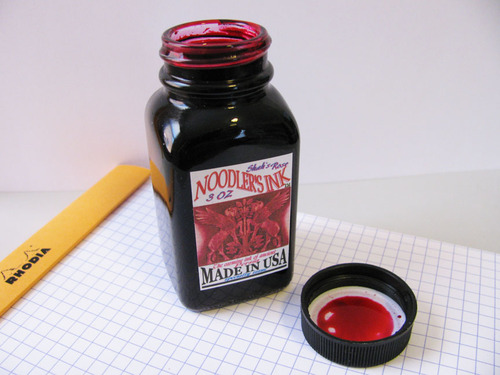

Rating: 3.5
May 10, 2010

Noodler’s Shah’s Rose is an aptly named ink – I’ve had roses in my garden this exact color. It is a beautiful dusky pink, just slightly less purple than a true magenta. It is highly saturated, and I recommend shaking the bottle before using to make sure that the dye has not settled out. It exhibits moderate shading in wide nibs, but is extremely consistent in fine nibs.

Noodler’s inks tend to flow well – unlike J. Herbin inks, which have a watery character, Noodler’s inks feel slightly viscous and provide a slight lubricating quality. Each pen I’ve used them in tends to glide smoothly across the paper. Another characteristic of Noodler’s inks is their resistance to feathering – on both Rhodia and Moleskine journals, Shah’s Rose does not feather at all. Show through is minimal, even on the thin paper of a Moleskine cahier, and I noticed no bleed through of any sort when used with the EF nib of a Lamy 2000.

One of the qualities of Noodler’s inks that mystifies me is the dramatic difference in dry time with different paper. On Moleskine journals and Rhodia notebooks, the ink takes upwards of a minute to fully dry. On the more absorbent paper of an Ecosystem journal or on standard copy paper, however, it dries in 3 to 4 seconds. Thus, depending on the paper, this ink can be great for lefty over-writers, or it can be their worst nightmare.

Noodler’s Shah’s Rose comes in a 3 oz. bottle that is filled to the brim. Noodler’s intentionally uses stock bottles and lids to keep their prices low, which means that they aren’t intended to be attractive in and of themselves. They are functional and stable, but not something one would display on one’s desk.

I don’t normally use pink inks; I bought Shah’s Rose to mix with other inks, and I suspect that will be its main function. The ink is a bit too light in tone to be pleasant to read on a regular basis, though it behaves quite well in all other respects. It is a beautiful color, and I may use it in other artistic endeavors – but probably not for daily use.

Note about the scan: this color is tough to get scanned correctly. The scan is brighter and more purple than the actual color.

Review materials: For the wide strokes, I used a Lamy 1.9mm steel calligraphy nib on a Lamy Safari. For the fine strokes, I used a Lamy 14K gold EF nib on a Lamy 2000. The paper is Rhodia 80g.
