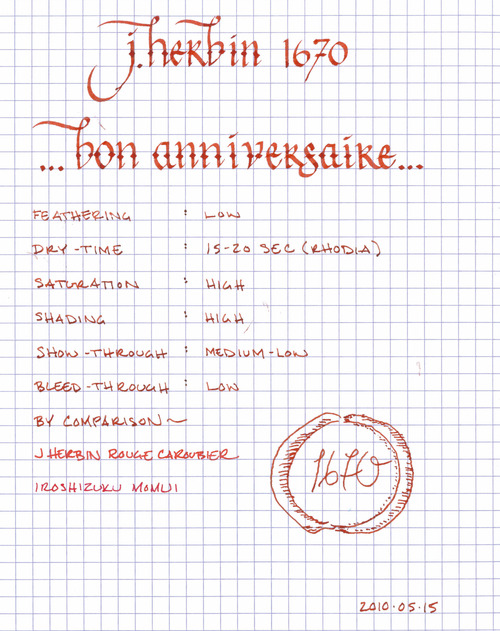
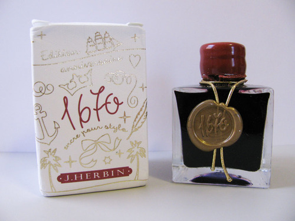

Rating: 5.0
May 16, 2010

I bet that if the devil ever asked you to sign a contract in blood, you could fool him by pulling out a fountain pen filled with J. Herbin 1670 anniversary ink. The color is called Rouge Hematite, after the mineral hematite, which derives its own name from the Greek word for blood. Justly so – there’s really no mistaking it – this is the color of ink you’d expect to be filling Dracula’s ink well.

Ghoulishness aside, 1670 is an utterly amazing dark red color with “earthy overtones” that J. Herbin developed to celebrate the 340th anniversary of the company. According to them, the ink is “a reminder of the historic color of the Herbin logo and the sealing wax used by the members of the royal courts.” This description is particularly apt, for in a wet nib of any size, 1670 exhibits magnificent shading that evokes the highlights and shadows of an embossed wax seal. However, in a dry writing pen, 1670 displays another side of its personality, where the deep red gives way to dusky, orange highlights. As a result, this is one of the most complex inks I’ve had the pleasure of using.

1670 is highly saturated, and as a result is thicker than other J. Herbin inks. It’s not quite at Noodler’s ink levels of saturation, but it is close. Perhaps because of the viscosity of the ink, feathering is very low on all paper I tested it with, from the thin paper of a Moleskine cahier to the thick, absorbent paper of an Ecosystem notebook, to the reference-quality paper of a Rhodia bloc pad. Show-through on all of these papers was generally low, though it varies with the thickness of the paper; it was noticeable on the cahier paper, but not enough to be distracting. Bleed through, even with my very wet Lamy Studio, was nonexistent on everything except for the cahier, where it was present but minimal.

The drying time of 1670 is noticeably longer than other J. Herbin inks. On Rhodia paper, a wet line took between fifteen and twenty seconds to dry fully, whereas on the absorbent paper of my Ecosystem notebook, it was dry to the touch in about five seconds.

Surpassing the beautiful bottling of their other inks, 1670 comes in a very special 50ml bottle. It has a gold wax seal on the front of the bottle, and the cap has been dipped in a red wax that matches the color of the ink. I have two complaints about the bottle, despite its beauty. First, the neck of the bottle is extremely narrow. It would be difficult to fit anything much wider than a Lamy Safari through, and as a result it is definitely not conducive to being able to tip the bottle to get the last drop of ink out. Second, the wax on the cap is extremely fragile and prone to crumbling. I have read that the manufacturer is planning on rectifying this in future production, but as of now, expect it to start falling apart soon after you get the bottle.

Overall, J. Herbin 1670 is an amazing ink – one that makes me excited to see what they will produce next. Though I’ve only had the bottle for a few days, it has already surpassed Iroshizuku Momiji as my favorite red ink. The color is dark and rich enough to be easily readable on both white and off white paper, and I see myself using it for much of my daily writing. Of any red ink that I’ve used, it is the best candidate for being business appropriate – there is a certain gravitas to 1670 that its cousins lack.

I’d recommend picking up this limited edition ink while you can, as it is my understanding that J. Herbin is planning on producing this only during the anniversary year of 2010.

Review materials: For the wide strokes, I used a Lamy 1.9mm steel calligraphy nib on a Lamy Joy pen. For the fine strokes, I used a wet-writing, EF 14k gold Lamy nib on a Lamy Studio. The paper is Rhodia 80 gsm from a Rhodia Bloc No. 16 pad.
