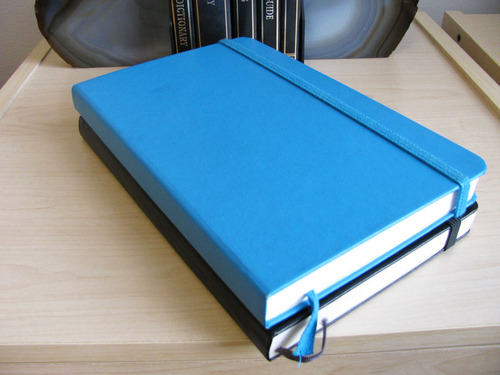
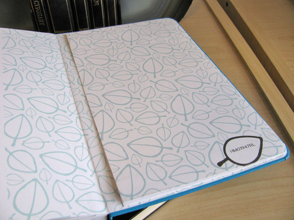
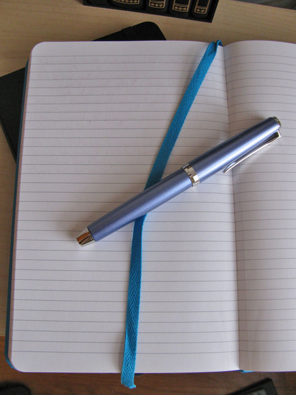

Rating: 4.5
June 13, 2010

Much has been discussed about Ecosystem’s commitment to producing a green notebook. The bright, white, 100% post-consumer, recycled paper by New Leaf Paper is prepared using a chlorine-free bleaching process and printed with a soy-based ink. It has an organic cotton bookmark, and the cover is coated with a water-based acrylic.

Additionally, all of the components are sourced in the United States, which cuts down on the cost and carbon emission of transportation. Even the binding, sewing, and cutting are done in a facility with an ecological savings program.

However, their commitment to producing sustainable and ecologically sound products would be for naught if the books themselves weren’t any good. Fortunately, they’re great.

In November of 2009, I purchased a medium, hardback, author (ruled) notebook from Barnes & Noble, and I’ve been using it as my writing journal since. It is exactly the same size and shape as a large Moleskine journal, though it is thicker due to its heavier weight paper. I purchased mine in “lagoon,” which is Ecosystem’s term for their light, sea-blue color covers.

One of the odd things about the Ecosystem line is that certain combinations of size, cover type, and internal paper are only available in certain colors. The medium hardback author notebook at the time of purchase was only available in lagoon (blue), watermelon (pink), and onyx (black). The artist (blank) book was available in kiwi (green), though, and the same size was available in a flexi-cover in clementine (orange). Ecosystem has recently added grape (purple) to their lineup as well – but only in certain combinations. It’s as odd approach, as I’m sure I’m not the only one who wants an orange, ruled hardback.

Ecosystem has adopted the Moleskine form factor for their books, which appeals to me. They feature rounded corners, a pocket in the back, a sewn-in bookmark, and an elastic band. I have noticed that the elastic bands on these books hold up better than their Moleskine counterparts, and don’t stretch out over time. The bookmark is not as long as Moleskine bookmarks, but it’s plenty big enough to do its job – I haven’t had any trouble with it in the six months I’ve been writing in it.

The front endpapers feature a distinctive leaf pattern, some explanatory text about Ecosystem’s mission and a space to record your name and contact information. The back features the same leaf pattern, the previously mentioned paper pocket, and a unique code with a special purpose. This code can be entered on the Ecosystem website to register one’s notebook, so that if it is ever lost, it can be used to contact the owner. Also, one can see the components that went into one’s individual book – and the environmental savings from it manufacture.

The binding in the hardback notebooks is sewn, so the book lies mostly flat. I say “mostly” because of my major quibble with the book – where most of the signatures meet, a bit of adhesive creeps up between the pages, locking them together near the spine. The adhesive never spreads more than a quarter inch, so the pages are entirely usable – but it’s a bit annoying when the rest of the book performs so admirably.

The paper itself is fairly smooth, though not as smooth as Clairefontaine or Moleskine paper; I have had no difficulty writing on the paper for long stretches of time. The author journal is ruled from edge to edge – the narrow rule provides for 32 lines per page, with a half-inch margin at the top and bottom. The ink itself is neither too bold nor too light – I find it just right for ease of use.

Ecosystem’s notebooks have microperferated pages, of which I was initially skeptical. One of the reasons that I prefer hardback covers is that I’m concerned about preserving the integrity of the book – I throw my notebooks in my bag every day, so they need to be rugged. However, the perforations strike just the right balance – there’s little danger of the paper separating without intentionally doing so, and when you do need to remove a page, it’s easy to accomplish, and a lot friendlier than trying to tear a page out of a Moleskine.

In fact, the perforated pages came in very, very handy when I was at my brother’s wedding, and used the notebook to write up my best man’s toast. After I’d written several drafts, I was able to cleanly and easily tear out the page with the final draft. It worked out marvelously.

So how does the Ecosystem paper stand up to fountain pen ink? The answer, it turns out, depends on the ink. Generally, the paper handles ink well – it is thick enough that show-through is very, very low and bleed-through is generally non-existent. Ecosystem paper is very, very absorbent, though – it drinks ink like it is going out of style – so, thin, easy-flowing inks like J. Herbin and Iroshizuku tend to feather more and produce a bolder line than they do on Rhodia or Moleskine paper. Also, it appears that one side of the paper feathers ever so slightly more than the other – no doubt an artifact of the manufacturing process.

However, using thicker inks like Noodler’s and Private Reserve on this paper is a revelation. I’d never been a fan of Noodler’s inks, in particular, because of their very long drying time on Moleskine notebooks – the ink can take upwards of a minute to dry. As a result, I found myself at odds with other fountain pen users who love Noodler’s – and reported no trouble with drying time. When I finally tried the ink on Ecosystem, though, I felt like I’d reached a new level of understanding when it comes to pen and ink. On this paper, Noodler’s and Private Reserve inks dry almost instantaneously – three to five seconds at the most. Additionally, because those two brands of ink are very resistant to feathering, they don’t suffer from the same level of “bold-ing” that other inks do on this paper.

I can’t recommend this combination of paper and ink enough. Ecosystem notebooks have opened up a whole segment of the ink market to me that I’d previously been avoiding, which, for someone who likes ink as much as I do, is a wonderful gift. Ecosystem products have become my preferred notebooks.

Ecosystem is a brand of Sterling Publishing, which is itself a wholly owned subsidiary of Barnes & Noble. Therefore it is unsurprising that I first found the Ecosystem books in my local Barnes & Noble. It appears that they are beginning to appear in other bookstores as well, and they are readily available online at the Barnes & Noble website or at the Ecosystem website itself.
