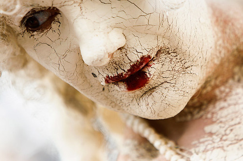
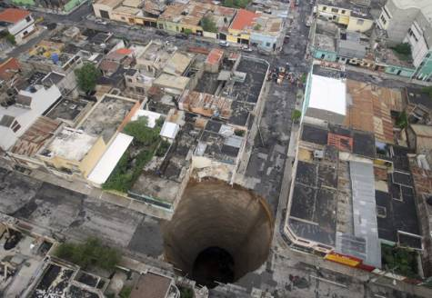

As an occasional speculative fiction writer, I am sometimes asked where I get my ideas from. “Everywhere” never seems to satisfy as an answer, and “I don’t know” is generally poorly received. So, I’ve spent some time thinking about it.

My general strategy is to look at people, places, or situations that would normally be absurd, and then to figure out how the world would have to fundamentally change in order to make them normal. That shift in reality becomes the setting of the work, and more often than not provides clues as to the main conflict of the story. To accomplish this, I use a variety of tactics.

First, I may take a scene, an image, or a bit of dialogue that makes sense in a particular context and then strip away that context. The challenge is to then create an entirely new context in which the object in question makes sense.

(MARKUS SCHREIBER / AP)

For example, the picture above is of a woman in costume at the Carnival of Cultures Parade in Berlin. Let’s strip away that context and create a new one. She looks a little bit like a porcelain doll – an aged and weathered living doll. Perhaps she lives in a world where opulence means having living artwork, where having a gallery full of sentient statuary is a display of wealth. If so, did her owner go bankrupt and lose his collection? Has she been moldering in a warehouse for a decade? What options would be available to her, now that she’s no longer in mint condition?

(REUTERS)

Even a picture with a very strong context can provide plenty of ideas. The image of the Guatemalan sinkhole is tragic, to be sure. But what happens if we strip away the natural explanation for the sinkhole and search for another? Is the core of the earth cooling ever so slightly, causing the interior of the crust to start collapsing? Is this the first of many sinkholes popping up all over the world? If so, how does the planet respond? Do we take to the oceans, which are much more stable? Or maybe there’s just an epidemic of Godzilla-sized moles. Either way, an idea emerges that’s worth exploring.

Second, I may take two ordinary items that wouldn’t typically exist together and then juxtapose them. For example, a child bouncing a ball is ordinary. An alligator is ordinary. A child bouncing an alligator is not so ordinary. The question is, then, what about the world has to fundamentally change so that a child playing with a bouncy alligator is normal? Is the boy a superhero? Are alligators made of rubber? Are they pets? How would living rubber animals fit into an ecosystem? How are they created?

One could even combine the two pictures above using the same technique. Perhaps the statue woman is from a race of under-earth dwellers who have finally decided to take over the surface world, and the sinkholes are their form of weaponry. That’s a much different story than either of the other two on their own.

So, those are two of the techniques that I use to generate ideas. How about you? And what story can you generate from the two pictures presented above?
