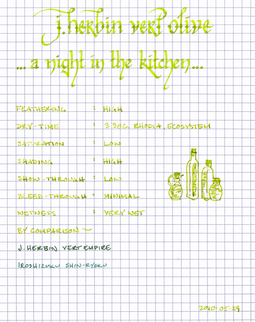
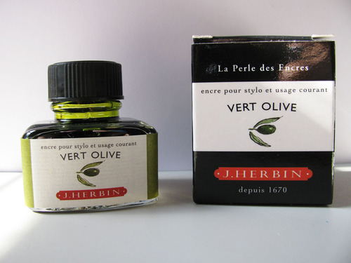

Rating: 2.5
June 08, 2010

J. Herbin Vert Olive should be an ink that’s the color of olives, but it is not. Instead, it is the color of extra virgin olive oil – an ephemeral, translucent yellow-green – as backlit by a fluorescent light. One could also describe it as the color of Mountain Dew. Either way, it’s a color found somewhere in one’s kitchen.  Its level of saturation is very low, but it does exhibit a very high degree of shading in both fine and wide nibs.

Vert Olive is a very wet ink – akin to Vert Empire or Blue Myostosis. It flows well, of course, but tends to feather significantly on every paper I tested: it was most noticeable in my Ecosystem journal, which is a very absorbent paper, and least noticeable on Rhodia paper, which tends to be feather-resistant. Show-through was low on all papers, fortunately, and I noticed bleed-through only on the thin paper of a Moleskine cahier.

Dry time is exceptionally fast. On Ecosystem, Rhodia, and Moleskine papers, Vert Olive was dry in less than three seconds. Consequently, writing on an incline seemed to produce no noticeable increase in drying time compared to writing flat for this ink.

There are plenty of green inks that are suitable for business use, but Vert Olive isn’t one of them. I could see it being used for highlighting or possibly editing, but not for correspondence. It is difficult to read on both white and cream-colored paper; while it provides plenty of contrast, the color is so vibrant as to be tiring on the eyes.

All of J. Herbin’s fountain pen inks come in a 30ml bottle with an integrated pen rest that is suitable for displaying on top of one’s desk.

While Vert Olive is a beautiful ink, due to its brilliant color I can only see using it for editing, highlighting, calligraphy, or other artistic endeavors.

Note on the scan: on my computer screen, the scan is slightly brighter than the actual ink, but only slightly. It is a very vibrant ink.

Review Materials: for this review, I used a Lamy 1.9mm steel calligraphy nib on a Lamy Joy pen for the wide strokes. The fine strokes were made using a Pelican M205 Demonstrator with a medium steel nib. The paper is Rhodia 80gsm. I also tested using a Moleskine cahier and an Ecosystem notebook.
