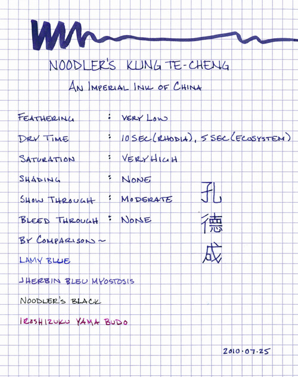
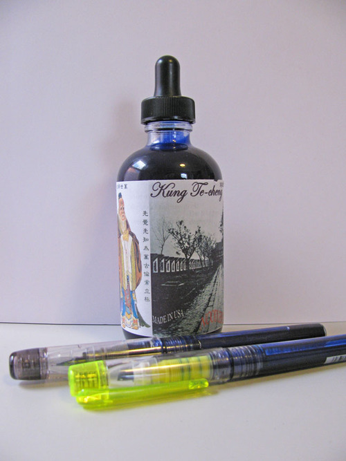

Rating: 5.0
July 25, 2010

Noodler’s Kung Te-Cheng is a beautiful, imperial ink that is the color of sapphires dipped in an indigo dye. According to the manufacturer, this ink is their attempt to replicate the characteristics of the first royal ink of ancient China – an ink was used during government exams during the age of Confucianism. Due to the connection to Confucius, they have named it after his 77th direct descendant, Kung Te-Cheng (1920 – 2008). They put a great deal of research into finding ancient examples and modern samples to base the color on, and have, as a result, developed an exquisitely beautiful ink.

Kung Te-Chung is described as “purple,” which is technically accurate, since it sits on the color spectrum between blue and violet. However, it is not the red/blue that we’re accustomed to thinking of when we think of purple. It is more accurately described as a rich, deep blue with a tinge of indigo. It is highly saturated, though not as much as some other Noodler’s inks, and thus puts down a consistent solid line in both fine and wide nibs.

As expected from a Noodler’s ink, feathering was nearly nonexistent on all of the paper I tested this ink with – Moleskine, Rhodia, and even standard copy paper. It is a very dark and saturated ink, so I was unsurprised that there was a medium amount of show-through on Moleskine paper. It is enough to notice, but not enough to bother me. The ink is well behaved with regard to bleed-through, though – I noticed none on any of the papers I tested.

The drying time of Te-Cheng is surprisingly quick compared to other Noodler’s inks. On Rhodia and Moleskine paper, it was dry in less than ten seconds, while on Ecosystem and copy paper, it dried in less than five seconds. Since I find that dry time is one of the most limiting factors to my enjoyment of many Noodler’s inks, this was a wonderful discovery.

Kung Te-Cheng is a “bulletproof” ink, meaning that it can’t be removed from a document. According to Noodler’s, its bulletproof inks bind with the cellulose in the paper, making it impervious to most forging techniques. I can attest that this is indeed a waterproof ink, since I completely soaked a page of Rhodia paper and this ink went nowhere.  It didn’t move, bleed, or decrease in intensity at all.

Unlike most Noodler’s inks, Kung Te-Cheng ships in a circular 4.5 oz bottle with an eyedropper lid. Like their other inks, the bottle is stark and utilitarian – nothing you’d want to set on top of your desk to display. It also comes with a Platinum Preppy fountain pen and a Platinum Preppy highlighter that have been converted to an eyedropper feed.

The fountain pen has a fine, black, anodized steel nib, which is marked with “03.” Medium Platinum nibs are marked with “05.” The bodies of both the pen and the highlighter are clear plastic, allowing you to see the ink filling the barrel – which with an ink this color is quite nice to look at. The pen itself is a good value for the $3 that it normally retails for, though the nib is slightly scratchy and takes a couple of strokes to start back up after it sits idle for a few seconds.  Overall, it lays down a nice solid line that is neither overly wet nor overly dry and is balanced well enough to be comfortable in the hand.

The highlighter, on the other hand, lays down a river of ink that takes forever to dry. Moreover, the chisel tip has neither the precision of a calligraphy nib nor the versatility of a brush. I don’t think that the highlighter is a good vehicle for this ink. It would be great for the highlighting ink that Noodler’s also manufactures, but not for Kung Te-Cheng.

The instructions warn that, because the formulation for this ink is unusual, it should only be used with the supplied pens. Apparently, the eyedropper fill and the feed of the Platinum Preppy reduce the possibility of clogging and keep the flow of the ink even. I have read, however, that a number of adventurous fountain pen aficionados have used it in a wide variety of pens without issue. As with all fountain pen inks, it is important to practice good pen hygiene, cleaning them regularly and emptying them if intending to let the pen sit without use for an extended period. This is all the more important when dealing with highly saturated inks like this one.

Kung Te-Cheng is a wonderful ink – one that I’m glad I discovered. It is well behaved on paper and dries quickly. Though I normally prefer inks with a high degree of shading, this is such a fantastic color that it is now my favorite blue ink. It is very easy to read on both white and off-white paper, and it is appropriate for both personal and business use.

Review Materials: for the wide stroke, I used the supplied eyedropper pen with the marker tip. For the narrow strokes, I used the Platinum Preppy with a fine 03 steel nib. The paper is Rhodia 80 gsm from a Rhodia Bloc No. 16 pad.

Note: This bottle of ink was graciously supplied for review by Lily Kim at Jet Pens.

[Noodler’s Kung Te-Cheng at Jet Pens](http://www.jetpens.com/product_info.php/cPath/55_676_738/products_id/3840)
