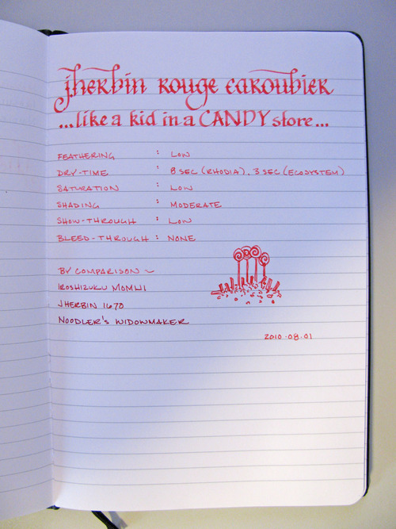
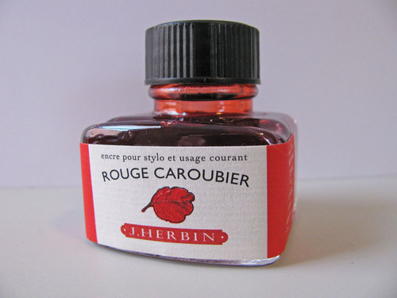

Rating: 4.0
August 18, 2010

J. Herbin Rouge Caroubier (red carob) is a bright red the color of cherry gumdrops. Using it makes me want to run out and buy a big bag of Swedish Fish, as it has low saturation, giving the ink a somewhat translucent feel – just like gummy candy. It exhibits a moderate level of shading in both calligraphy and fine nibs.

Like other J. Herbin inks, Rouge Caroubier flows well. It is not as wet as Vert Empire or Blue Myostosis – falling into the same category as Orange Indien or Poussiere de Lune. With each of the papers I tested it on, Rouge Caroubier exhibited a low amount of feathering. It was slightly noticeable in my Ecosystem journal, which is a very absorbent paper, but was not noticeable at all on Rhodia paper. Show-through was minimal, even on the thin paper of a Moleskine cahier, and I did not notice any bleed-through on any of the papers that I tested.

The drying time of this ink seems to be fairly consistent between Rhodia and Moleskine – about eight to ten seconds. However, on a very absorbent paper like Ecosystem notebook or printer paper, the ink dried in less than three seconds. Writing on an incline seemed to produce no noticeable increase in drying time compared to writing flat for this ink, at least in the pen I was using to test with.

Except for editing functions, red inks are not generally business appropriate, and this one is no different. For editing and proofing, though, it excels – being quite bright and providing very high contrast on white paper. The color is a bit too bold to use in a journaling capacity, in my opinion, but your mileage may vary.

J. Herbin fountain pen inks come in a 30ml bottle with an integrated pen rest that is suitable for displaying on top of one’s desk. The bright red label on Rouge Caroubier makes this bottle especially eye catching.

I am a big fan of red inks, and Rouge Caroubier is one I’m glad I have in my arsenal. I don’t use it often, but I don’t have another ink quite like it.

Note on the image: I normally scan my ink reviews, but this ink was very difficult to capture correctly when scanned. Therefore, I had to take a photograph of the review.

Review materials: For the wide strokes, I used a Lamy 1.9mm steel calligraphy nib on a Lamy Joy. For the fine strokes, I used a Lamy EF steel nib on a Lamy Safari. The paper is Clairefontaine 90g paper in a Quo Vadis Habana notebook.
