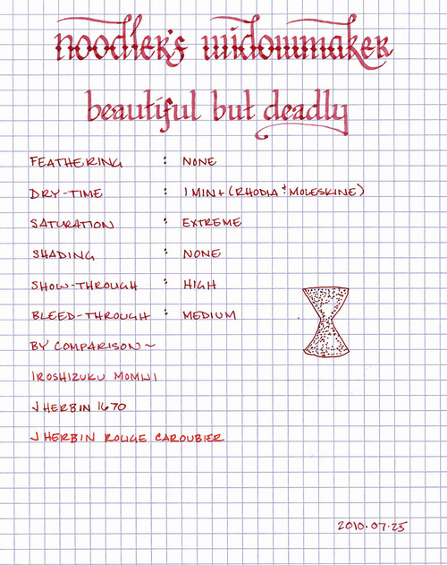
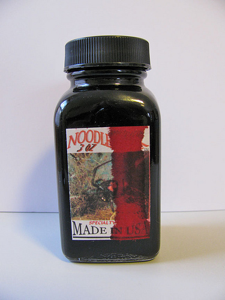

Rating: 3.0
August 03, 2010

Noodler’s Widowmaker is a hard color to pin down, as it changes character based on the underlying paper. On the bright white paper of a Rhodia pad, it comes across as a very dark, earthy magenta, whereas on the cream color of a Moleskine notebook, it looks a bit like dried blood, with a brown cast to it. While the ink itself is highly saturated, and thus the hue doesn’t actually change, the contrast between the ink and the paper greatly affects one’s perception of it.

Like most other Noodler’s inks, this one is very highly saturated, so I advise shaking the ink bottle before filling to make sure the dye is evenly distributed. Also, good pen hygiene is important; make sure to flush your pen well between every few fills of this ink. However, the high saturation does result in a very consistent line – in all but the widest nibs there is no shading to speak of. Also, as is common with Noodler’s ink, Widowmaker is very feather-resistant. I saw almost no feathering on any of the paper I tested it on, including garden variety copy paper, which tends to feather dramatically with most fountain pen inks.

Unfortunately, I’m not sure whether the Noodler’s fountain pen I used to test this ink lays down an extra wet line, or whether this ink has a higher penetrating power than normal, but I saw significant show-through in my Moleskine journal and a fair amount of bleed-through on thinner paper of all varieties. Thicker paper, like a heavier-weight copy paper or Ecosystem’s journal paper stood up better, overall.

With regard to dry time, this ink behaves like most of the other Noodler’s inks I’ve used, in that it exhibits a wide range based on the paper. On Moleskine journals and Rhodia notebooks, the ink takes upwards of a minute to fully dry. On the more absorbent paper of an Ecosystem journal or on standard copy paper, however, it dries between 8 and 10 seconds. Generally, it is going to be too slow to dry for lefty over-writers, regardless of paper, but it behaves well enough for fast-paced writing by everyone else on absorbent paper.

Noodler’s Widowmaker comes in a 3 oz. bottle that is filled to the brim – so be careful when opening. See the picture above for what a gentle bump to the very, very full bottle can do. Noodler’s intentionally uses stock bottles and lids to keep their prices low, which means that they aren’t intended to be attractive in and of themselves. They are functional and stable, but not something one would display on one’s desk.

Widowmaker is an interesting ink, but I’m struggling to find an appropriate role for it in my collection. It’s dark enough to be easy to read, so I can see using it for journaling, but I personally prefer ink with a higher degree of shading, like J. Herbin 1670. For those that prefer a solid, consistent line, and typically use absorbent, heavier weight paper, Widowmaker might be a good choice.

Review Materials: for the wide lettering, I used a 1.9mm steel calligraphy nib on a Lamy Joy. For the narrow lettering, I used the fine medium steel nib on a Noodler’s piston fill pen. The paper is Rhodia 80gsm from a No. 16 Bloc pad.
