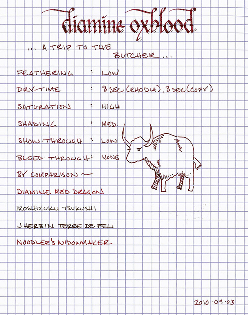
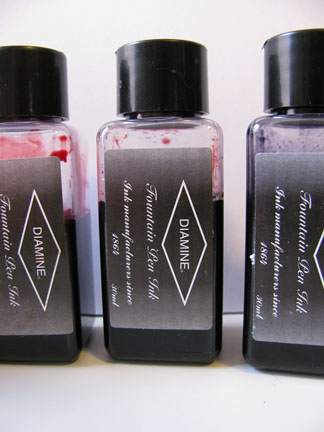

Rating: 4.0
September 14, 2010

Some inks are simply too appropriately named. Diamine Oxblood is one such ink. It is a well-behaved red-brown that falls firmly into the “dried blood” category. If you’ve ever brought a juicy steak home from the butcher and taken a look at the butcher paper, you know exactly what’s in store for you. Oxblood is highly saturated with a surprising level of shading. On both the off white of Moleskine paper and the bright white of Rhodia paper, this ink creates a bold, bloody line.

As with the other Diamine inks that I’ve tried, Oxblood flows easily, and provides a nice level of lubrication, allowing the pen to glide easily across the page. It is not as thin as J. Herbin inks, nor as thick as Noodler’s inks; it sits nicely in the middle. I noticed very little feathering on any of the papers I tested this with. It is a very strong color, but doesn’t exhibit much show-through. It also behaves well with regard to bleed though – I noticed no bleed through with an EF nib on Rhodia, Moleskine, and garden variety copier paper.

The drying time was very good. On Rhodia paper, on which ink often takes longer to dry, it took eight seconds. On standard copier paper, it was dry to the touch in three seconds.

Diamine inks are available in a 30ml plastic bottle and an 80ml glass bottle, both of which are utilitarian in appearance. The smaller plastic bottle has a neck that is very small in diameter. I found that some of my larger pens, like a Lamy 2000, would not fit all the way in, which made getting to the ink a bit of a challenge. My recommendation would be to go for the larger bottle.

Oxblood is an interesting ink – I like it, though I prefer the new Diamine Red Dragon. It’s not quite business appropriate, unless you specialize in exchanging limitless power for souls. It’s also a little too dark for use in highlighting and proofing. However, it works well for journaling and personal correspondence. In my judgment it is easy to read, pleasant to write with, and behaves very well on all of the papers I tested it with. If you’re partial to red-brown inks, I have no reservations at all recommending it.

Review Notes: for the wide strokes, I used a Lamy 1.9mm steel calligraphy nib on a Lamy Joy. For the narrow strokes, I used an EF steel nib on a Lamy Al-Star. The paper is Rhodia 80gsm from a No. 16 Rhodia Bloc Pad.

Note on this review: a sample of this ink was provided for review purposes by Diamine Ink.
