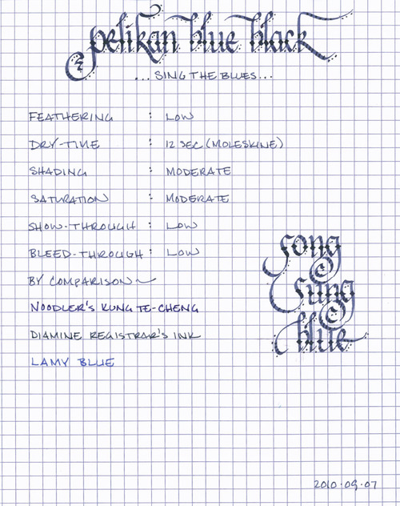
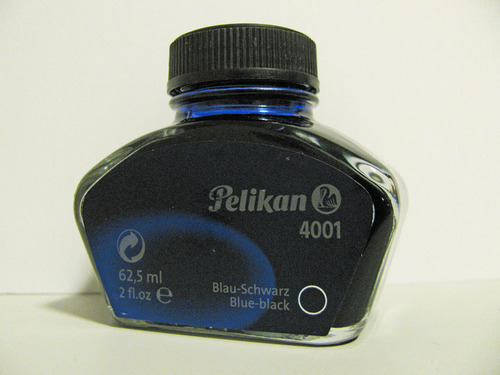

Rating: 4.0
September 21, 2010

Pelikan Blue Black is a member of Pelikan’s 4001 ink line – their standard, bottled fountain pen inks. It is a pleasant blue-grey that reminds me of denim, and is moderately saturated while exhibiting a modicum of shading. The color of the ink is not dramatically affected by the color of paper – it lays down a consistent line on both bright-white Rhodia paper and off-white Moleskine paper.

Blue Black is a dry writing ink, which makes it a great choice for taming wet-writing pens. It’s about as dry as Lamy Blue, but provides much better lubrication. In my Pilot Falcon with a medium nib, this ink produces a line more like a fine nib. As a result, this ink demonstrates a very low level of feathering, show-though, and bleed through – even on the thin paper of a Moleskine cahier. Surprisingly, though, the drying time was longer than I expected – it took twelve seconds on Moleskine journal paper before it was smudge-proof.

When I ordered this ink, I was under the impression that it was of the waterproof variety. Alas, I was mistaken. According to Pelikan, this is not a waterproof ink. It’s permanent, in the sense that it is resistant to fading, but it is not waterproof. My testing reveals that it does possess a moderate degree of water resistance. Running it under water gradually reduced the strength of the line over the course of several minutes, and rubbing the ink while wet increased the rate of dispersion. Thus, I think it’s appropriate for addressing envelopes – a little rain won’t render it illegible – but wouldn’t be my choice for signing checks.

Pelikan inks come in both 30ml and 62.5ml bottles. While they’re not especially fancy, they’re aesthetically pleasing enough that they could sit atop one’s desk instead of in the drawer. The 62.5ml bottle that I purchased has nice, wide mouth, which is good, but also has a flat bottom, which I suspect will make soaking up the very last drops of ink more difficult than it needs to be.

Pelikan Blue Black is my first experience with Pelikan inks, and from what I’ve seen, it won’t be my last. It’s definitely geared to business use, as blue-black is a traditionally conservative ink choice, but it’s perfectly usable for personal journaling. While it’s not especially exciting, it is a good partner for my wet-writing pens, it’s inexpensive in quantity, and it behaves quite well on all of the papers I’ve tested it with. I predict that it will stay in my rotation – it’s a good, solid, workhorse of an ink.

Review notes: for the wide strokes, I used a Lamy 1.9 mm steel calligraphy nib on a Lamy Joy. For the narrow strokes, I used an EF steel nib on a Lamy Safari. The paper is bright white 80gsm from a Rhodia No. 16 Bloc Pad.
