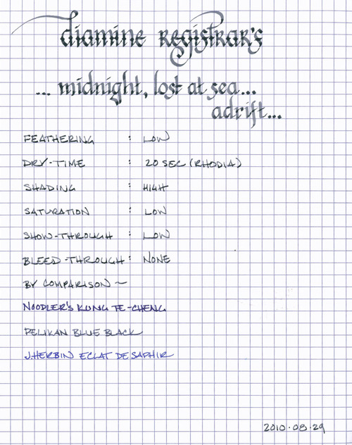
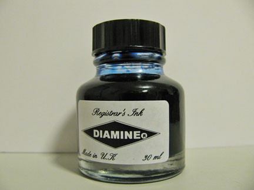

Rating: 4.0
September 03, 2010

In addition to writing ink reviews, I love to cook. Over the years, I’ve compiled all of my favorite recipes into a Moleskine journal so that I have my very own recipe book. For a long while, I used a Sharpie pen, which has a high degree of water resistance. After my switch to fountain pens about a year ago, though, I recorded recipes in whatever fountain pen ink I had in a pen at the time – which, as I found out the hard way last week, generally have a very low degree of water resistance.

I was cooking with my book on the counter, when I dropped some water. Then, I looked down to find that my recipe for fresh salsa was now a delightfully fuzzy blob of Café des Isles. I may have discovered a new career painting abstract watercolors, but was a bit dismayed by the resulting illegibility of my recipes. Thus, I began a quest to try out waterproof inks.

Noodler’s Ink has a number of bulletproof inks, including the fantastic Kung Te-Cheng, but I was curious about the more traditional blue-black inks, so I started my search with Diamine Registrar’s Ink. It is a modern version of iron gall ink, which was the most common form of ink used in Europe from the 12th through the 19th centuries. When used on vellum or paper, it cannot be removed by rubbing or washing – only be scraping away a layer of the writing surface.

Traditional iron gall ink has one very specific caveat. It is produced by combining iron salts with tannic acid extracted from various vegetable sources (traditionally from oak galls, which are hard, brown spheres that grow on oak trees and house wasp larvae – for real – nature is weird), which means that it is not pH neutral. Over time, the acidic nature of the ink will gradually eat away at vellum and paper, and, more concerning, can contribute to the corrosion of any steel components on a fountain pen.

Diamine’s modern formula contains fairly low concentrations of the iron gall compounds, so it is safe for both paper and pen, though practicing appropriate pen hygiene – cleaning it thoroughly between fillings and emptying it before storing it for extended periods of time – is always a good idea.

The first thing I noticed is that, when Registrar’s ink hits the paper, it is a lovely, light blue-grey with very low saturation - it’s light enough that I was confused at first - it’s more akin to a wash than an ink. The second thing I noticed, though, was an amazing transformation – as the ink dries, it turns a dark blue-grey and exhibits a phenomenal degree of shading. Then, a third surprise – over the next day as the iron in the ink oxidizes, it darkens even more to a true blue-black. On the bright white paper of Rhodia, the fully oxidized ink has the character of the sea at midnight – mysterious and deep. On off-white paper, like Moleskine, the blue tones are disguised and the ink appears almost completely black.

I noticed very little feathering on any of the papers I tested this with, from the feather-resistant Rhodia to cheap copy paper. Additionally, it is definitely waterproof, as advertised. Running it under water for over a minute resulted in no movement of the ink at all – not even a little feathering. Rubbing it while underwater resulted in very slightly tinted water, but I noticed no diminishing of the lines on the paper. I’m quite impressed.

This is a dry ink that does a good job of taming my very wet-writing Lamy Studio. This pen is normally a gusher, but I noticed very little show-through and no bleed-through even on the thin paper of a Moleskine cahier. It has a thin feel, though, and provides no lubrication, so the EF nib was a bit scratchier than I am used to. Drying time was fairly standard: 20 seconds on Rhodia and Moleskine, and 8 seconds on standard copy paper.

Diamine Registrar’s Ink is sold in 30ml glass bottles and 100ml plastic refills. The glass bottle is functional and not much more. It has a simple label with the Diamine diamond logo on the front and a nice, secure lid. It’s the kind of bottle that one shoves in the drawer when one is finished with it.

I’m happy that I decided to investigate blue-black inks. Diamine Registrar’s ink has a magical character, and has a wide range of applications. As a permanent ink, it’s definitely business appropriate, and would make a good signature ink. It’s also interesting and well-behaved enough to use for daily writing and journaling. The only drawback is that it is more expensive than many standard inks – but for those who value permanence in their fountain pen ink, it’s a premium worth paying for.

Review notes: for the wide strokes, I used a Lamy 1.9mm steel calligraphy nib on a Lamy Joy pen. For the narrow strokes, I used a Lamy Studio with an EF gold nib. The paper is Rhodia 80gr bright, white paper.
