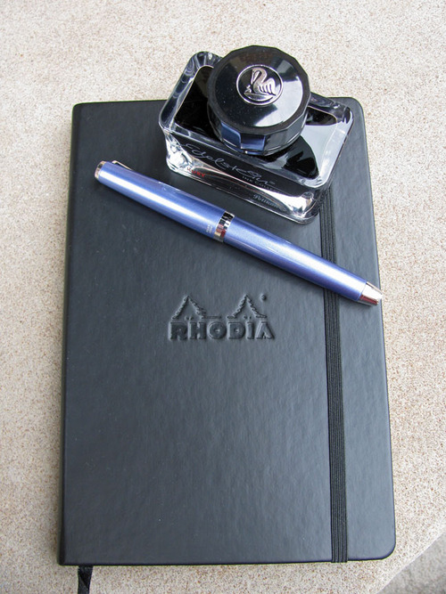
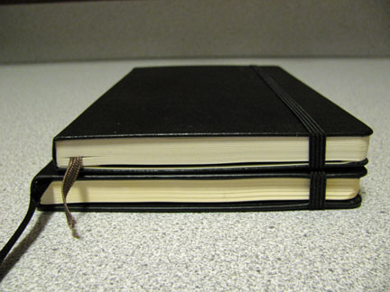
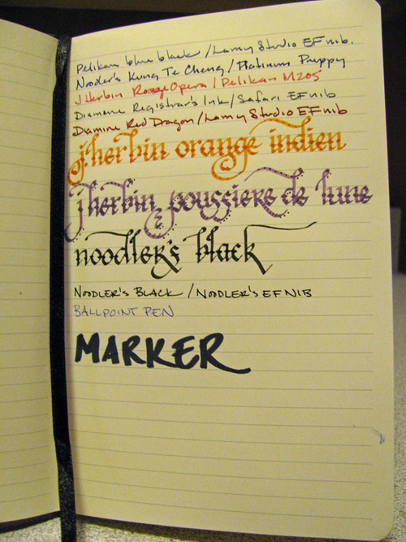

Rating: 5.0
September 30, 2010

I’ve been keeping writing journals for well over a decade, since I began the practice back in college. During that time I’ve used a wide variety of notebooks: ruled Moleskines, leather-bound blank journals, books with black paper that had to be written on with colorful gel pens, books that cost one-dollar, books that cost sixty dollars, spiral bound, hard bound, hand-bound, large, medium, small – the list goes on and on. However, I have never abandoned a journal to move on to the next, more interesting notebook – no matter how many I had sitting at the ready.

Well, I’ve never been more tempted to jump ship than I am now – the A5 Rhodia Webnotebook is fantastic. It is slightly larger than a large Moleskine journal – the same height, but about half an inch wider. It is approximately the same thickness, though it contains 96 sheets (192 pages) of paper versus the 120 sheets (240 pages) of a Moleskine, and has similar accoutrement: a sewn-in ribbon bookmark, a pocket on the inside of the back cover, and an elastic closure that runs vertically from top to bottom. Additionally, its signatures are stitched, so it lies flat when open.

In other ways, as well, the Rhodia shows subtle differences from a Moleskine. The large, ruled notebook has 27 lines versus 30, and the rules do not stretch from edge to edge. Its paper is ivory instead of the off-white of a Moleskine. The cover is slightly softer and thicker to the touch than its competitor, and the Rhodia logo is embossed on the front center of the book rather than the lower back. Like Moleskines they come in two colors: black and, in this case, orange.

Where the Webbie markedly differs from a Moleskine is the paper. It is filled with 90 gr Clairefontaine paper, which is an utter joy to write on. As I mentioned in my Quo Vadis Habana review, Clairefontaine paper is regarded by fountain pen aficionados as some of the best in the world to write on. It is silky smooth, and even scratchy nibs glide easily over the surface.

The paper is of low absorbency and resists feathering – standing up perfectly to wet inks like J. Herbin and Iroshizuku. The trade-off is that most inks take much longer to dry on this paper than on more absorbent paper, like an Ecosystem notebook or standard copier paper. Noodler’s inks, in particular, often take upwards of a minute to dry on Clairefontaine paper when they take only seconds to dry on standard office paper.

The 90 gr paper is thick enough to stand up very well to the wettest inks. I noticed no bleed-through from fountain pen inks at all during my testing, and the amount of show-through is noticeably less than in a Moleskine notebook. It also handles other media well – I had no trouble with a garden-variety ballpoint pen. A permanent marker bled through, but did not mark the underlying page.

It’s worth pointing out that the Webnotebook has gone through several revisions here in the US. The first version used 80 gr paper that was not manufactured by Clairefontaine. From what I have heard, it was not especially fountain-pen friendly. The second version had tightly sewn signatures, which caused problems with the book lying flat. It also had a Rhodia logo emblazoned on the bottom of each page.

The third generation of Webnotebook is the one I have – and which is the one that I recommend without hesitation. The logo has been removed and the signatures loosened up enough to allow the book to lie flat without issue. Another recent development is the availability of a blank version, for those that prefer an unlined notebook.

The only cause for concern is the relative price and the availability. Moleskines are available everywhere it seems, whereas I’ve only been able to find the Webnotebook in a local stationary boutique.  Also, the Webbie costs slightly more – but at this price point, what’s a dollar or two?

I’m prepared to declare the Rhodia Webnotebook the single best Moleskine-type notebook on the market. If you enjoy the act of writing on paper, especially with a fountain pen, then this is the book for you.

Note about this review: a review copy of the Rhodia Webnotebook was graciously provided by Karen at Exaclair – Rhodia’s US distributor. Once I finish this one, I plan to buy a dozen more – all in orange.
