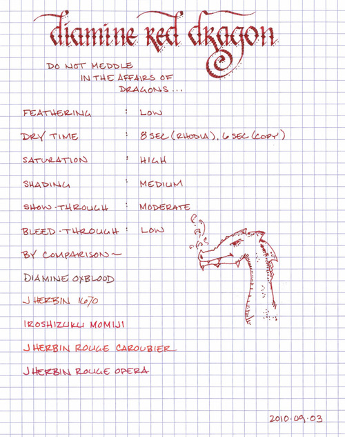
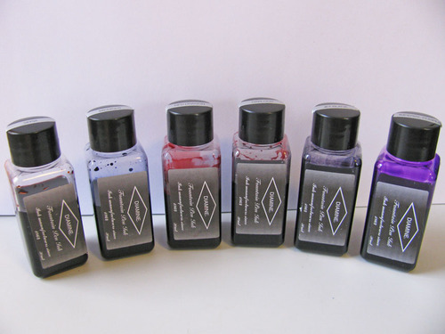
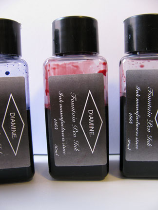

Rating: 5.0
September 07, 2010

I love red inks, and Diamine Red Dragon has just won a place in my top three. I’ve had a lot of experience with J. Herbin, Iroshizuku, and Noodler’s inks, but, up until recently, had no experience with Diamine inks. I’d read many flattering things about them online, so I figured that I should give them a shot. The lovely folks at Diamine were nice enough to send over six bottles for review, and Red Dragon is the first of them.

To appeal to my tastes, an ink brand has to possess a certain set of qualities. They need to have bold, interesting colors with moderate to good shading; they should be resistant to feathering; and they need to be quick to dry on the paper I most often use them with. Noodler’s inks are often bold and interesting, but take forever to dry on higher quality paper. J Herbin inks possess tremendous shading potential, but are often watery and prone to feathering. Thus far, Diamine seems to possess each of the qualities that I’ve mentioned.

Red Dragon is a newly released color from Diamine – one that is just beginning to show up in US retailers. It is a fantastic orange red (as opposed to a pink red or purple red) with earthy overtones. It is aptly named, as it is bold and powerful, yet dignified in character. It is slightly darker than J Herbin 1670 – which I would describe as its closest competitor – and is similarly highly saturated. It has a moderate level of shading – enough to be appealing to those who like shading, but not so much to be distracting to those who prefer a solid line.

This ink has a nice level of readability. It’s not a blindingly bright red, like J Herbin Rouge Caroubier. Rather, it is pleasant to read on both bright white and off white paper, which makes it easy to use for daily writing. Like most red inks, it’s probably not appropriate for conservative business use, but it is unlikely to offend anyone. In such settings, it could easily be used for highlighting or proofing.

The drying time for Red Dragon was quite acceptable. On the slow-drying Rhodia paper, it was dry to the touch at eight seconds. On garden-variety copier paper, it dried slightly more quickly at six seconds.

Show-though was noticeable on Moleskine journal paper and minimal on Rhodia paper, but in neither case did I find it bothersome. I did notice a small amount of bleed-through on the thin paper of a Moleskine cahier, but not on any of the other papers I tested.

Diamine inks are available in a 30ml plastic bottle and an 80ml glass bottle, both of which are utilitarian in appearance. The smaller plastic bottle has a neck that is very small in diameter. I found that some of my larger pens, like a Lamy 2000, would not fit all the way in, which made getting to the ink a bit of a challenge. My recommendation would be to go for the larger bottle.

Red Dragon has managed to unseat Iroshizuku Momiji as my second favorite red ink, which is something I never thought would happen. Its depth of character, good behavior, strong readability, and versatility put it just behind J. Herbin 1670 on my list, which is no small feat. I recommend it heartily.

Review Notes: for the wide strokes, I used a Lamy 1.9mm steel calligraphy nib on a Lamy Joy. For the narrow strokes, I used an EF steel nib on a Lamy Safari. The paper is Rhodia 80gsm from a No. 16 Rhodia Bloc Pad.

Note on this review: a sample of this ink was provided for review purposes by Diamine Ink.
