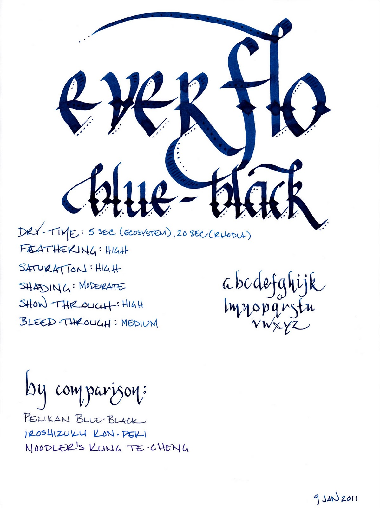
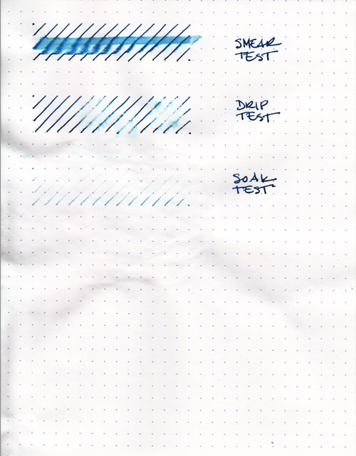
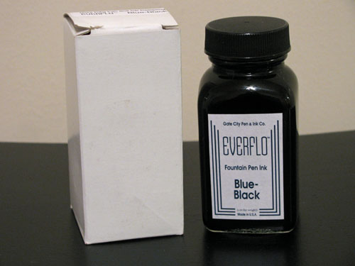

Rating: 1.0
January 11, 2011

After I've finished writing an ink review, I'm left with anywhere from four to six pens lying around with several milliliters of ink still in them. Typically, I empty the pens back into the ink bottle they came from, in order to save the ink for later. Occasionally, I like an ink enough that it stays in the pen I used to test it until I'm distracted by the next wonderful ink to cross my desk. More rarely, I'll be so crazy about an ink that it takes up near-permanent residence in my ink rotation: Noodler's Kung Te-Cheng, Diamine Imperial Purple, J. Herbin 1670. Everflo Blue-Black, on the other hand, is the first ink that went right down the drain.

Let's not get ahead of ourselves. Everflo is a new line of ink introduced by the Gate City Pen and Ink Company, a partnership established in 2010 between well-respected nibmeister Richard Binder and Jim Baer. Their stated purpose is to build vintage-style, handmade pens, and to offer ink with vintage behavior to match. However, I'd bet my trusty Lamy Safari that Everflo is actually produced by Noodler's Inks for Gate City. The bottles, caps, and even boxes are exactly the same as Noodler's Ink – even down to the marks on the bottom of the bottles.

The identity of the ink manufacturer is irrelevant, though, since, in my estimation, no one should want to claim credit for it. It is the singularly worst-behaving ink that I've ever had the displeasure of putting in a pen.

The color is probably the best quality of this ink. While named "blue-black," it is different than a traditional blue-black. This ink is a lovely, dark, saturated blue-green that develops a hint of black when used in a wet writing pen. In a dry writing pen, like the trusty Lamy Safari that I just put on the line, the "black" part of the blue-black is lost, but it nevertheless remains a lovely dark teal. It provides for moderate shading, though this is most evident in a wet writer. In a dry writer, it is much more consistent.

I also give the ink credit for being well-lubricated. It does help the pen glide nicely across the page. It's too bad that the interaction with said page is where things go all pear-shaped.

When I first got this ink, I decided to load it into my Pilot Falcon with a soft-medium nib. It is one of my wettest writers, and when I put ink to paper, I thought that it might be the culprit for the heavy feathering, significant show-though, and noticeable bleed-through that plagued every paper I tried. However, even when I switched to my Lamy Safari with an EF nib, the problems remained.

I tested with both pens on Rhodia, Moleskine, and Ecosystem paper. Rhodia was the best behaved, as expected, with no feathering as a result of either pen. However, I noticed significant show-through with both pens. I also noticed significant bleed-through with my Noodler's Creaper flex nib pen, and with my Pilot Parallel calligraphy pens. Even a fine line took upwards of twenty seconds to dry.

Moleskine was, by far, the worst performer. Both pens made a mess of the paper – with extreme amounts of feathering and show-through, and significant bleed-through. Drying time with the Safari was in the twelve to fifteen second range. The absorbent paper of the Ecosystem notebook reduced the drying time to five seconds, which is manageable, but suffered from noticeable feathering and show-through, and even a bit of bleed-through from both pens.

Water resistance is intentionally absent, as Everflo inks are designed to be washable. The smear test, in which I ran a wet finger across the page, left an illegible blue streak. The drip test, in which I let a drop of water sit for a minute before blotting it, raised nearly all of the ink from the page. The soak test, in which I run the paper under a stream of water, was quite effective in eliminating almost any trace of the ink. Pleasantly, the ink washed right out of my pens, as well, leaving no trace behind.

As mentioned earlier, Everflo comes in bottles that are suspiciously identical to those used by Noodler's. They're also filled nearly to the brim, just like Noodler's. They're also about as unlikely to grace the top of your desk, just like Noodler's. They do an admirable job of keeping the ink in the bottle, though, which is precisely where this particular one should stay.

I can't, in good conscience, recommend this ink to anyone. It's a lovely color, to be sure, and it provides a nice level of lubrication to even the narrowest of pen nibs. But that's about all. There are hundreds of much better behaved inks out there that are just as lovely, and each one of them deserves more attention than this one. I'm hoping I get better results from the bottle of Everflo Orchid I ordered at the same time, but I'm not feeling optimistic.

Review Notes: I used a Pilot Falcon with a gold SM nib and a Lamy Safari with a steel EF nib for the fine lines. I used a Noodler's Creaper with flex nib for the flex samples. For the wide strokes, I used Pilot Parallel 6.0mm and 3.8mm pens with steel nibs. The paper is Rhodia 80gsm.

Retailer Note: In the USA, Everflo is currently available only from [Richard Binder's website](http://www.richardspens.com/) and the [Goulet Pen Company](http://www.gouletpens.com/Default.asp), where I ordered my bottles. You shouldn't hold this ink against them – Brian Goulet is a great retailer who loves fountain pens and loves his customers even more. He's always great to work with and puts in extra effort to make sure all of his orders ship on time and arrive in good condition. Them, I'll recommend.
