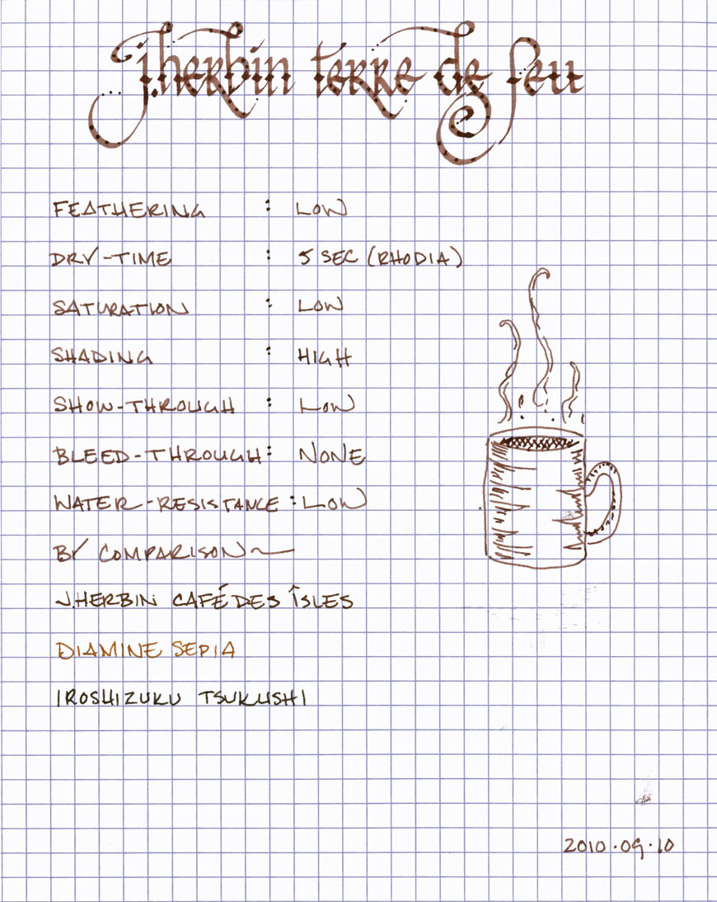
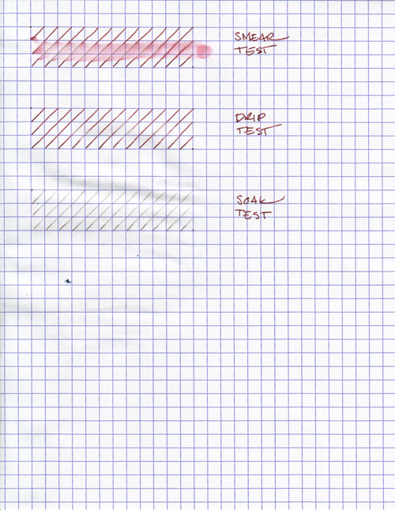
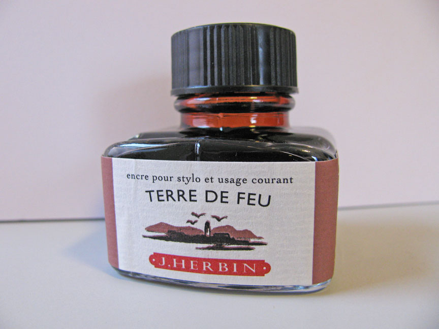

Rating: 4.0
January 3, 2011

If J Herbin Café des Isles is the color of coffee with cream, then Terre de Feu is the color of powdered cocoa. It is a lovely milk-chocolate ink with a slight reddish undertone – almost reminiscent of red clay. It possesses a low degree of saturation and a high degree of shading in even a fine nib pen.

As with most J Herbin inks, Terre de Feu is slightly watery – as a result, it flows easily, but does not provide significant level of lubrication between pen and paper. It is well-behaved in other respects, though. It exhibits a low level of show-through and no bleed-through at all on each of the papers I tested it against.

Dry time was average. On the slow-drying and non-absorbent Rhodia paper, it took 5 seconds to dry to the touch. On the absorbent and typically fast-drying Ecosystem paper, it took slightly longer, at 6 to 8 seconds. I've seen this behavior with occasional inks, and it always startles me. Feathering was atypically low for J Herbin inks on both papers, which is nice to see.

Water resistance was generally low. In the smear test, in which I run a wet finger across the page, the red-brown dyes ran easily, creating a lovely smudge on the page. The drip test, in which I let several drops of water soak into the page for a minute before blotting them up, pulled the red-brown dye right off the paper, leaving a ghostly grey line behind.

The results of the soak test, in which I run the paper under a stream of water for thirty seconds, were better than I anticipated. While the red-brown dye washed off almost immediately, it left behind a light grey line that is similar to a pencil line. As a result, a catastrophic encounter with water might not completely obliterate one's work. However, I wouldn't use Terre de Feu with anything I intended to resist the elements, like the outside of an envelope.

J. Herbin fountain pen inks come in a 30ml bottle with an integrated pen rest that is suitable for displaying on top of one's desk.

Brown inks are a versatile lot. It is a relatively conservative color, so one could quite likely use it for business purposes. It reads easily on white and off-white paper, and therefore works well for journaling or personal correspondence. This ink, in particular, is lovely for calligraphy and other artistic endeavors, with a rich, earthy character hiding under its surface.

I like J Herbin Terre de Feu more than Café des Isles. It is a versatile ink that walks the line between conservative and bold, and the red undertones are evocative and lovely. While the water resistance is low, it is otherwise a delightful ink to use, and, for those that like brown ink, is a worthwhile addition to your collection.

Review materials: For the wide strokes, I used a Lamy 1.1mm steel calligraphy nib in a Lamy Safari. For the narrow strokes, I used an EF steel nib in a Lamy Safari. The paper is Rhodia 80gsm from a No. 16 Bloc Pad.
