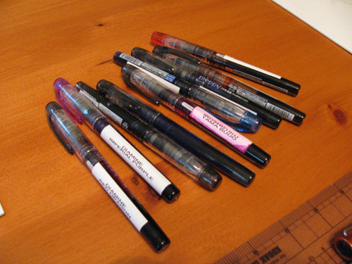
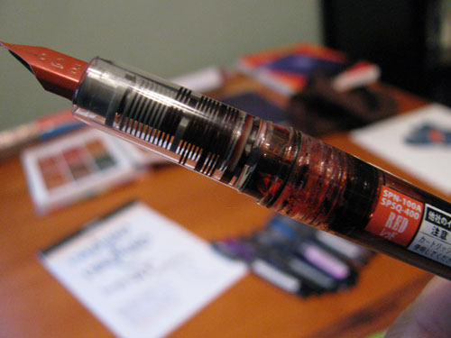

After a year or so of doing pen and ink reviews, I decided that I needed to [establish a set of reference inks](/blog/2011/3/15/reference-inks/) - those inks that I would use to evaluate others against. Once I picked out the colors, I then decided that it would be nice to have pens that I could keep inked wit these reference colors that, presumably, I would be using all of the time. Enter the Platinum Preppy.

The Preppy is a budget-level fountain pen with above-budget level price. The first one I owned was a de-labeled one that came with a bottle of Noodler's Kung-Te Cheng ink. It had been converted into an eyedropper-filled pen with an o-ring a bit of silicone grease and functioned as one of the coolest looking demonstrator pens that one could find. Each converted Preppy holds upwards of 3 ml of ink - a prodigious amount. I figured that doing something similar would be a great way to have each of my reference inks close at hand without breaking the bank.

A little bit of googling revealed that, with the right materials, the process of converting a Preppy into an eyedropper-filled pen is extremely straightforward. Brian Goulet, of the Goulet Pen Company, has an [excellent instructional video](http://www.inknouveau.com/2010/12/converting-platinum-preppy-to.html) on how to convert your own, for those that are curious.

So, feeling confident, I ordered ten or so Preppys plus the neccessary ingredients, and then proceeded to convert them. The process was quick and easy, and I was quite happy with the result - a handful of pens filled with a rainbow of fruit flavors.

Then I hit a creative drought, and the pens sat on the shelf for a good six months without being touched. This is every fountain pen owner's worst nightmare. Would the ink have dried in the nib? Would the pens be unusable? Could I get them to write, but be faced with hard starts, skipping, and the other consequences of gross pen abuse?

I'm pleased to report that every single one of them picked up and wrote flawlessly. After six months of inactivity, the converted Preppy pens started and wrote without a problem. Platinum has engineered an extremely hardy pen.

There are drawbacks to the Preppy, of course - after all, it is a budget pen. At $3-4 you are not getting a gold nib that glides across the page with no effort. The nib is steel and, though it has a tiny bit of give, it is not terribly smooth. The rest of the pen is clear plastic that looks very cool filled with ink, but otherwise has a "school children's pen case" feel to it.

Yet, the Preppy is one of the few pens that it easy to take apart and thoroughly clean. When you do run into trouble - say with the previously mentioned Noodler's Kung Te-Cheng-filled pen sitting around with the cap not fully closed (even though you thought it was), and the ink does dry in the feed - it is possible to completely wash out the pen and return it to its original state.

The Preppy is a workhorse of a pen, and one that you shouldn't be afraid to experiment with. It's neither glamorous nor engineered to be cradled gently in one's hand, but it is otherwise an excellent buy. I'd recommend it, especially for those looking to have a little fun with their pen collection.

Platinum Preppy Fountain Pens are available from:

- [Goulet Pens](http://www.gouletpens.com/Platinum_Preppy_Fountain_Pen_s/879.htm)
- [Jet Pens](http://www.jetpens.com/Platinum-Preppy-Fountain-Pens/ct/371)
