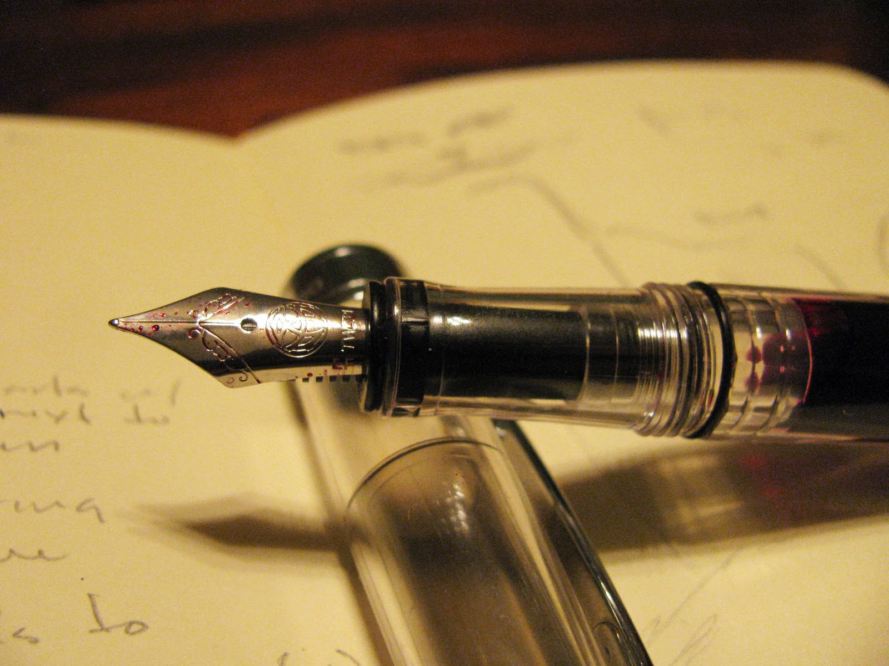
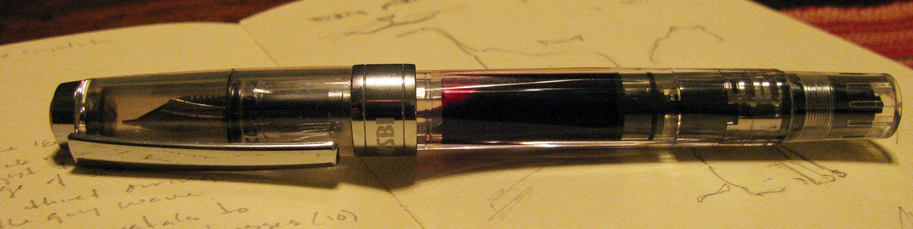
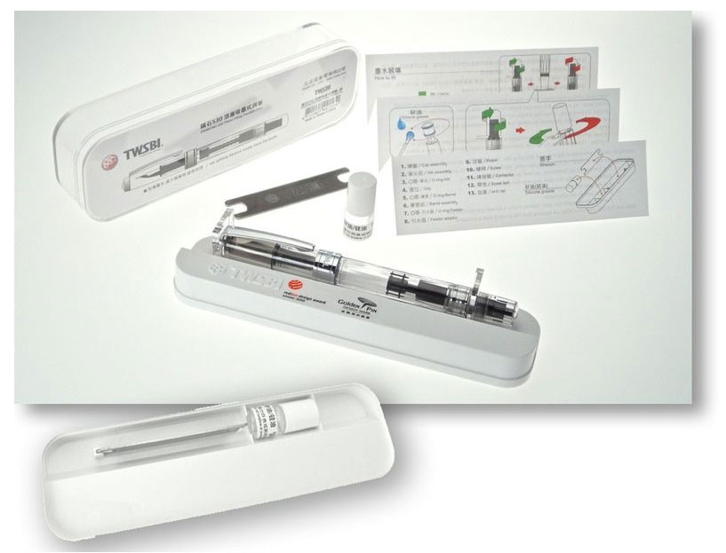
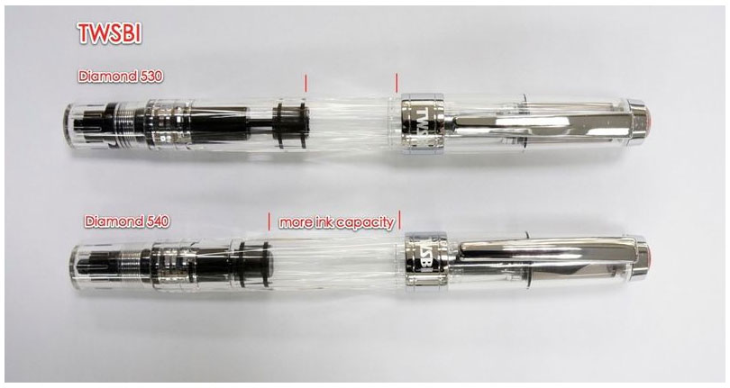

[Many](http://goldspotpens.blogspot.com/2011/01/twsbi-diamond-530-fountain-pen-review.html) [excellent](http://okami-whatever.blogspot.com/2011/01/twsbi-diamond-530.html) [things](http://ravensmarch.wordpress.com/2010/07/22/diamond-mine/) have been written about the TWSBI Diamond 530. A clear, piston-fill, steel-nib demonstrator available for US$40, it was one of the best pens in its price range. It was also constructed to be completely user-serviceable -- it came with instructions on disassembly and reassembly, along with a tub of silicone grease and a purpose-built wrench for removing the piston.

I used my 530 extensively - it was a workhorse of a pen that I could have easily held onto for years. That is, until TWSBI came out with its successor, the Diamond 540. Despite being a well engineered pen that featured a great design, the 530 had two minor issues that kept it from being a classic: the threading on the cap was very tight -- enough so that to remove and replace the cap took more effort than one would expect; the piston was likewise stiff, and would occasionally stick -- I would worry that I was going to damage the mechanism when filling it with ink.

I'm pleased to report that the 540 fixes both of those problems. The cap still feels secure on the pen, but it now twists on and off with ease. The piston was also fixed. Now it moves through its entire range of motion without issue. Additionally, they've increased the ink capacity of the pen to a notable degree. The pen almost holds a full 2 ml at capacity.

The steel EF nib is the same one that shipped with the 530 -- in fact, the nib units are interchangeable and available from TWSBI separately. It's a stiff nail, so there is neither flex nor spring, but it does write smoothly and reliably. It's an easy starter, and can take being uncapped for a few minutes without much issue.

While the price has gone up by $10 over the 530, it is still an excellent value at this price point. The only improvements I could suggest now would be a spring-loaded clip and the option for a gold nib - both things I would only expect on a pen costing twice as much.

I can't recommend the Diamond 540 enough. It's one of the best values for its price, and nearly rivals pens costing more than twice as much.

The TWSBI Diamond 540 is available from:

- [Goldspot Pens](http://www.goldspot.com/Twsbi_pens/Diamond_540/TW-540-EF.html)
- [Goulet Pens](http://www.gouletpens.com/TWSBI_Diamond_540_Fountain_Pen_p/twsbi-540.htm)
- [TWSBI ebay store](http://stores.ebay.com/TWSBI-Pen-Store)
