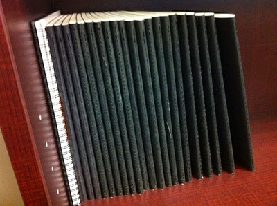
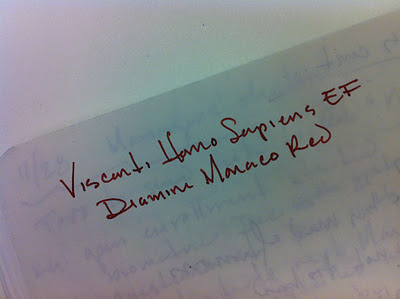
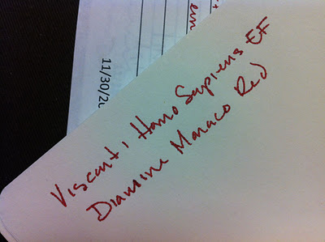
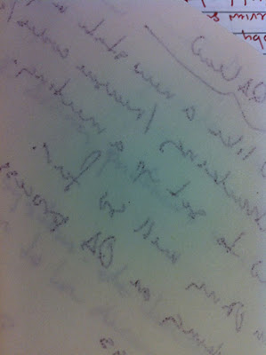

Amongst fountain pen aficionados, Moleskine is known primarily for the inconsistency of their paper. For a long time, I'd had pretty good experiences with Moleskines and fountain pens, especially as someone who favors dry-writing, narrow nibs. While I've switched to Rhodia notebooks for most of my personal writing, I'm still using extra-large Moleskine Cahiers at work. The 7.5 by 10 inch, cardboard-covered notebooks provide great value for the money: a three pack of the extra-large cahiers, each with 120 pages, runs about $19 online.

Over the course of the past two years, I've amassed quite a collection. I fill roughly one notebook a month with the notes I take for all of the meetings that I sit through on a daily basis. Typically, the paper is smooth, thin, and slightly absorbent. When I purchased my wet-writing [Visconti Homo Sapiens](/blog/2011/11/20/pen-review-visconti-homo-sapiens/), I was pleased to find that I saw very little bleed through and only mild feathering - that is, until I finished my last notebook and had to buy a new pack.

The paper in the new notebooks still looks like the same thin, ivory paper I'd been used to. Now, however, it has a bit of a tooth and is extremely absorbent - so much so that my wet writing pen creates a feathery mess on the page. Bleed-through and show-through, which used to be minimal, are now commonplace. I feel like I'm writing with a Sharpie.

What's more distressing is that even within the same notebook, I get slightly different results from page to page. Some pages behave like my last notebook, while others exhibit the aforementioned feathering, show-through, and bleed-through.

I use a fountain pen because I enjoy a superior writing experience when using it. Unfortunately, the inconsistent quality of paper in the Moleskine Cahier means that it doesn't deliver on its end of the bargain. Therefore, I'm making the switch to Clairefontaine notebooks. I just ordered three of them from Goulet Pens, and, while they contain less paper for the same cost, I know that I'll enjoy using them ever so much more.

Moleskine notebooks are available just about anywhere.
