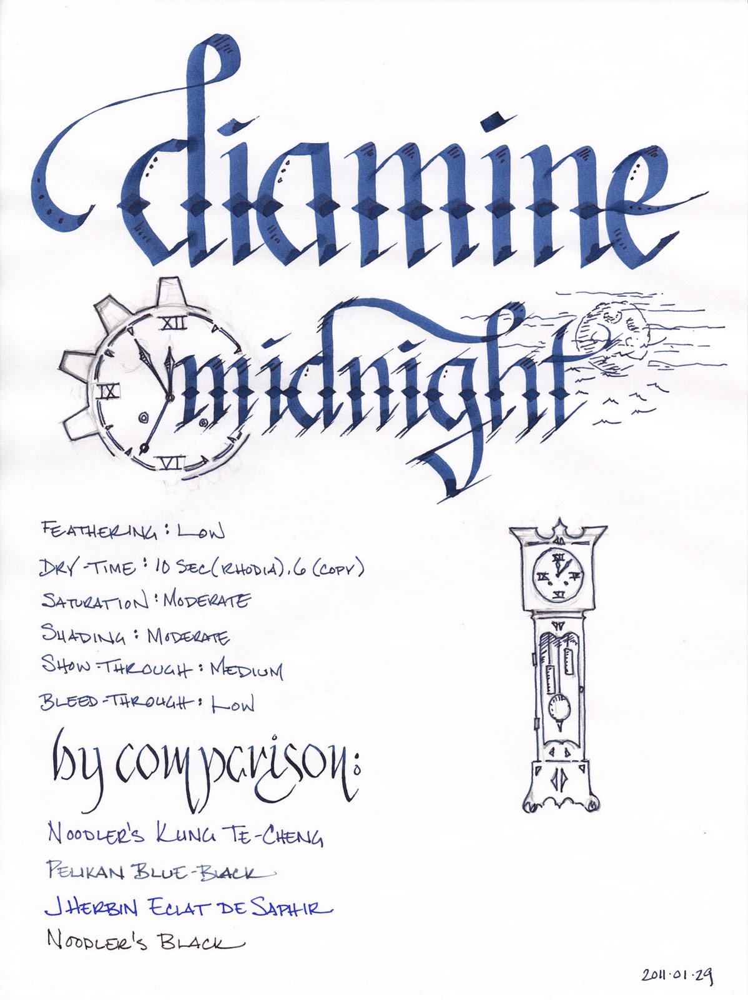
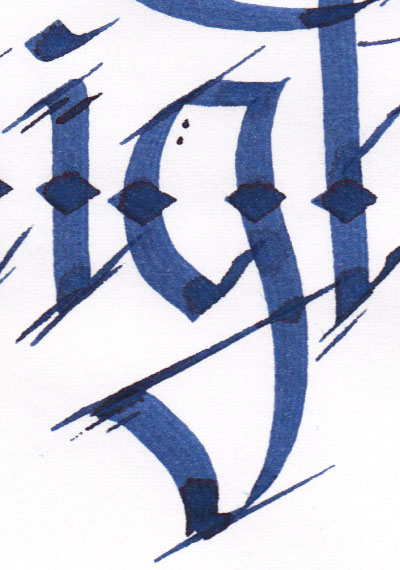
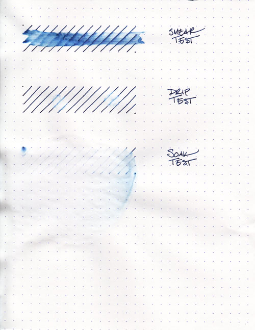
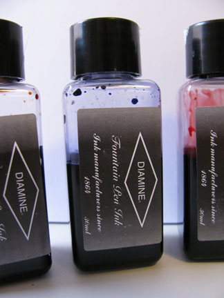

Rating: 4.5
February 1, 2011

When I first put Diamine Midnight to paper, I thought to myself that it was a nice, but not particularly interesting dark blue ink. Then I looked closer, and closer, and closer – and got drawn right in. For those willing to pay attention, this ink has a wonderful sense of depth that captures the variability and mystery of the nighttime sky. In fact, in the more saturated sections, there's a hint of red that peeks out, giving it an almost sinister look. This is the dark blue of a steampunk starscape – of Victorian London, where Dracula and Jack the Ripper lurk in the shadows.

It is a moderately saturated dark blue with a hint of indigo. In a fine nib, it exhibits a modicum of shading – just enough to give it a rich, complex feel. In a calligraphy nib, one can see significant areas of high and low saturation, and a mysterious red border between the two. The color is not particularly affected by the color of the paper – on both the bright white Ecosystem and off-white Rhodia webbie, the color remained consistent.

Midnight is a well-behaving ink, a characteristic that I've found in each of the Diamine inks I've reviewed so far. On both absorbent paper, like Ecosystem, and resistant paper, like Rhodia, feathering was not noticeable. Show through was noticeable on thinner paper, like a Moleskine cahier, but otherwise very low. I noticed only one very minor issue of bleed-through with any of the paper and pen combinations – the 6mm Pilot Parallel calligraphy pen caused a tiny spec to peek through.

As with the other Diamine inks I've reviewed, water resistance is not an included feature. The smear test, in which I rub a wet finger across the page, obscured the lines and left a blue smudge behind. The drip test, in which I let droplets of water sit on the page for about a minute before blotting them, left ghostly, pale blue impressions of the lines behind.

The soak test, in which I run the paper under a faucet for half a minute, did a great job of washing the ink right off the page. Midnight is not a waterproof ink – it doesn't even achieve the "addressing an envelope" level of resistance – so I'd recommend leaving it for journals or other things that have a low risk of encountering moisture.

Diamine inks are available in a 30ml plastic bottle and an 80ml glass bottle, both of which are utilitarian in appearance. The smaller plastic bottle has a neck that is very small in diameter. I found that some of my larger pens, like a Lamy 2000, would not fit all the way in, which made getting to the ink a bit of a challenge. My recommendation would be to go for the larger bottle.

Blue inks are one of the mainstays of the corporate environment, and Midnight would fit in quite nicely. It's a dark blue that's easy to read on both ivory and white paper, and isn't bright enough to offend anyone's sensibilities. It is also a great choice for personal correspondence, having a nice, warm, rich tone. Finally, it's also a great candidate for calligraphy and other artistic endeavors – that mysterious red aura that it develops adds an unexpected depth of character to the work.

Diamine Midnight doesn't quite knock Noodler's Kung Te-Cheng out of the top spot on my list of blue inks, but I think it easily took second. If you like dark blue inks, this is an easy choice to add to your collection. Now I just have to buy an 80ml bottle to replace the sample I was sent in order to make sure I've got enough on hand to last a long time.

Review materials: For the wide strokes, I used two calligraphy pens: Pilot Parallel 6.0mm and 3.8mm pens. For the "by comparison" line, I used a Noodler's Creaper Flex Nib pen. All three have steel nibs. For the fine strokes, I used a Lamy EF steel nib on a Lamy Safari. The paper is Rhodia 80g.

Note on this review: a sample of this ink was provided for review purposes by Diamine Ink.

Diamine Midnight is available from:

- [The Goulet Pen Company](http://www.gouletpens.com/Diamine_80ml_Midnight_Ink_p/d7063.htm)
- [Amazon](http://www.amazon.com/gp/product/B003OXMB8E?ie=UTF8&tag=seizethedav0c-20&linkCode=as2&camp=1789&creative=390957&creativeASIN=B003OXMB8E)
