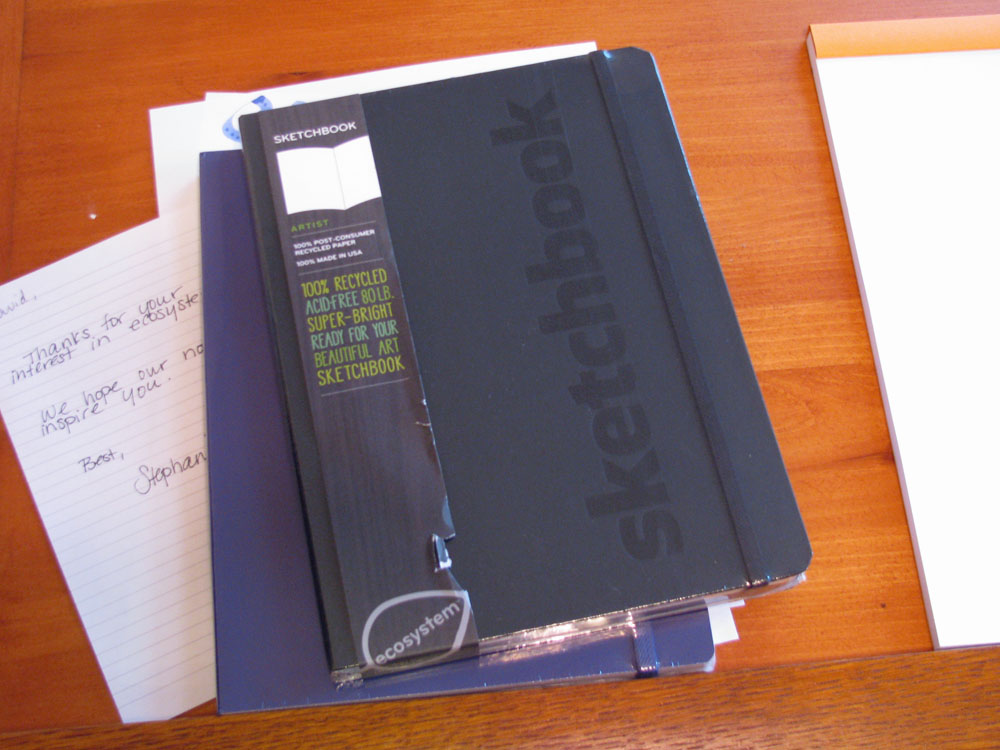
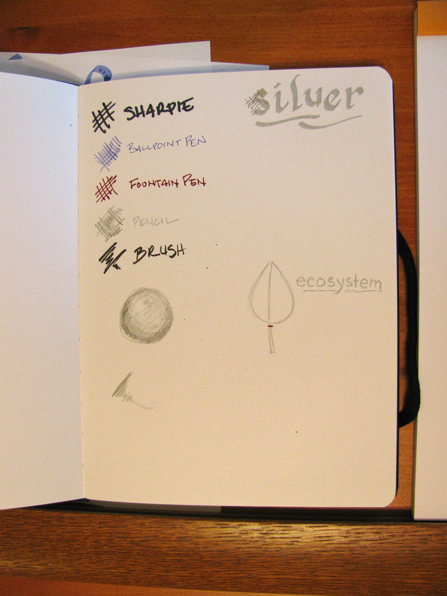

Rating: 4.0
February 15, 2011

I've been a big fan of ecosystem notebooks, having positively reviewed their [hardback lined journal](/blog/2010/6/13/paper-review-ecosystem-notebook/) and [created an iPad cover](/blog/2010/6/1/the-great-ecosystem-ipad-cover-hack/) from a large, lined softcover journal. When I found out that they were releasing a sketchbook, I made it a point to get a copy to review, and I have to say that I'm pretty pleased.

The basic setup is very similar to a standard ecosystem hardback notebook: rounded corners on the paper and cover; a bound-in, 100% organic cotton bookmark; a sturdy elastic strap to keep the cover closed; and a paper pocket inside the back cover. The cover is 100% recycled board covered with 100% post-consumer recycled paper stock, and dyed with vegetable-based ink. Unlike the standard notebooks, the word "sketchbook" is embossed on the cover.

The endpapers are printed with ecosystem's leaf pattern, and there is a space to record your name and contact information in the front. Like all other ecosystem notebooks, there is also a serial number printed on the inside back cover that, when entered on the ecosystem website, allows you to register it so that if it is ever lost it can be used to contact you. It also shows you all of the components that went into your specific batch of books, so that you can see the ecological impact of your purchase.

Unlike a standard hardback notebook, the sketchbook is quite a bit larger – measuring 7 3/8 by 9 7/8 inches. Inside are 128 pages of bright white, chlorine free, acid free, 80 lb. paper. I'm happy to report that my major quibble with the early hardbound notebooks – glue that crept between the signatures and locked every few pages together near the spine – is gone. Every page now lies completely flat.

So how does this perform as a sketchbook? Quite well, I'm happy to report. The paper is generally smooth and uncoated. It takes a medium pencil, ballpoint pen, and brush pen quite well – without any hint of feathering or bleed-through. A sharpie marker bled through, as I expected, but did not transfer any ink to the underlying page. Fountain pen ink was a mixed bag – one very wet pen feathered more than I expected, but I was able to use a 6mm calligraphy nib with several inks without issue.

India ink, when used with a dip pen, fared well – it bled through in some of the wetter places, but I saw no buckling of the paper, and it did not make it through to the underlying paper, regardless. I did not try charcoal or pastel, but I suspect the level of smoothness would make it less than ideal.

Overall, I'm very happy with this sketchbook. Ecosystem continues to produce very nice notebooks that I am happy to use. I think this is one that is definitely worth checking out to see if it meets your needs as an artist.

Note: A review copy of this sketchbook was provided by Ecosystem.
