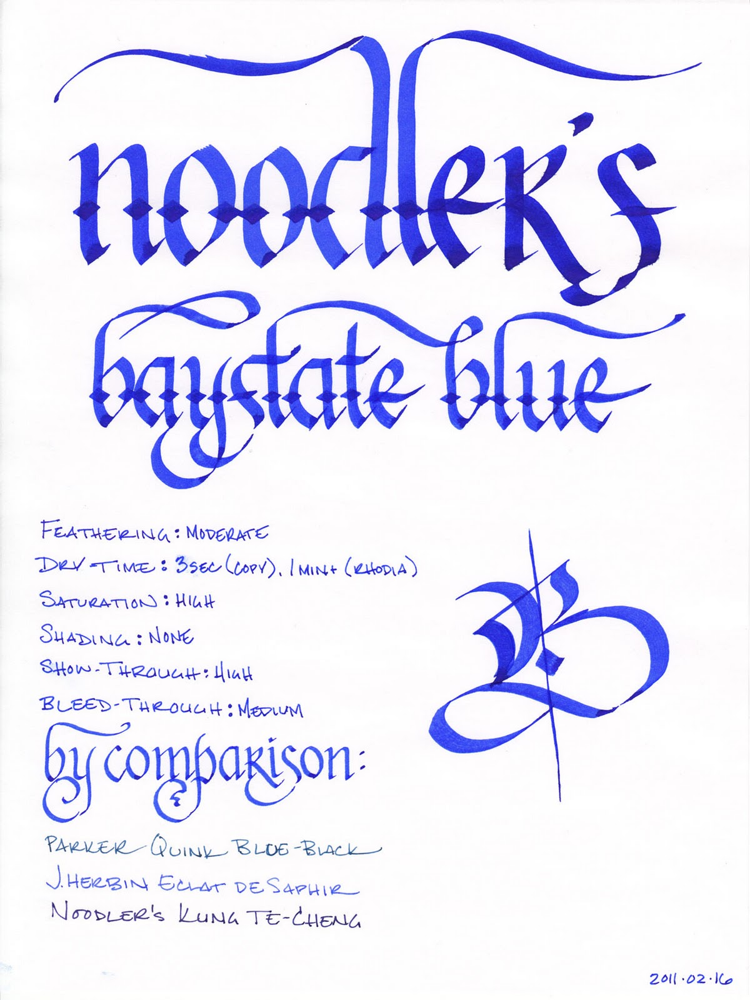
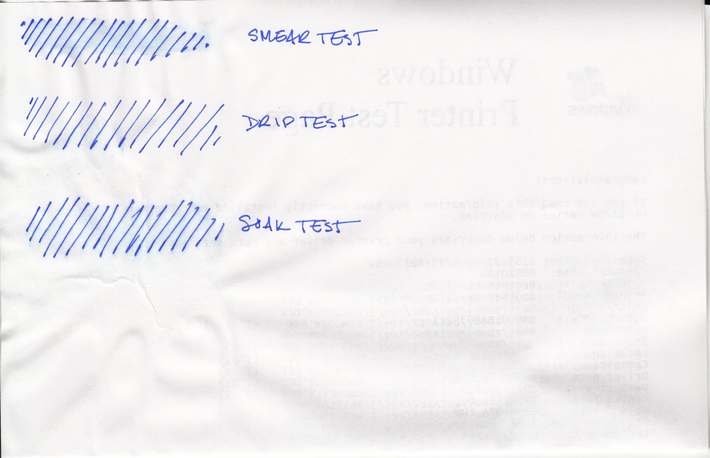
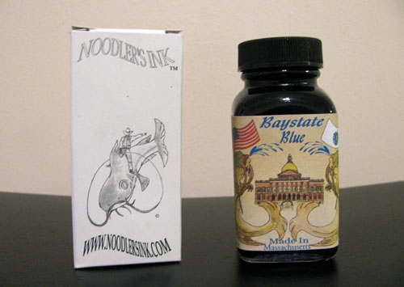

Rating: 3.0
February 22, 2011

My first thought, upon opening the bottle of Noodler's Baystate Blue, was "Holy cats, that's blue." It is not a subtle ink. Rather, it is an electric cobalt blue that positively jumps off the page. It's highly saturated, as many Noodler's inks tend to be, and it exhibits no shading. It simply lays down a solid, bright, blue line.

Baystate Blue has generated a bit of controversy lately. Some people absolutely hate this ink, claiming that it behaves poorly, stains everything in sight, and ruins fountain pens forever. In response, Nathan Tardiff, the wizard behind the Noodler's curtain, posted a video defending the behavior of Baystate Blue. In the video, he demonstrates no feathering or bleed-through on cheap copier paper. With all due respect to Mr. Tardiff, his paper is not my paper. In my testing, the behavior of this ink is all over the board.

I tested this ink on five different papers using the same pen, a Lamy Safari with an EF steel nib. On cheap copier paper, I saw moderate feathering, moderate bleed-through, and significant show through. On the other hand, it was dry to the touch in 2 seconds.

On bagasse paper from Staples (their Sustainable Earth notepads), the feathering, show-through, and bleed-through were worse than the copier paper, though the dry time remained the same. For comparison's sake, Noodler's Kung-Te Cheng performed significantly better, with almost no feathering in a similar pen.

In a Moleskine journal, I saw no feathering, but did notice significant show-through and bleed-through. Dry time was about 10 to 12 seconds. On Rhodia paper, as I expected, I saw no feathering at all, moderate show-through, and no bleed-through – but it took over a minute to dry to the touch.

Baystate Blue performed best on the absorbent paper of an Ecosystem author journal, which is unsurprising given the other Noodler's inks I've tested. There was a very low level of feathering, only moderate show-through, and no bleed-through that I could discern. It dried in four seconds.

In addition to performance, there are a few other things to consider when it comes to Baystate Blue. First, it will stain absolutely anything and everything it touches, and it does so with a vengeance, as though it is personally offended that any other color is present on your kitchen counter, your stainless steel sink, your clothing, or your skin. You, me, and everything else is clearly too polychromatic for its tastes, and it will never stop until the world is transformed into a solid sea of cobalt blue.

Noodler's themselves warn against using any of the Baystate line of inks if you are uncomfortable with the possibility of permanently altering the color scheme of your kitchen. They are not kidding.

Second, it can and will actively stain the plastic parts of a pen, though a solution of bleach and water will apparently remove most of the color from plastic; it is not an easy ink to clean out of a pen. Third, Noodler's indicates that Baystate Blue should not be mixed with other inks except for those in the Baystate line, as the pH value is more alkaline than other inks in the Noodler's line.

This ink is marketed as being waterproof, and here, once again, my results varied depending on the paper. I used both the coated paper of a Rhodia Dot Pad and the absorbent paper taken from my home office laser printer. From what I can discern, only the ink that gets absorbed by the paper can be considered water-fast. By definition, the coated Rhodia paper absorbs far less ink than the printer paper, and consequently shows much worse behavior.

The smear test, in which I rub a wet finger across the page, results in a bright blue smear on the Rhodia. On the copier paper, it creates a light blue tint in the affected area. The drop test fared better on the copier paper – no ink came up there, but it did lift from the paper on the Rhodia paper.

The soak test, in which I run the paper under a stream of water, resulted in a blurry blue mess on the Rhodia paper, though, to be fair, the lines are all still discernable. On the copier paper, I once again saw a light blue tint, but the ink did not otherwise move.

So is it waterproof? Well, yes. You won't lose your work if you drop your notebook into the ocean and then jump in to recover it. However, it won't be pretty to read once you've managed to dry it out. If you're concerned about full water resistance, I'd point you to other Noodler's inks that perform better across all paper types, or the Platinum line of pigment inks.

Noodler's inks come in a standard 3 oz. bottle that's filled to the brim – so be careful when opening (especially this one). Noodler’s intentionally uses stock bottles and lids to keep their prices low, which means that they aren’t intended to be show pieces in and of themselves. They are functional and stable, but not an objet d'art intended for the top of one's desk.

In the video mentioned earlier, the good Mr. Tardiff mentions that Baystate Blue provides the greatest level of contrast of any ink on the market, and I find it hard to disagree. However, depending on your tastes, that level of contrast might not be for you. I find it easy to pick out on the page, certainly, but I think pages upon pages of it would drive me nuts. That's an aesthetic preference, though – I could easily see someone falling in deep, cobalt blue love.

I normally consider Noodler's inks to be great on cheap paper and unpleasant on good paper, but this one has me confounded. On office-grade copier paper, it performed tolerably.  On thicker absorbent paper like that of an Ecosystem journal, it performed admirably. On the cheap bagasse paper it was a mess, and it took far too long to dry on Rhodia paper, where it, of course, looked the best.

I can hesitantly recommend it for those that use a better grade of copier paper than my office does, or for those that use Ecosystem journals. I would suggest giving it a pass for those dedicated to their Rhodia pads, or for those that use cheap, thin notepaper.

Review materials: For the wide strokes, I used three calligraphy pens: Pilot Parallel 6.0mm and 3.8mm pens, and a 1.9 mm Lamy Joy. All three have steel nibs. For the fine strokes, I used a Lamy EF steel nib on a Lamy Safari. The paper is Rhodia 80g.

Noodler's Baystate Blue is available from:

- [Goulet Pen Company](http://www.gouletpens.com/Noodler_s_Ink_Baystate_Blue_p/n19048.htm)
