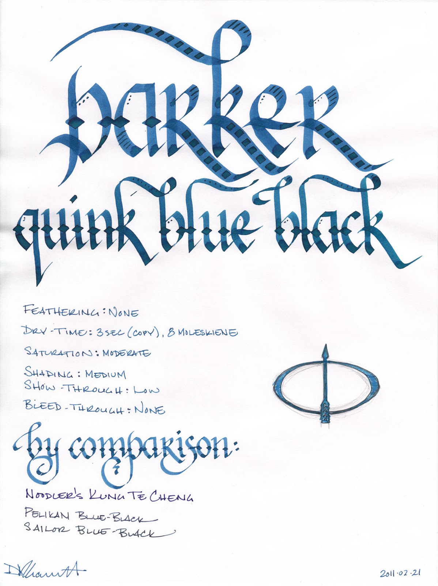
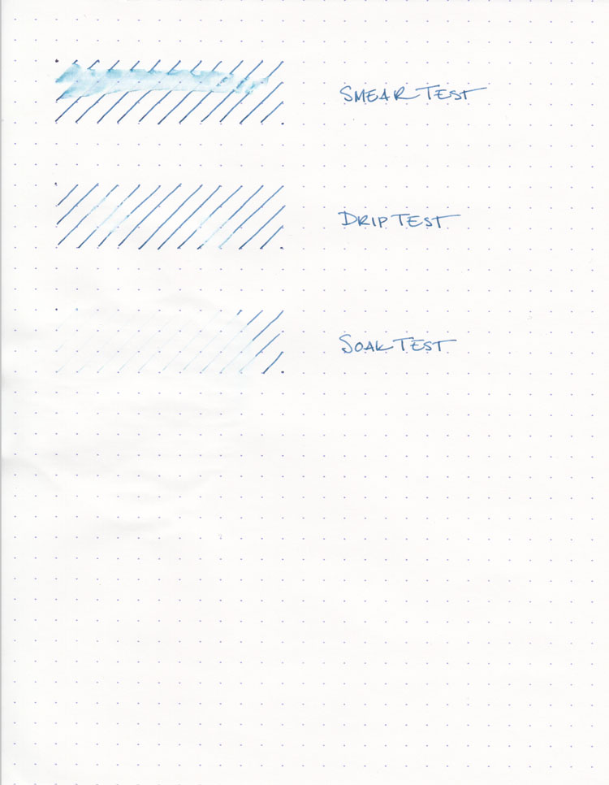
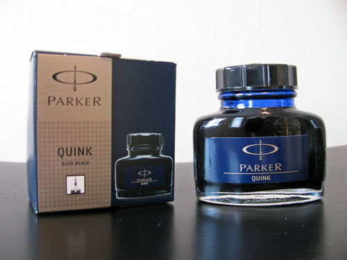

Parker Quink Permanent Blue Black is a workhorse of an ink that I'm sorry I waited this long to try out. First developed in the late 1920's, it was regarded as a revolutionary ink that eliminated the need for blotting. It remains, to this day, one of the most popular fountain pen inks in production.

Parker's version of blue-black is moderately saturated and allows for a modicum of shading in a fine nib. It is not the color I think of when I think of blue-black, however. I see it as more of a medium teal-blue. On ivory or off-white paper, the teal tones show through even more prominently than on white paper. It is also a bit of a dry writer. On each paper, the nibs I tested wrote true to size, if not slightly smaller.

Blue-black is the first Parker Quink (a portmanteau of "quick" and "ink") in my collection, and I now understand why it is so popular. It is one of the best behaving inks I've ever used. I tested it on five different papers: cheap copier paper, Staples "Sustainable Earth" bagasse, a Moleskine notebook, an Ecosystem notebook, and a Rhodia webbie.

On every single paper I tested, I saw no trace of feathering, a low level of show-through, and no bleed-through at all. Drying times varied a bit – from 3 seconds on the copier paper; to 8 seconds on the bagasse, Moleskine, and Ecosystem; to 12 seconds on the Rhodia – but they all fell well within the normal range for each paper.

For an ink labeled as permanent, though, it is anything but waterproof. The smear test, in which I drag a wet finger across the page, produced a lovely teal smudge which obliterated any trace of the underlying line. The drip test, in which I let a drop of water sit on the paper for a minute before blotting, lifted a significant amount of ink from the page.

The soak test, in which I run the paper under a stream of water, washed away nearly all the ink. The faintest trace of a line was left – the ghost of inks past, I suppose – but not enough to be legible. To be fair, the "permanent" label exists only to contrast with the "washable" label of their blue ink, which is specifically designed to be easily removed from one's hands. Still, I wouldn't address an envelope with it, especially if one's destination is in Atlantis.

Parker Quink comes in a solid, sturdy 2 oz. bottle, which is a perfectly pleasant. It's neither ugly nor utilitarian, but it is a bit conservative, as befits the ink it holds. It won't look out of place on the desk of anyone that wears a Brooks Brothers' suit to work (present company included), but it might seem a tad archaic on the shelf of a modern, bohemian artist.

I suspect that the primary audience for Parker Quink Blue Black is business, as it is a slightly conservative ink that is designed to be used all day, every day. It is also perfectly acceptable for personal correspondence and journaling, as it is easy to read and easy to use on a wide variety of paper. It will write anywhere with nary an objection, and it rinses out of pens without any issues.

Parker Quink Blue Black is a solid ink that is a tremendous value for the price. If you're looking for an inexpensive, well-behaved, daily use ink, then this is an excellent candidate. If you're looking for something flashy or bold, then look elsewhere.

Review materials: For the wide strokes, I used three calligraphy pens: Pilot Parallel 6.0mm and 3.8mm pens, and a 2.0mm Pelikan Script. All three have steel nibs. For the fine strokes, I used a TWSBI EF steel nib on a TWSBI Diamond 530. The paper is Rhodia 80g from a No. 18 notepad.

Parker Quink Blue Black is available from:

- [JetPens](http://www.jetpens.com/index.php/product/view/products_id/6161)
