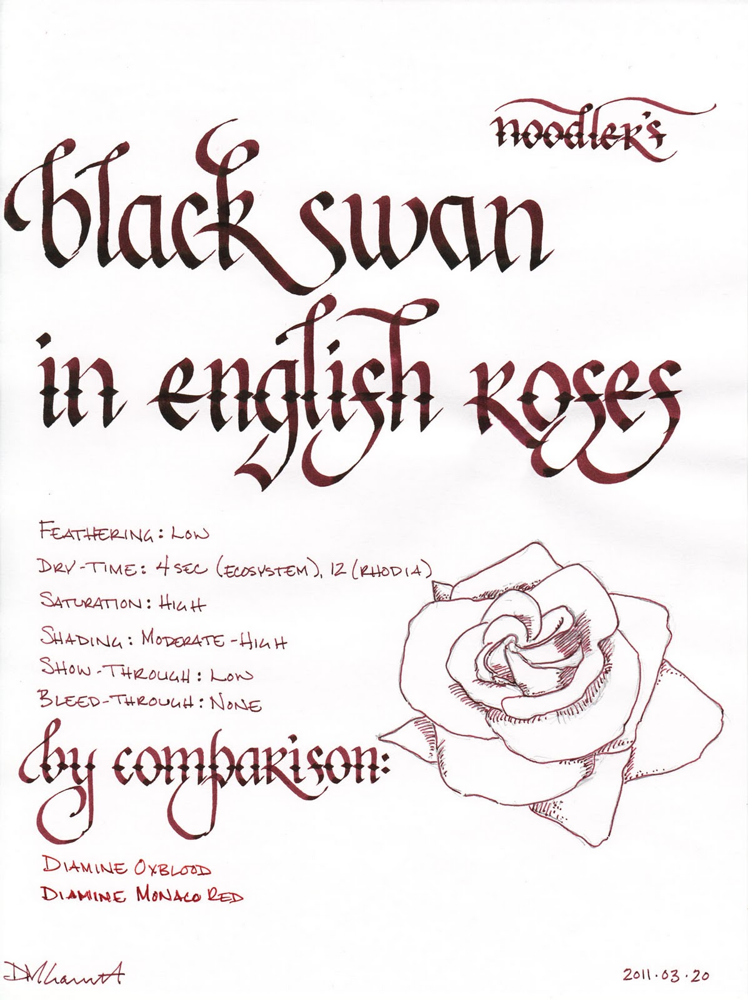
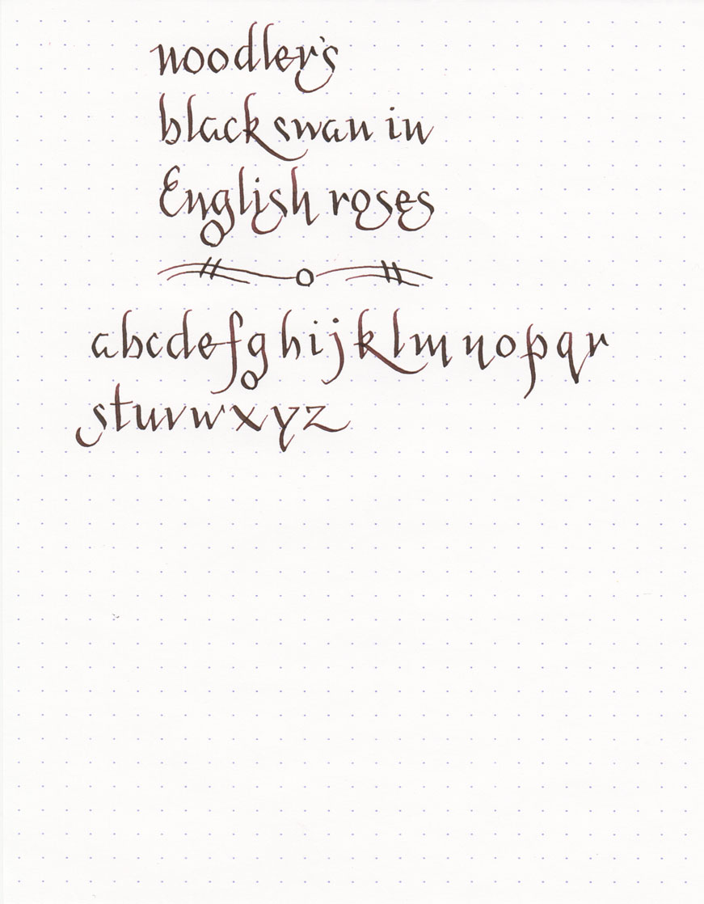
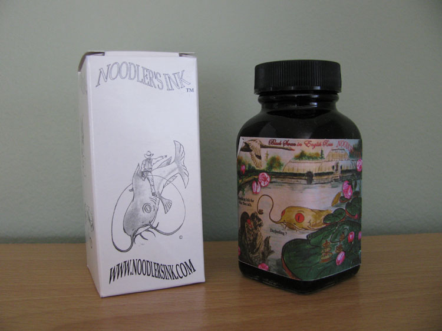

Noodler's has released the second in its line of inks that have been designed for flex nib pens. The high-shading Black Swan in English Roses continues the high level of quality set by its predecessor. In my [review of Black Swan in Australian Roses](/blog/2010/11/30/ink-review-noodlers-black-swan-in-australian-roses/), I praised the ink's poetic nature, and English Roses delivers a similarly lyrical experience.

Where Australian Roses was violet-black with pink undertones, English Roses is an earthy red-brown with bright, poppy red undertones that peek out from time to time. It is a wonderfully deep, rich, and rewarding ink to work with.

This ink is definitely designed for a wet-writing pen. In my TWSBI Diamond 530 with an extra-fine nib, it felt a bit dry and produced a very narrow line. However, it behaves exactly the way I want it to in my Pilot Falcon with a soft-medium nib. The Pilot is a very wet writer, and even inks like Diamine, which are in the midrange of "wetness," produce too great a flow for my tastes. English Roses, on the other hand, is exactly right – I can use it on the ultra-thin paper of a Moleskine cahier without any bleed-through whatsoever, and it produces dramatic and lovely shading.

I tested English Roses on five different papers using a fine nib: cheap, office-grade copier paper; Staples "Sustainable Earth" bagasse, a Moleskine lined notebook, an Ecosystem author notebook, and a Rhodia webbie. On every single paper, the ink behaved exceptionally well, exhibiting no bleed-though, no discernable feathering, and low levels of show-through.

Drying time ranged from a low of 4 second on the absorbent paper of the Ecosystem, to 6 seconds on the copier paper and the bagasse, to 12 seconds on the Rhodia, to a high of 20 seconds on the Moleskine.

Like Australian Roses, English Roses is partially water resistant. The smear test, in which I run a wet finger across the page, created a red streak, but the lines remained intact and are still mostly legible. The drip test, in which I let droplets of water sit on the paper for a minute before blotting, resulted in the red dye being lifted, but the darker brown dye remained on the page.

The soak test, in which I run the paper under a faucet, resulted in the complete washing away of the red dye (it left a red haze on the page), but left the brown parts of the ink intact. It was fully readable even after a full soak. In my opinion, it is not an ink that you could put down and then paint or wash over, but an envelope addressed with it should have no trouble arriving at its destination.

Noodler's Black Swan in English Roses comes in a standard 3 oz. Noodler's bottle that's filled to the brim – so be careful when opening. Noodler’s intentionally uses stock bottles and lids to keep their prices low, which means that they aren’t intended to be show pieces in and of themselves. They are functional and stable, but not an objet d'art intended for the top of one's desk.

English Roses is another amazing ink in the Black Swan series. To get the full value from it, you'll need to use it with a wet-writing or flex nib, but it performs admirably under these circumstances. It will still perform quite well in a drier nib, but you won't quite get the same level of dramatic intrigue out of it. I continue to be impressed by the dry time, performance, and beauty of the Black Swan series, and I hope that further entries await us.

Review notes: I used a 3.8 mm Pilot Parallel calligraphy pen for the widest strokes, a 2.0 mm Pelikan Script calligraphy pen for the medium strokes, and an extra-fine steel nib on a Lamy Safai for the thin stroke. The paper is Rhodia 80gsm from a No. 18 pad.

Noodler's Black Swan in English Roses is available from:

- [Goulet Pen Company](http://www.gouletpens.com/Noodler_s_Ink_Black_Swan_in_English_Roses_p/n19037.htm)
