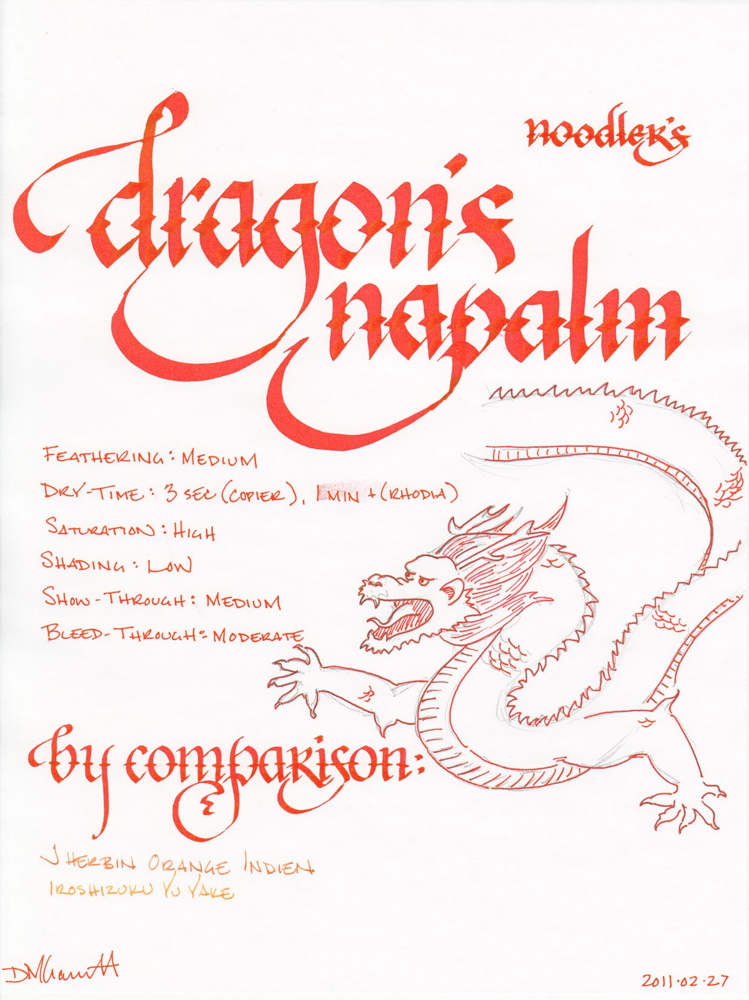
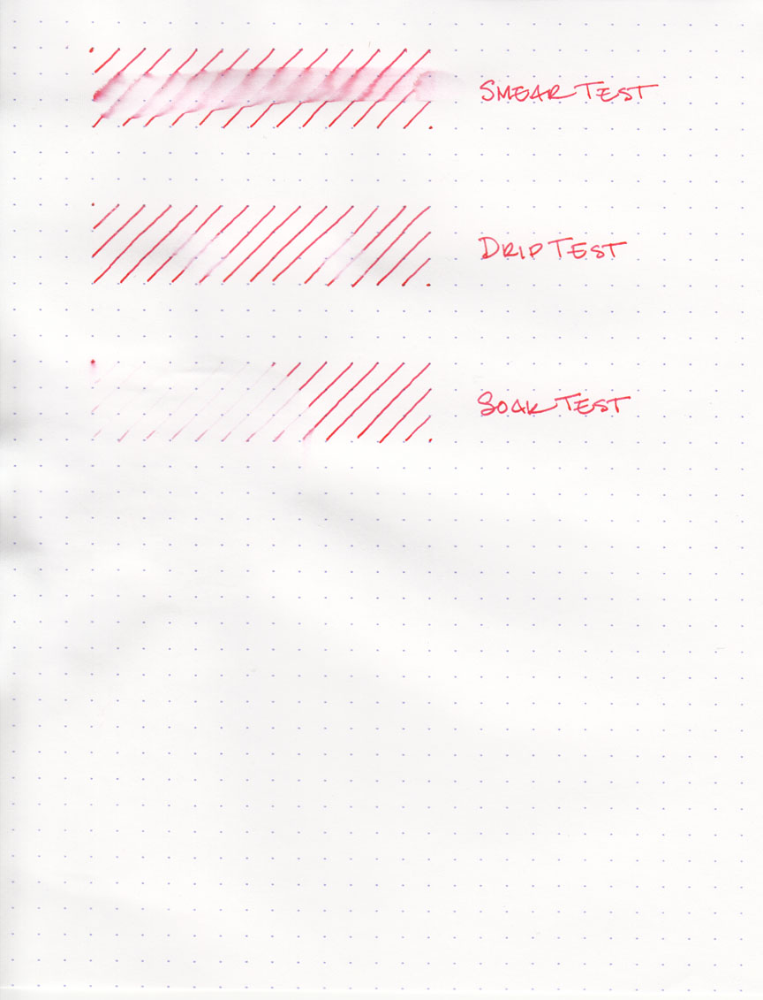
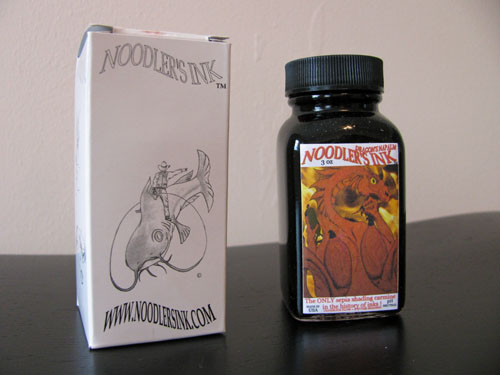

If you want to get someone's attention, send them a letter written in Noodler's Dragon's Napalm ink. It's the perfect ink for the task, as it is very close to the color of safety orange – that attention-getting hue that adorns traffic cones, the tips of toy guns, hunting caps, inmate jumpsuits, and the official state fungus of Ohio – the orange barrel.

It's a vibrant, highly saturated, ink that produces a bright, solid line in a fine-nibbed pen. In a broad-nibbed pen, though, it shades to a deep orange red, and it takes on a slightly pink tinge when under the right light. Speaking of shading, according to the manufacturer, it is the only "sepia-shading carmine" in the history of inks. What does this mean?

Carmine is a bright red color and sepia is a dark brown-grey, but this ink doesn't seem to me like a combination of the two. The carmine pokes its head out in areas of heavy shading, but the sepia reference isn't obvious. A little paper chromatography, though, draws out a yellow-brown that underlies the color. Without it, Dragon's Napalm wouldn't have the same depth of character.

I tested Dragon's Napalm on four different papers using an extra fine nib: cheap, office-grade copier paper; Staples "Sustainable Earth" bagasse, an Ecosystem author notebook, and a Rhodia webbie. Feathering and dry time varied quite significantly across the different types of paper.

On the cheap copier paper, it behaved acceptably, though not optimally. It displayed moderate feathering, significant show-through, and minor levels of bleed-through. Dry time was 3 seconds. On the bagasse, by contrast, it exhibited severe feathering, significant show-through and bleed-through, and took 8 seconds to dry to the touch.

On the Ecosystem's New Leaf paper, Noodler's Dragon's Napalm performed the best. It exhibited a low level of feathering, a low level of show-through, no bleed-through, and dried in 6 seconds. It's been my experience that Ecosystem's notebooks and Noodler's inks complement each other extremely well, and this is no exception.

With a few exceptions, Noodler's inks also tend to behave in a specific fashion with the fountain-pen friendly Rhodia paper, and Dragon's Napalm remains consistent. I found no feathering, no bleed-through, and a low level of show-through. On the other hand, the drying time was over 1 minute. It's a shame that so many of the Noodler's inks I've tried take so long to dry on Rhodia paper, since they otherwise behave so well.

Dragons are known to the western world as fearsome, fire-breathing creatures that will engulf entire cities in flame to ensure that their snacks of medieval peasants are cooked to perfection. However, this particular dragon's fire can be easily quenched by a little bit of water; it did not hold up well on any of the water tests. The smear test, in which I run a wet finger across the page, resulted in a lovely neon orange smudge, but no trace of the underlying lines.

The drip test, in which I let several droplets of water soak on the page before blotting, resulted in the ink being lifted almost entirely from the page; only a hint of the original lines remained. Similarly, the soak test, in which I run the paper under a stream of water, washed the ink away quite effectively. It's an attention-getting ink, to be sure, but not one which you'd want to use in any water-sensitive situations.

Noodler's Dragon's Napalm comes in a standard 3 oz. Noodler's bottle that's filled to the brim – so be careful when opening. Noodler’s intentionally uses stock bottles and lids to keep their prices low, which means that they aren’t intended to be show pieces in and of themselves. They are functional and stable, but not objets d'art intended for the top of one's desk.

I don't think anyone is going to mistakenly use Noodler's Dragon's Napalm to draft a legal brief or sign a contract, but it would be appropriate for proofing a paper or otherwise dramatically calling attention to something. It's a bit bright for journaling, I would suspect – certainly to my eyes, page after page of it would quickly become too much of a good thing. However, I could see it being used to jot a quick note or, more likely – in artwork or calligraphy.

Dragon's Napalm is an extremely vibrant ink that extremely vibrant people will likely get a kick out of. It behaves well enough on higher quality paper for me to recommend it to those who are looking for a very bold orange ink.

Note on images: this ink is devilishly difficult to scan correctly. I've attempted to correct the writing sample to get as close as possible. The sample as presented is slightly more red than in real life, and some of the shading detail has been lost.

Review notes: I used a 6.0 mm Pilot Parallel calligraphy pen for the widest strokes, a 2.0 mm Pelikan Script calligraphy pen for the medium strokes, and an extra-fine steel nib on a Lamy Safai for the fine strokes. The paper is Rhodia 80gsm from a No. 18 pad.
