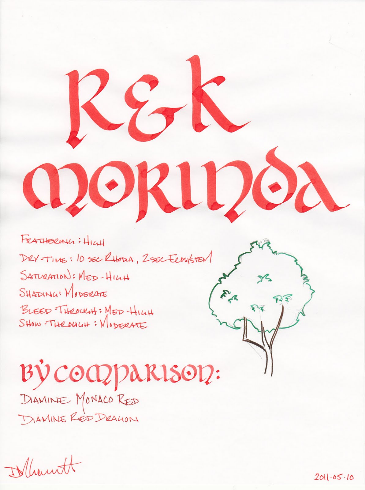
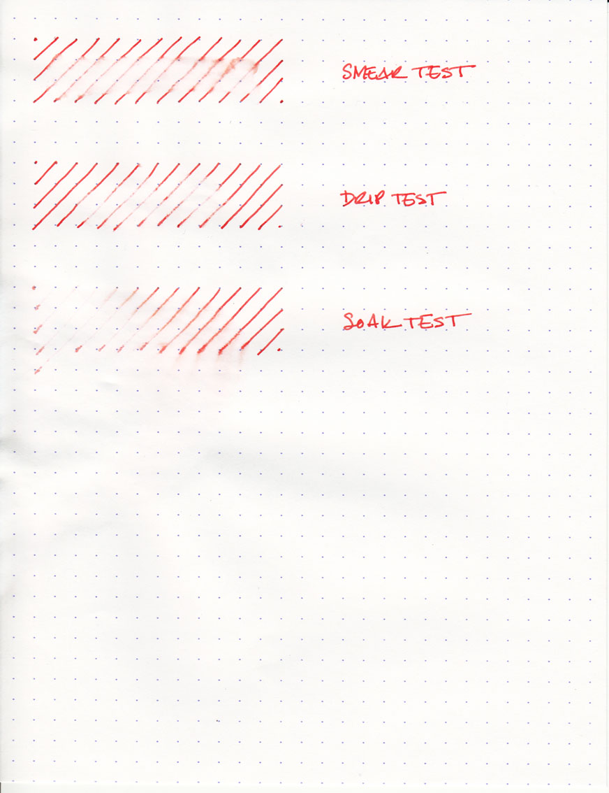

Thanks to the generosity of the Fountain Pen Network member, Jared, I received set of ink samples. Among them were several vials of Rohrer and Klingner ink, which is a German brand that has recently become available in the US. I was immediately attracted to the vial of Morinda, which is a pretty, vibrant candy-red ink. It is similar in color to J. Herbin Rouge Caroubier, but significantly more saturated and somewhat less prone to shading.

Morinda, as it turns out is a genus of flowering plant also known as the Indian mulberry. Some of the species of plant produce a fruit which is often described as the "starvation fruit," due to its pungent and bitter flesh. Apparently it's only worth eating if you're suffering from starvation. Duly noted. More relevant to the discussion of ink, though, is the dye made from parts of the plant.

The bark of the great Morinda (morinda citrifolia) is used to make a purple brown dye, while its roots are turned into a yellow dye. The roots of the Morinda tinctoria are cultivated in India to make a bright red dye, which is the color that I assume this ink is named for.

Morinda is a wet ink, and produces a broader line than comparable inks. Unfortunately, the wet nature of the ink resulted in some undesirable behavior during my testing. I tested with four different papers: cheap office copier paper, Staples bagasse, absorbent Ecosystem notebook paper, and high-quality Rhodia webbie paper. Across all of them, I noticed a higher than normal level of feathering. It even managed to occasionally feather on the Rhodia paper, which is normally feather-proof.

On the cheap copier paper, I noticed medium levels of show-through and bleed-through, and a six second dry time. On the bagasse, the ink exhibited medium levels of bleed-though and high levels of show-though, and the same six second dry time.

The Ecosystem notebook fared a bit better, but its thicker, more absorbent paper tends to behave better with troublesome inks. Relative to other inks on Ecosystem paper, I did notice an elevated level of show-though and bleed-though with Morinda. On the Ecosystem, it dried to the touch in two seconds. Except for the afore-mentioned occasional feathering, the Rhodia paper held up well to this ink. Show-though was low and bleed-though was non-existent. On it, the ink dried in ten seconds.

Morinda held up better than I expected when subjected to my series of water-fastness tests. On the smear test, in which I ran a wet finger across the page, the ink ran, but remained somewhat legible. I've seen other inks turn into an illegible mess, so this was somewhat refreshing.

On the drip test, in which I let droplets of water sit on the page for a minute before blotting, about fifty to seventy percent of the ink came up from the page. Certainly not ideal, but not a disaster, either. The soak test, in which I held the paper under the faucet for a few moments, lifted much of the ink that was directly targeted. However, the ink in the "splash" zone remained legible, which is not often the case. Overall, Morinda provides a modicum of water resistance - certainly more than I expected. It is a mark in its favor.

I dearly love red inks. They are by far my favorite color to write with. However, they are unsuited for most business applications, save for proofing and editing. R&K Morinda is no different in this regard. It is, when compared to other red inks, particularly bright - though not blindingly so. For those with more tolerant eyes, it could certainly be appropriate for daily personal use.

Rohrer and Klingner inks are sold in fifty milliliter bottles. The bottles are fairly utilitarian, though they do have pleasantly colored labels.

This is my first experience with Rohrer and Klingner inks, and I'm interested in seeing more. Regarding Morinda, specifically, I'm of two minds. The color is lovely, and it is pleasant to write with, but the higher than normal degree of feathering, show-through, and bleed-through limit my enthusiasm. I'm hoping that other R&K inks are somewhat better behaved. For those that use high-quality paper, Morinda is worth a look, especially if you do not already own an ink in this color family. For those that write primarily on office-grade paper, I'd consider trying a different brand.

Note on the scan: the Morinda ink washed out a bit when scanned in, so the actual color is a tad more vibrant and saturated. It is a fairly accurate representation of the character of the ink otherwise.

Review notes: for the widest lines, I used a Pilot Parallel calligraphy pen with a 6.0mm steel nib and a Pelikan Script pen with a 2.0mm steel nib. The fine lines were written using a TWSBI Diamond 530 with an EF steel nib. The paper is Rhodia 80gsm.

Rohrer and Klingner inks are available from:

- [Pear Tree Pens](http://www.peartreepens.com/Rohrer-Klingner-Bottled-Fountain-Pen-Ink-p/rk40-xxx.htm)
