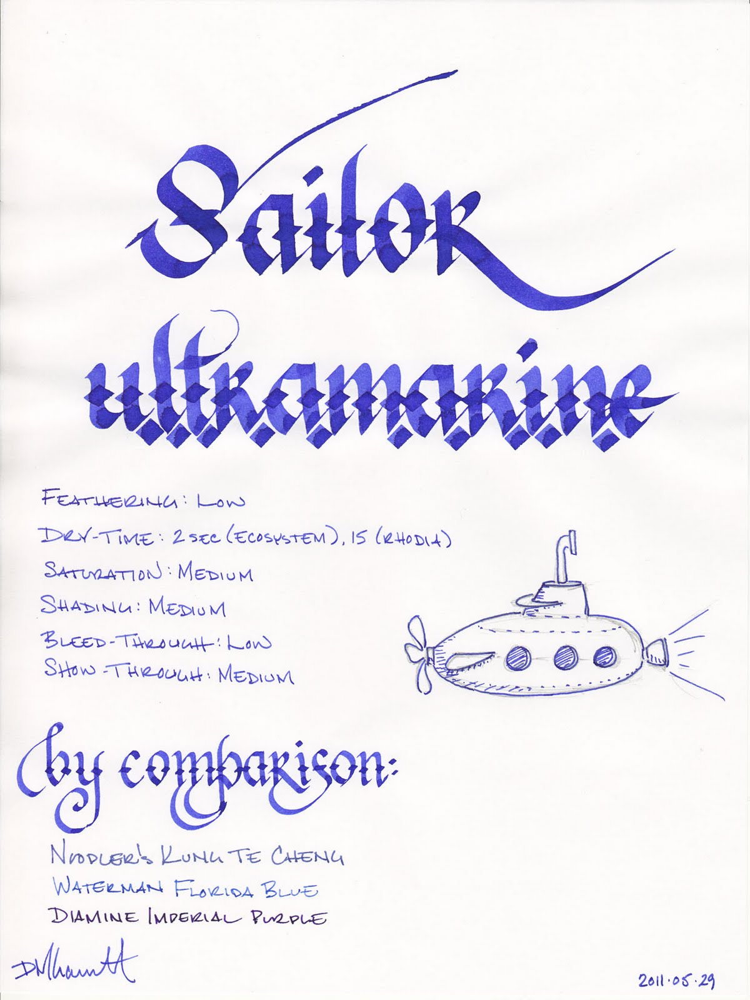
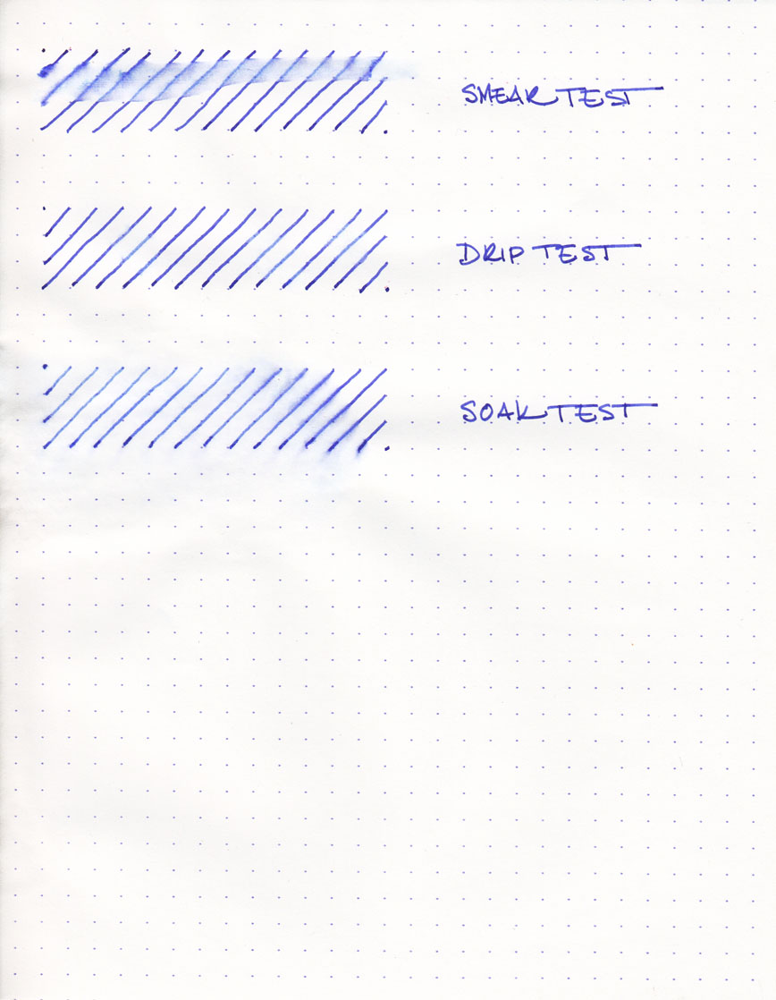

Sailor Jentle Ultramarine is one of Sailor's six new ink colors (the others being Apricot, Epinard, Grenade, Peche, and Sky High). I purchased samples of each, and Ultramarine is the first one I tested. Ultramarine is a unique color that sits on the spectrum between blue and indigo. One could call it blue-purple, but that wouldn't quite do it justice.

Historically, ultramarine was an expensive pigment that was made by grinding up the gemstone lapis lazuli. It was first used in the 6th and 7th centuries, but was most popular during the 14th and 15th centuries. It was generally reserved by European artists for the most important subjects in paintings, such as the robes of Mary and the Christ child in sacred works.

Thankfully, the color can be produced artificially today, which makes inks like this one affordable. The color is so rich and beautiful, though, that you'd be forgiven for thinking that you're still writing with ground-up lapis. Sailor Ultramarine, in particular, is moderately saturated, which produces medium levels of gem-like shading in a fine nib.

I tested this ink on five papers: cheap, office-grade copier paper; Staples "Sustainable Earth" bagasse; Ecosystem notebook paper; Moleskine cahier paper; and high-quality Rhodia 90gsm paper. I've previously reviewed Sailor Jentle Blue-Black, and its behavior was exemplary across each of these papers. I'm pleased to report that Ultramarine is equally well-behaved.

On the copier paper, it displayed a low-medium level of feathering, a medium level of show-through, and a low level of bleed-through. It was dry to the touch in three seconds. On the bagasse, the ink displayed a low level of feathering and bleed-through, and medium level of show-though. It dried in six seconds. On the Ecosystem notebook, the ink dried in two seconds, and had a low level of feathering and bleed-through. It exhibited moderate levels of show-though.

The ink's performance on the Moleskine cahier was better then many. While it took fifteen seconds to dry, I noticed absolutely no bleed-through, low levels of feathering, and only moderate show-through. Finally, on the Rhodia paper, the ink dried in just under fifteen seconds, which is within the realm of normalcy for Rhodia. As expected, it demonstrated no feathering, no bleed-through, and very little show-though.

My only complaint about the ink is that it has a very sharp chemical solvent smell to it. Some inks possess a mild odor that is only noticeable up close, but this scent is more powerful. It is similar to the smell of some permanent markers. If you're sensitive to odors in general, or specifically to that type of scent, I'd recommend trying a sample or otherwise evaluating it in person before buying.

Ultramarine held up unexpectedly well during the water tests. The smear test, in which I ran a wet finger across the page, was first. Here, the ink did smudge, but left behind legible lines. The drip test, in which I let droplets of water sit for a minute before blotting, raised about a third the ink from the page, but left the other two-thirds intact and legible.

The soak test, in which I run the paper under a faucet for a half a minute, was the most surprising. About a third of the ink washed away, but the remaining ink remained completely legible. I'm happy to report that Ultramarine possesses a high degree of water resistance, though it is not completely waterproof.

Ultramarine is a beautiful color, and I can see it being used by less conservative businesspeople. It's easy to read, especially on white paper, so it's also useful for daily journaling or correspondence. The high degree of water resistance makes it a good choice for addressing envelopes, but the tendency to smear slightly makes it unsuitable for artistic endeavors that require it to be washed over.

Sailor inks come in a bottle that looks like a cold-cream jar - they're nothing especially interesting to look at, though they are fairly innocuous. Much more interesting than their appearance is the inclusion of a mechanism that aids the filling of pens.

A plastic funnel sits inside the mouth of the bottle. Prior to filling a pen, turn the bottle upside down (leave the lid on for this step, of course), and ink will fill the funnel. Then turn the bottle back over, and the ink will remain in the funnel for long enough to allow you to easily fill the pen. This is especially handy once the ink falls below a certain level in the bottle; it makes it very easy to get to every last drop.

I'm becoming quite a fan of Sailor inks. While I originally ordered samples of all of the new colors, I know for sure that I'll be ordering full bottles of many of them, and Ultramarine will be certainly be first.

Review materials: For the wide strokes, I used two calligraphy pens: Pilot Parallel 6.0mm and 2.0mm Pelikan Script. Both have steel nibs. For the fine strokes, I used a Lamy 2000. The paper is Rhodia 80g from a No. 18 notepad.

Sailor Jentle Ultramarine is available from:

- [Goulet Pens](http://www.gouletpens.com/Sailor_Jentle_Ultra_Marine_p/sj-13-1000-250.htm)
- [JetPens](http://www.jetpens.com/Sailor-Fountain-Pen-Jentle-Ink-50-ml-Bottle-Ultramarine-Purple/pd/6868)
