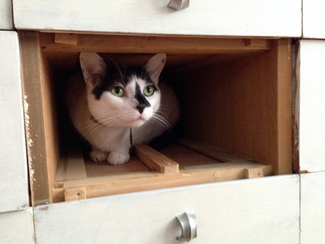

"Hola, Señor."

"Hello, cat."

"It is a lovely and glorious day today, is it not? The sun is shining, the birds are chirping…"

"You're not supposed to be on the table. What do you want?"

"Well, speaking of birds – since you won't let me outside to eat them, would you instead treat me to a bite of your pizza?"

"No."

"No?"

"No."

"I see. Well, these are tumultuous times that we live in. The world is changing at an ever-increasing rate, and we must change with it or become lost. So, how about now?"

"No."

"How about now?"

"No."

"Now?"

"No."

"Now?"

"No."

"Allow me to remind you that, I, Ernesto Zocalo El Gato, your closest and most loyal friend, am simply asking for a small bite of your pizza."

"I've had you for less than a month."

"Stronger friendships than this have been forged in less time."

"No, you can not have my pizza."

"Perhaps a nibble?"

"No."

"Perhaps a tiny nibble?"

"No."

"I see, so my friendship means nothing to you. Very well. I turn my back on you."

"Good. Leave me in peace."

"Señor, it occurs to me that perhaps we have started on the…how do you say it in your language…wrong foot."

"Why?"

"Perhaps this is due to a misunderstanding."

"No, why are you back? I thought you were going to let me eat my lunch."

"Fine. You do not wish to talk. I understand. Perhaps I will simply climb down into your lap."

"What? Hey."

"Shall I purr for you? It is one of the many services I offer."

"Well, ok. If you're just going to stay there and curl up."

"This is all I desire, you see."

"Ok."

"Though, now that I am down here, I am mere inches from your pizza. Perhaps I could have just a tiny bite."

"Hey! Get down!"

"Why am I now on the floor? How odd."

"Damn it, cat. Why are you back on the table?"

"I detected the scent of pizza, Señor. Oh, look, there is a slice of pizza, simply lying on a plate, desperately waiting to be consumed. It would be rude to leave it there to rot."

"Leave my pizza alone! I said get down."

"The floor again. It is so very confusing. I do not understand how this occurs."

"I put you there."

"Where?"

"On the floor. Stay on the…damn it."

"Hola, Señor. I notice that you are not eating your pizza. Perhaps you are not hungry. It would be a shame to let it go to waste."

"You can not have my pizza."

"Not even a little?"

"No."

"A crumb?"

"No."

"An imperceptible quantity?"

"You know what? Fine. Go ahead. Have some pizza."

"Pizza? What a kind offer, Señor. The kind that only a loyal and trusted friend would make. You are truly a credit to your species."

"Uh-huh."

"Hmm. That is an odd taste – the orange paste on top of the pizza. What is this concoction called?"

"Sriracha."

"Is that a Spanish word?"

"No, it's Thai. It's the name of a hot sauce."

"A hot sauce. I see. It is creating a strange tingling sensation on my tongue. Is this normal?"

"Pretty typical."

"Well, this is becoming somewhat uncomfortable. Perhaps you are not such a loyal and trusted friend after all."

"You want more pizza?"

"You are a cruel man, Señor. A cruel, cruel man! Madre de Dios! Mi boca es en fuego!"

"You wanted the pizza."

"How do you make it stop?"

"Make what stop?"

"The burning!"

"Oh, it'll go away on it's own, or…"

"Or?"

"Forget I mentioned it."

"I would remind you that you have caused irreparable harm to my sensitive mouth. I would like to know what comes after the 'or.'"

"Well, ice cream helps, too."

"Ice cream? Do you have ice cream?"

"Don't even think about it."
