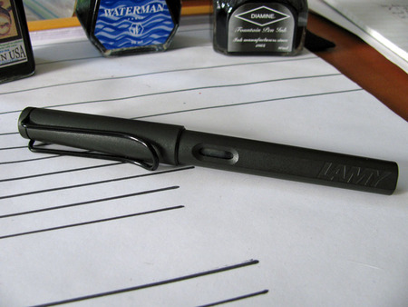
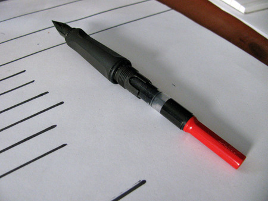
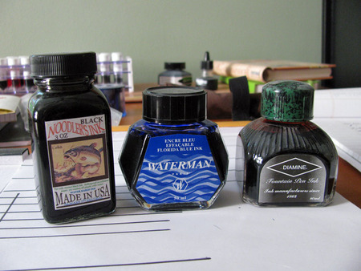
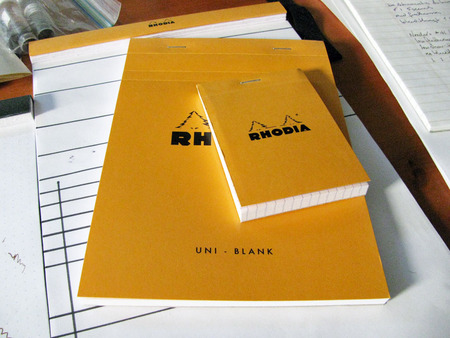

When someone gets bitten with the fountain pen bug, they often become overwhelmed by all of the available choices, and then quickly ask a number of questions: What is the difference between a cartridge, a converter, a piston, and a vacuum fill? What's the difference between a steel and gold nib? Who makes the best ink? What kind of paper do I need? What's more, where do I get all of this stuff?

It is easy to get overwhelmed, so here are my suggestions for where to start. These are good, solid products that are easy to use and represent great value for the money. Once you've got the hang of the basics, you can explore the more advanced options – but you'll still want to hold on to the items that I describe below.

The three main factors that will affect your experience are the pen itself, the ink, and the paper.

## Pen

The best beginner's pen, in my opinion, is the Lamy Safari. The Safari is a workhorse of a pen and is marketed toward every-day users and students. It is easy to clean and maintain, it's durable, and it's fairly priced. The steel nib is available in a variety of widths, which range from extra-fine, which approximates a fine-tipped ballpoint pen, to fine, which resembles a medium-tipped ballpoint pen, to medium and broad. The plastic body of the pen comes in a range of colors, from conservative charcoal to bright red.

The Safari comes with a cartridge of blue ink. The cartridge plugs into the back of the nib unit, and can be replaced with other cartridges. Lamy ink cartridges come in basic colors: blue, black, blue/black, red, green, turquoise, and violet. They are easy to use, convenient to carry around, and are fairly mess free. The only drawback is the lack of color variety.

If you feel like exploring the wide range of colors available in bottled inks, then you'll need something called a converter. A converter plugs into the back of the nib unit, just like a cartridge, except that it contains a screw-driven piston. To fill a pen that uses a converter, you'll need to plunge the whole nib, up to the barrel of the pen, into an open bottle. By twisting the screw on the end of the converter, you can move the piston up and down, and pull the ink up into the barrel.

When you've filled the converter, make sure to wipe off any excess ink on the body of the pen and the nib with a paper towel. Otherwise, you're liable to end up with inky fingers.

## Ink

Bottled fountain pen ink is available in a wide variety of colors and qualities. Some ink is highly saturated and produces vibrant, solid lines. Other ink produces amazing variations in shading, resulting in a lovely watercolor effect with each stroke. Some ink is designed to withstand the attacks of forgers and resist all attempts at removal, while other ink is designed to wash right out of clothing.

One of the joys of owning a fountain pen is exploring all of the amazing options. Fortunately, there is a large community of individuals who post their impressions online, along with color swatches, writing samples, and artwork.  Many are even willing to trade ink samples through the mail. It's easy to [get addicted](/blog/2012/1/27/inkventory-2012).

To start, though, you're going to want the basics:

[Noodler's Black](/blog/2012/3/24/ink-review-noodlers-black-revisited) is one of the all-time great inks. If you like black ink, and you write primarily on copier paper, legal pads, or other office-grade paper, then you'll love the solid line it produces, the way that it makes the pen feel like it's gliding across the surface of the paper, and the lack of feathering it exhibits. Its main drawback is that, on high-quality, coated papers, it can take a really long time to dry – upwards of minutes. It also has the benefit of being resistant to water and to forger's tricks. It's a great ink to sign checks and contracts, or to address envelopes with.

Waterman Serenity Blue (formerly known as Florida Blue) is one of the classic blue inks. It is vibrant enough to read easily but conservative enough for business use. It behaves well on even cheap paper, and it cleans up easily from both pen and skin.

If you do any sort of editing, underlining, or highlighting, then a vibrant color is useful to have in your collection. Diamine makes ink that has a great balance of properties: their colors are vibrant, they dry in a reasonable time frame, and they behave well across a variety of paper types. Their [Monaco Red](/blog/2010/12/24/ink-review-diamine-monaco-red) is an earthy, orange red with brick undertones that shows up easily on the paper without being obnoxious and hard to read.

## Paper

The last piece of the puzzle is paper. Most people are familiar primarily with notebook paper, legal pads, and cheap, office-grade copier paper. A whole world of high-quality paper awaits. Two brands of paper are well knows for being fountain-pen friendly. They have smooth surfaces, which makes them easy to write on, and they resist ink, which means that they produce nice, crisp lines with a minimum of feathering.

Rhodia is famous for producing notepads bound in a bright orange, coated cardboard. They are available in a wide variety of sizes and in blank, lined, or graph paper. The microperforated paper itself is bright white and pH neutral, so it is easy to read, stands up to wear and tear, and lasts a long time. Rhodia notepads are what I use to write [all of my ink reviews](/categories/ink-reviews/).

Clairefontaine makes great notebooks. Their softcover, clothbound notebooks contain 96 pages of satin-smooth, bright white paper, and are available in blank, lined, French-ruled, or graph.

All of the items mentioned above can be found online at various retailers. My preferred source is [Goulet Pens](http://www.gouletpens.com/), which is run by a husband and wife team who are very active in the fountain pen community. They're friendly people, their customer service and shipping times are outstanding, and they've always got great prices on their products. They're where I buy the majority of my pens, ink, and paper.

If you want to know more about fountain pens, ink, and paper, I would encourage you to check out the [Fountain Pen Network](http://www.fountainpennetwork.com/forum/) – a forum for pen enthusiasts and a repository of huge amounts of information. Also make sure to check out any of the ink links (which you can find to the right), which are pen-related blogs that I read on a regular basis.

You're also welcome to ask me questions, either by email or here at Seize the Dave.

Happy writing!
