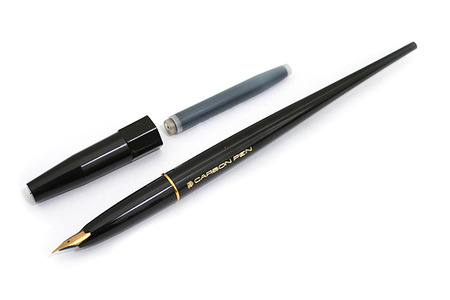
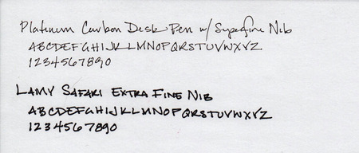

[Platinum Carbon](/blog/2011/3/8/ink-review-platinum-carbon-black) is archival-quality ink that I've reviewed favorably in the past. I've reviewed other permanent inks as well, but Carbon stands out for its ability to completely withstand water once dry, making it very friendly to artists who want to paint with washes or watercolors over inked lines. Most other permanent inks permanently stain the page, but leave a residue that can be smeared or tint the color of the wash.

To understand the behavior of Carbon ink, it is useful to discuss the difference between dyes and pigments. Generally speaking, dye is a soluble substance that chemically bonds to the substrate that it is coloring. Because they are soluble, many dyes can be washed off easily, and must be fixed in place using other substances. Since the vast majority of fountain pen inks are dye based, finding ones with water resistance is hard to come by.

There are a few dye-based inks that are waterproof, though, by becoming insoluble once they bond with the cellulose in paper. Noodler's "bulletproof" inks are notable examples. The trouble with these inks is that any dye that dries on top of the paper, as previously mentioned, remains vulnerable to moisture – it can be smudged, smeared, and washed away.

Pigment, on the other hand, is an insoluble, particulate substance that physically adheres to the substrate it colors. It is typically added to a medium, a neutral substance that allows it to be easily applied, which often contains a binder, a substance that aids in adhesion, to create a suspension. Oil and acrylic paints, printer's and India ink are all examples of pigment-based colorants.

Traditionally, pigment-based inks are unsuitable for fountain pen use. The medium is often too viscous and the particles too large to be carried by the delicate capillary action that powers the flow of ink in a fountain pen.

Carbon ink solves this problem by using micro-particles that are suspended in a medium friendly to fountain pens. The micro-particles are small enough to flow through the feed and nib, and the medium is engineered not to clog. However, if the ink were to dry out in the pen, the insoluble nature of the pigment would make it very hard to clean out. It would require disassembly of the pen at the very least, whereas most dye-based inks could be flushed out with some effort.

Unfortunately, this characteristic makes many fountain pen users wary of using the ink. Everyone has had or will have a pen dry out on them at some point, and no one wants to ruin their favorite pen when it happens.

Enter the Platinum Carbon Desk Pen. Designed for sitting on top of one's desk, and not for carrying around in one's pocket, this inexpensive pen is dedicated to the task of writing with Carbon ink. Now you can write with Carbon ink to your heart's content, and if the worst should happen, you can simply buy another.

The pen is made of glossy black resin and has the Platinum logo and the words "Carbon Pen" embossed on the side in gold ink. It ships with a single Carbon ink cartridge, but will also accept a converter, which is available separately. The cap is a friction fit – it does not click or screw into place – but it does have a hexagonal section that prevents the pen from rolling around when capped. While the pen looks and feels solid, and isn't intended to be disposable, it is clearly not a luxury pen.

Fortunately, the pen is lovely to use. It has a very long barrel, like a Lamy Joy or Pelikan Script calligraphy pen, which makes it easy to hold and well balanced in the hand. The barrel tapers to a point at the end, so the cap can't be posted. The grip section is also glossy black resin, so those with sweaty hands might find it to be slippery, but I didn't have any issues.

Everything I've described so far is good – there are no showstoppers – but nothing to recommend rushing out and purchasing one. The gold-plated, steel nib, on the other hand, is phenomenal. The model I tested has a "super-fine" nib, which produces the slimmest line I've ever seen produced by a pen.

(For some reason, the term "super-fine" sounds like it should be part of a tagline in a late 70s/early 80s advertisement. Perhaps one featuring Billy Dee Williams or Quincy Jones. "What's finer then fine? Super-fine!" But, I digress.)

At any rate, a nib this fine has no business being this smooth. It has a bit of spring to it, which gives it a cushioned feel on the page. Additionally, you can coax a tiny bit of line variation with gentle pressure, due to the springiness; it is not a flex nib – to be clear, just one with a bit of give.

The super-fine nib produces an extremely slender line, as you can see in the sample above. The super-fine line would be perfect for writing complex ideograms with, which I suppose is the point. With many types of ink, a line this fine would look washed out, but the Carbon ink is up to the task. While clearly not as bold as the extra-fine line created by the Lamy, it's still a solid black on the page.

I was also happy to find that the feed exhibited no trouble supplying ink to the super fine nib. I've had other extra-fine pens that wrote dry, but this one writes along with no trouble.

At $13.50, the Platinum Carbon Desk Pen is a great value for the money – especially if you're interested in using Carbon ink, but don't want to risk a more expensive pen. If you find yourself hooked, you can even buy a desk pen stand made specifically for the pen.

I'd like to thank Jet Pens for providing the pen for review purposes. Jet Pens made a name for themselves by importing pens, pencils, inks, paper, and other writing accessories from Japan. While their selection of products has expanded to include brands from other countries, high-quality Japanese products still remain their focus. Their customer service is top notch, and I've had them linked as an Ink Retailer that I trust for quite some time.

The Platinum Carbon Desk Pen is available from:

- [Jet Pens](http://www.jetpens.com/Platinum-Carbon-Desk-Fountain-Pen-Super-Fine-1-Carbon-Ink-Cartridge/pd/3851)

Review notes: the writing sample was created with a Platinum Carbon Desk Pen with super-fine steel nib and a Lamy Safari with an extra-fine steel both using Carbon ink. The paper is bright white Rhodia 80gsm.
