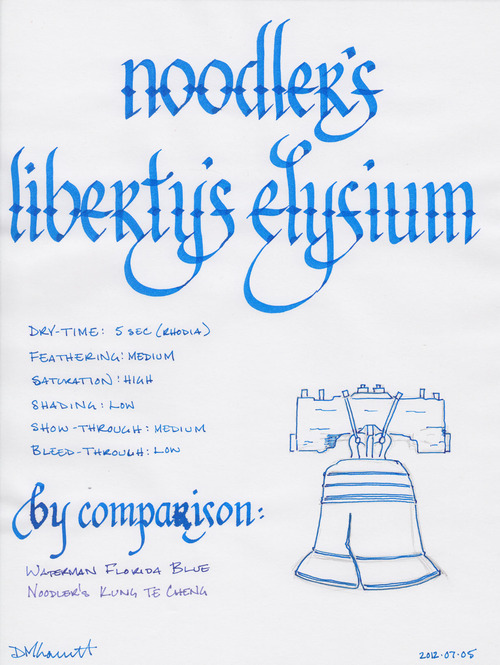
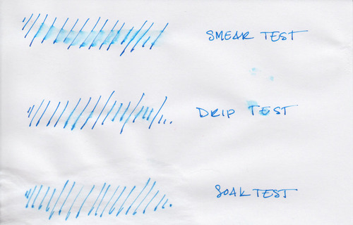

There are many good things to say bout the [Goulet Pen Company](http://www.gouletpens.com/), but one of them is the degree of care they take in packaging items for shipment. Most bottles of ink are individually wrapped to insure against leakage, then are wrapped in several layers of bubble wrap to prevent them from getting banged around, and then again in plastic wrap to protect them against the elements. As you might expect, I've never had any item arrive in a damaged state, despite packages being left in the rain, left in the snow, and left in the rain/snow combination whimsically referred to as a "wintery mix."

Beyond the care taken, though, the most distinctive thing about a shipment from the Goulet Pen Company is the bright, blue packaging material. If you've ordered from them before, you'll know exactly what I'm talking about. They also use a very similar blue in their ink drop logo. So when the newest Goulet-exclusive ink was announced, many people speculated that we'd see something in "Goulet blue."

Liberty's Elysium, manufactured by Noodler's Inks, is exactly that lovely, cool shade of blue. It is vibrant enough to provide great contrast on white paper, but subdued enough to be easy to read. It is brighter than Waterman Florida Blue, but not nearly as obnoxious as [Noodler's Baystate Blue](/blog/2011/2/22/ink-review-noodlers-baystate-blue/). Like most Noodler's inks, Liberty's Elysium is highly saturated and produces a bold line with a low level of shading.

It is wet writing ink that dries very quickly. Show-through was moderate on each of the paper types I tested: fountain pen-friendly Rhodia, Staples bagasse notepads, and cheap, office-quality copier paper. In my Clairefontaine notebooks, I was able to use both sides of the paper without any issues.

Bleed-though was likewise very good, except where I was using wet-writing calligraphy pens. Even then, it only occurred where the ink pooled on the paper at the bottoms of letters.

Noodler's Liberty's Elysium caused a moderate amount of feathering in wet writing pens and on cheap paper. This is evident in the "by comparison" section of the written review, were the "b" and "r" both suffer from severe feathering. On office-grade copier paper, and on Staples bagasse, it produced a medium line instead of a fine line. Generally, though, the feathering is tolerable – on good quality, ink resistant paper the behavior is almost non-existent.

Yet, despite how wet the ink is, my single criticism of Liberty's Elysium is that is dries too quickly. Those who have read my other reviews may find this ironic, as long dry times have been my chief complaint about other Noodler's inks. However, when using my [Visconti Homo Sapiens](/blog/2011/11/20/pen-review-visconti-homo-sapiens/), leaving the cap off for more than five seconds causes the pen to start hard and occasionally skip on the initial stroke. Drying quickly on paper is an admirable quality. Drying quickly in my pen is less so.

Regardless, on Rhodia paper, Liberty's Elysium dried to the touch in about 5 seconds. On Staples bagasse, it took about 10 seconds, but on office-grade copier paper, it was dry in less than three seconds.

Liberty's Elysium was originally marketed as bulletproof ink, which caused some controversy when it was released. The term "bulletproof" isn't a regulated term, nor is it a commonly accepted industry term. It is a marketing term coined by Nathan Tardiff, the man behind Noodler's Inks, but it is one that has been applied consistently across the Noodler's line. The fountain pen community has come to expect a specific set of behavior from these inks.

Noodler's bulletproof inks are designed to withstand attempts to remove them from paper. The dyes bond to the cellulose in the paper and can't be washed away by water, bleach, or other methods. Therefore, they stand up fairly well to water on most paper. On coated papers that resist ink, they may sometimes smudge, as the ink that dries upon the surface is still susceptible to being washed away, but the color and intensity of the ink remain stable.

The water test reveals the trouble with marketing Liberty's Elysium as bulletproof. The smear test, in which I run a wet finger across the page, results in a blue smudge and significant travel of the ink across the page. The lines are still intelligible, but they are significantly diminished in intensity.

The drip test, in which I let several drops of water sit on the page before blotting them up, results in similar behavior: ink that bleeds and smudges, and is reduced in intensity. The soak test, in which I run the paper under a stream of water for thirty seconds, results in a significant portion of the ink being washed away and some feathering. This is not the behavior that most Noodler's customers have come to expect from their bulletproof ink.

However, a closer look at the soak test reveals that the lines that remain are completely legible and fairly bold. It appears that the ink is _partially_ bulletproof – some portion of the ink remains resistant to removal while the rest can be washed away. This is similar in behavior to [Noodler's Black Swan in Australian Roses](/blog/2010/11/30/ink-review-noodlers-black-swan-in-australian-roses/), which is marketed as "partially bulletproof." Consequently, Noodler's Ink and Goulet Pens have changed the designation of the ink to match, which, in my opinion, nicely solves the problem.

Nathan Tardiff is a man who enjoys the study of history. Many of his inks have historic elements in both name and label design. It's the most common motif beyond the Noodler's catfish mascot. With a name like Liberty's Elysium, one would expect a historically themed label, and Mr. Tardiff does not disappoint. The label is packed with scenes from the American colonial period, including Patrick Henry's quote, "Give me liberty, or give me death!" Brian Goulet explains the meaning behind the other scenes and quotes on the label in the [video where he introduces the ink](http://youtu.be/M7wDRicGxvo).

It is fair to say that the labels bring an interesting touch to an otherwise utilitarian bottle. Aside from some specialty lines, Noodler's inks are packaged in plain, 3 oz, glass bottles that are sourced from high-volume suppliers in order to keep costs down. You could easily see these bottles filled with spices in your local grocery store. The bottles are notoriously filled to the brim, so be careful when opening – make sure you've got it somewhere flat and stable before you unscrew the cap.

Liberty's Elysium is great ink worthy of the great people who work at Goulet Pens. It's a beautiful blue that's just subdued enough for the office, but still interesting enough for personal use. It behaves moderately well on a wide variety of paper types, and it is one of the few blue (not blue-black) inks with this level of permanence. My only quibble is the behavior of the ink in my Visconti pen – drying too quickly in the nib. Beyond that though, the Goulets should be proud of their newest exclusive ink.

Review notes: the wide strokes were made using a Pilot Parallel calligraphy pen with a 3.8mm steel nib. The medium strokes were made with a Pelikan Script 2.0 pen with a 2.0mm steel nib. The fine lines were made using a Visconti Homo Sapiens pen with an EF palladium nib. The paper is Rhodia 80gsm from Rhodia Bloc pads.

Noodler's Liberty's Elysium is available exclusively from:

-  [Goulet Pen Company](http://www.gouletpens.com/Noodlers_Ink_Libertys_Elysium_p/n20001.htm)
