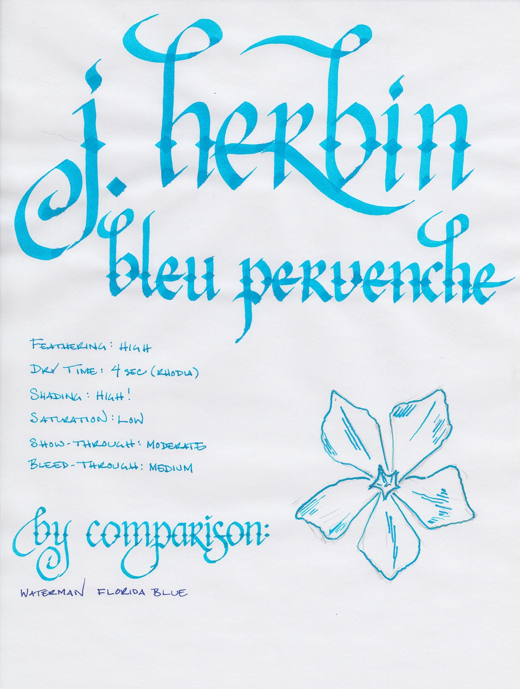
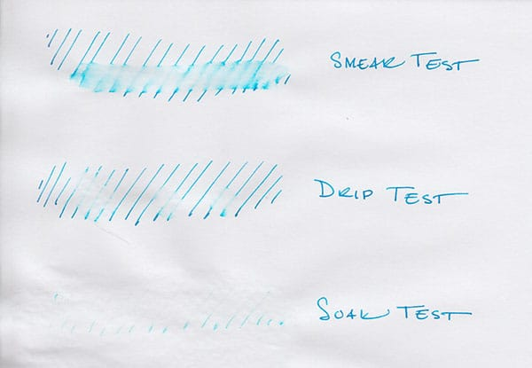
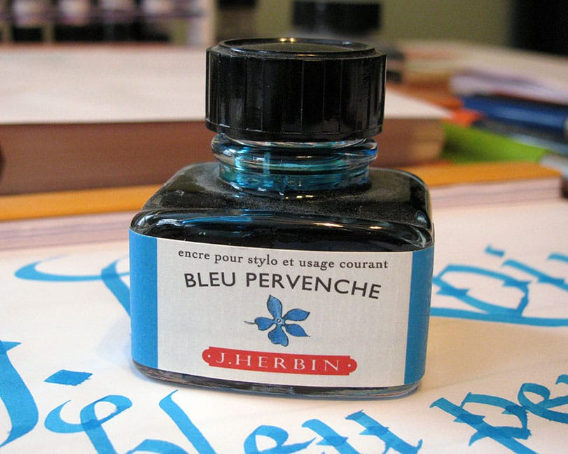

J. Herbin makes watercolor-lovely ink. Some colors, like [Bleu Myosotis](/blog/2010/11/15/ink-review-j-herbin-bleu-myosotis), give the impression that the viewer is looking at a field of wildflowers through a set of gauzy curtains in the pale light of a spring morning. Bleu Pervenche, on the other hand, places the viewer on a rocky outcropping, gazing out at the blue-green waters of the Mediterranean, one hand against the brow to shield his eyes, squinting in the summer sun.

It's an extremely lovely, bold color, even if it is puzzlingly named. Pervenche means periwinkle in French, and this color doesn't resemble the periwinkle that I'm familiar with in the slightest. It's not a light blue-purple, but a bright, bold blue that leans toward the green end of the spectrum (as opposed to the purple end).

I prefer to use new ink for a week or two before I review it. In this case, I cleaned the [Noodler's Black](/blog/2012/3/24/ink-review-noodlers-black-revisited) out of my trusty [Visconti Homo Sapiens](/blog/2011/11/20/pen-review-visconti-homo-sapiens) and filled it with Bleu Pervenche. While few inks are as smooth as Black, I was pleasantly surprised at how well Bleu Pervenche handled. It is wet-writing ink, which allowed the pen to move easily across the surface of most paper types I used.

The ink exhibits a high degree of feathering on normal copy paper and Staples Bagasse. It generally behaves well on coated papers like Rhodia pads or Clairefontaine notebooks, but does feather when using wet-writing pens like the Pilot Parallel calligraphy pens in the writing sample above.

Like most J. Herbin inks, saturation is low, which enables the loveliest characteristic of Bleu Pervenche to shine: the high degree of shading that it exhibits even in fine-writing pens. Show- and bleed-though were both moderate on Rhodia paper, though I didn't notice it at all on slightly heavier Clairefontaine notebook paper.

J. Herbin inks aren't known for being water resistant, and Bleu Pervenche is no exception. When I ran my wet finger across the page for the smear test, it erased most of the lines, and left a blue haze in its wake. The drip test, in which I let a several drops of water sit on the page for a minute before blotting them up, wasn't much better – most of the ink came up with the blotter. The soak test, where I run the paper under water for thirty seconds, was the most impressive of all – nearly all of the ink was washed away, and only the faintest of lines remains.

J. Herbin fountain pen inks come in a 30ml bottle with an integrated pen rest that is suitable for displaying on top of one's desk. The bottles are slightly challenging to use with a large-nibbed pen, though – I had to tilt the bottle to get a deep enough well to fully submerge my pen.

Despite the high degree of feathering and the logistical issues of the small bottle, I have no hesitation in recommending J. Herbin Bleu Pervenche for those that enjoy bold, vibrant colors. It's nearly impossible to be unhappy when writing with this ink. It's an instant pick-me-up, and worth picking up to add to your collection.

Review notes: The fine lines were created by a Lamy Safari that was equipped with a steel EF nib, the medium lines with a Lamy Joy 1.9mm calligraphy pen, and the broad lines with 6.0mm and 3.8mm Pilot Parallel calligraphy pens. The paper is bright white, 80gsm, from a Rhodia Bloc pad.
