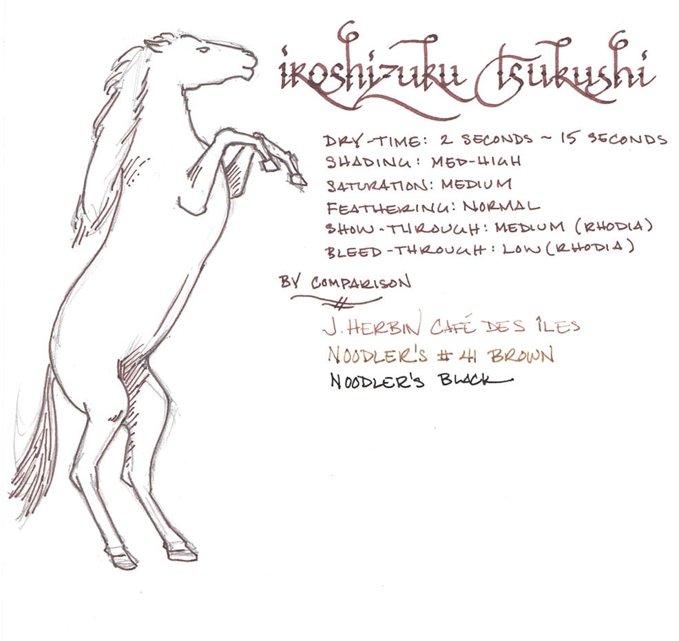
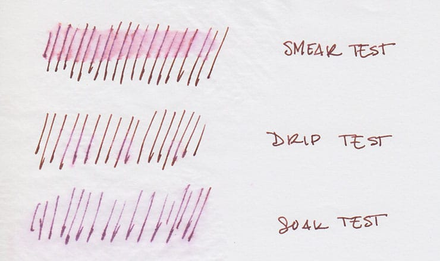
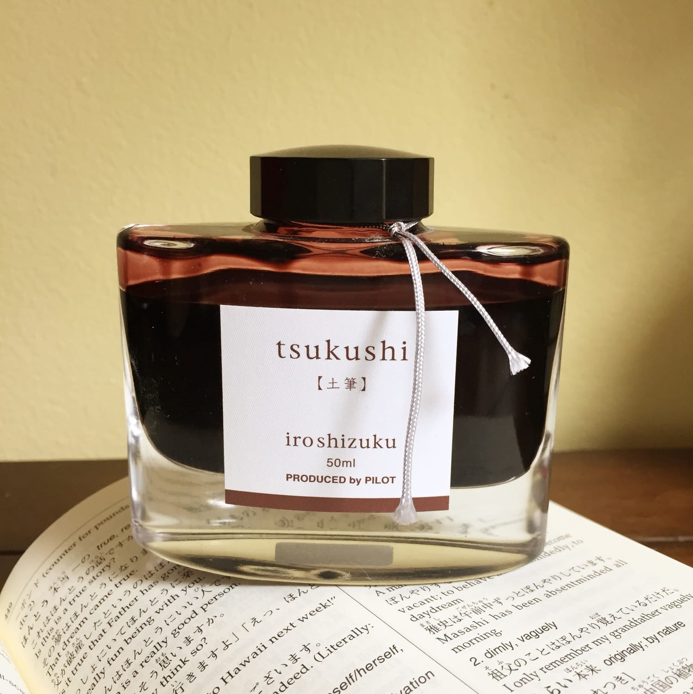

Iroshizuku is a line of ink produced by Pilot under their high-end Namiki brand. The natural landscape and plants of Japan inspire the colors in the line, resulting in some of the most interesting and unique ink around. Some of my earliest reviews were of Iroshizuku ink: [Yu-Yake](/blog/2010/2/28/ink-review-iroshizuku-yu-yake), a delightful burnt orange; [Momiji](/blog/2010/4/28/ink-review-iroshizuku-momiji), an incredible, if subtle red; [Yama-Budo](/blog/2010/4/10/ink-review-iroshizuku-yama-budo), a ripe, juicy purple; [Kiri-Same](/blog/2010/3/1/ink-review-iroshizuku-kiri-same), the color of storm clouds in a bottle; and [Kon-Peki](/blog/2010/3/18/ink-review-iroshizuku-kon-peki), a deep and intoxicating ocean blue. To mark my recent return to ink reviews after a two-year hiatus, I just reviewed [Asa-Gao](/blog/2014/8/3/ink-review-iroshizuku-asagao), which is a daily-writer-worthy vibrant blue.

Returning to this line of ink made me remember just how much I love it. I’ve collected lots of ink over the years, which means that the average tenure of any particular color in my daily writer is probably one month, if not less. As a result, many of the Iroshizuku inks that I collected early on have sat, lonely and unused, for a few years. So, when I went to choose the next ink in my rotation, I picked an Iroshizuku ink that I had owned for years but never reviewed: Tsukushi.

Tsukushi means “horsetail” in Japanese, and can refer to either the horsetail plant or to a wooden stick with a burned tip that’s used to create under-drawings for artwork. According to Pilot, the ink is “a soft brown, like a young horsetail awaiting the coming of spring,” which I assume refers to the plant, as the idea of a burnt stick waiting around for spring can only be explained by artistic bears coming out of hibernation and then sleepily marching into the studio for a quick sketch before wandering off to hunt salmon.

At any rate, Tsukushi is a medium brown with a hint of earthy red. It’s moderately saturated, and does exhibit nice shading with both a fine nib and a wide stub nib. As a wet writing ink, it provides sufficient lubrication across a variety writing surfaces.

As a line, Iroshizuku ink behaves best on high quality, ink resistant paper like Clairefontaine, Rhodia, or Midori. Because most of the colors are wet-writers, they have a tendency to feather on cheap, absorbent paper like bagasse or copier paper. Tsukishi squarely fits the pattern, as seen by its behavior on the various papers I tested it on.

| Paper | Dry Time | Feathering | Show Through | Bleed Through |
| :-- | :-- | :-- | :-- | :-- |
| Rhodia | 12 seconds | None | Medium | None |
| Midori | 15 seconds | None | Medium | None |
| Bagasse | 3 seconds | High | High | High |
| Copier | 2 seconds | Medium | High | High |

Tsukushi held up better than I expected during tests of its water resistance. On the smear test, in which I drag a wet finger across the page, the ink certainly smeared – the red compounds in the ink splayed across the page – but the underlying lines still remained legible. On the drip test, in which I let a few drops of water sit on the page before blotting them up, the ink bled slightly and some came up off the page, but it still remained readable.

On the soak test, in which I ran the page under a stream of water for half a minute, Tsukushi tenaciously clung to the page. While a considerable portion of the ink was washed away, the lines remained clearly visible; at least some amount of the ink appears to have bonded to the paper, preventing it from being fully removed. While nowhere near bulletproof, it was a solid performance

Iroshizuku bottles remain one of the loveliest designs in the field. Each beautiful, 50ml bottle brilliantly showcases the color of the ink it contains. They are quite solid and the thick bottom gives each one a surprising amount of heft. Also, an indentation in the bottom of the bottle is intended to aid in soaking up the last few drops of ink. These are bottles that deserve a place of pride on top of a desk.

Brown inks have not been in my regular rotation for the past couple of years, but my time with Tsukushi is making me rethink that – especially as we head into autumn here in the US. It’s well-behaved ink with nice shading in a color that I haven’t yet found elsewhere. It’s not cheap – Iroshizuku ink runs about $28 (US) per bottle – but from its time in my pen, I’d say that it’s worth it.

Iroshizuku Tsukushi is available from:

- [Goulet Pens](http://www.gouletpens.com/Pilot_Iroshizuku_Tsukushi_50ml_Ink_p/pn69218.htm)
- [Jet Pens](http://www.jetpens.com/Pilot-Iroshizuku-Ink-50-ml-Tsukushi-Horsetail-Plant-Reddish-Brown/pd/4663)

Review notes: The hand-written portions of the review were created on 80 g/m2 Rhodia paper from a No. 18 Bloc pad. The flourished italic script was written using a Monteverde Prima with a 1.1mm steel stub nib, while the remainder of the text was written using a Visconti Homo Sapiens fitted with an EF palladium nib.
