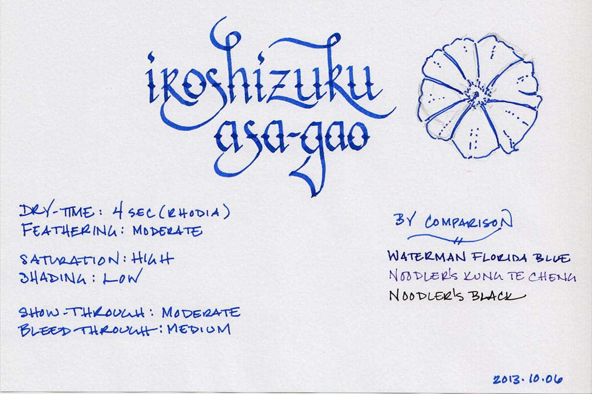

I’d like to begin by offering a hearty apology to the fine folks at [Jet Pens](http://www.jetpens.com), who sent me a bottle of [Iroshizuku Asagao](http://www.jetpens.com/Pilot-Iroshizuku-Ink-50-ml-Asa-gao-Morning-Glory-Dark-Blue/pd/3508) all the way back in October of 2013. At the time, I thought that I could sneak in an ink review in the middle of my EMBA program. That was a gross over-estimation of time and ability on my part. I managed to get the ink samples created, but the review itself never materialized – always de-prioritized in favor of papers, presentations, and projects. I’m finally back, though. My brain has recovered, and, for my first foray back into the reviewing realm, I’m delivering the long-overdue review of Iroshizuku Asagao.

The morning glory was first identified in China, where it was used for medicinal purposes. It was introduced to Japan in the 9th century, where it became cultivated for its ornamental properties. It became such a popular flower in Japan that the Japanese now lead the world in developing new varieties of the plant, producing a multitude of colors. Asagao is based on the most common color, though – a lovely, vibrant blue. It is highly saturated ink that produces significant contrast on bright white paper, and exhibits low levels of shading when used with a fine-nib pen.

The ink performed modestly across a variety of paper types. On Rhodia paper, which is very fountain pen friendly, the ink dried in 4 seconds, and displayed moderate feathering. Show-through and bleed-through were both moderate as well – manageable, but one wouldn’t want to use this ink to write on both sides of the page. It performed reasonably well on cheap copier paper, where it dried in 1 second, and had low to moderate feathering. It had above average levels of bleed-through and show-through, though. Asagao fared the worst on Staples’ bagasse, where it dried in 2 seconds, but exhibited extraordinary feathering, and had high levels of bleed-through and show-through.

Asagao is the first Iroshizuku ink on which I’ve conducted a water test, so I wasn’t quite sure what to expect. They are not advertised as possessing any significant water resistance, so I had no idea whether it would wash out easily, or hang on tenaciously. Overall, it did reasonably well.

The smear test, in which I run a wet finger over the page, turned the lovely blue lines into a lovely blue smudge. However, the original lines remain legible beneath the large blue smear – the information is preserved, even though you wouldn’t want to hand the paper over to anyone you wanted to impress.

The drip test, in which I leave drops of water on the page for a few seconds or so before blotting, caused the lines to feather and some ink to be blotted up, but the sample was still readable. The soak test, in which I run the paper under a stream of water for thirty seconds in an attempt to wash the ink off the page, did rinse a great amount of the ink away. However, enough remained behind to be completely legible.

Iroshizuku bottles remain one of the loveliest designs in the field. The beautiful 50ml bottle brilliantly showcases the color of the ink it contains. It’s quite solid and its thick bottom gives it a surprising amount of heft. An indentation in the bottom of the bottle is intended to aid in soaking up the last few drops of ink.

When I first put Asagao into my pen, I felt as though it was missing something. It was vibrant, lovely to look at, and well behaved, but it didn’t quite have the unique character that many other Iroshizuku inks seem to possess. They’re colors that you just can’t find anywhere else. Then I realized that, as much as I love those inks, they never make it into my regular rotation. Asagao, on the other hand, would be perfect for daily use. It’s a little bold, especially on bright white paper, but on the cream-colored paper of a Moleskine or Midori notebook, it mellows and really comes into its own. If you like Iroshizuku inks, and you’re looking for a daily writer, then Asagao might be the one for you.

[Iroshizuku Asagao](http://www.jetpens.com/Pilot-Iroshizuku-Ink-50-ml-Asa-gao-Morning-Glory-Dark-Blue/pd/3508) is available from a number of sources, including the fine folks at [Jet Pens](http://www.jetpens.com/).

Review Notes: The hand-written portions of the review were created on 80 g/m2 Rhodia paper from a No. 16 Bloc pad. The flourished italic script was written using a Lamy Joy fitted with a 1.9mm steel nib, while the remainder of the text was written using a Visconti Homo Sapiens fitted with an EF palladium nib.
